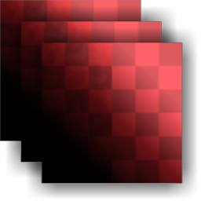

# Color Equalizer multiple

<table>
<tr style="border: 0;">
<td style="border: 0;" valign="top">

{width="128px"}

## Color Equalizer multiple

**Entrée :** *Filtres de matière/Traitement de la numérisation*

**Complexe**

</td>
<td style="border: 0;" valign="top">

## Description

Il s&#39;agit de la version multi-entrée de [Color Equalizer](../../../../../../compositing-graphs/nodes-reference-for-com/node-library/material-filters/scan-processing/color-equalizer/color-equalizer.md). Il homogénéise les différences de couleur et supprime les teintes indésirables à une échelle sélectionnable par l’utilisateur. Il est principalement destiné à être utilisé avec des photos multi-angles, qui sont ensuite combinées avec [Multi-angle à l&#39;Albédo](../../../../../../compositing-graphs/nodes-reference-for-com/node-library/material-filters/scan-processing/multi-angle-to-albedo/multi-angle-to-albedo.md) ou [Multi-angle à la normale](../../../../../../compositing-graphs/nodes-reference-for-com/node-library/material-filters/scan-processing/multi-angle-to-normal/multi-angle-to-normal.md).

>[!NOTE]
>
> Pour plus d&#39;informations, consultez le [Color Equalizer](../../../../../../compositing-graphs/nodes-reference-for-com/node-library/material-filters/scan-processing/color-equalizer/color-equalizer.md) d&#39;origine.

## Paramètres

### Entrées

* **Entrée 1-8** : *Entrée couleur* Traitement de plusieurs entrées.
* **Entrée de masque** :*Entrée en niveaux de gris*\
  Emplacement de masque utilisé pour masquer les effets du nœud.

### Paramètres

* **Nombre d&#39;entrées** : *1 - 8* Définit le nombre d&#39;entrées à traiter en parallèle.
* **Mosaïque d’entrée** : *Faux/Vrai* Conserve éventuellement la mosaïque sur les bords.
* **Rayon** : *0,0 - 50,0* Définit le rayon d&#39;égalisation. Un rayon plus grand ne supprimera que les grandes différences de couleur. Cela nécessite de retoucher chaque image.
* **Balance des tons clairs/foncés** : *0.0 - 1.0* Paramètre de biais pour laisser ou supprimer les teintes plus sombres.
* **Variation de couleur personnalisée** : *Faux/Vrai* permet de faire varier l&#39;effet vers une couleur spécifiée par l&#39;utilisateur.
* **Variation de couleur**\
  Uniquement actif si l’option Variation de couleur personnalisée est activée. Les paramètres vous permettent de sélectionner un décalage de teinte vers lequel effectuer l’égalisation.
  * **Teinte** : *0.0 - 360.0*
  * **Chrominance** : *0.0 - 1.0*
  * **Luma** : *0.0 - 1.0*
* **Source du masque** : *Aucun, Moyenne de l&#39;image, Paramètre de couleur, Entrée* Définit si un masquage doit avoir lieu. Paramètre de couleur active des paramètres supplémentaires ci-dessous. L’entrée bascule sur une entrée de masque définie par l’utilisateur.
* **Masquer**\
  Uniquement actif avec le masquage des paramètres de couleur. Contient des paramètres de masquage supplémentaires pour déterminer le masque en fonction de l&#39;image elle-même. Les paramètres ci-dessous vous permettent de convertir avec précision une teinte en un masque binaire sur lequel l’égalisation est appliquée. Notez que les effets du paramètre Rayon peuvent devenir beaucoup moins prononcés lors de l’utilisation de ces paramètres.
  * **Couleur** : *(valeur chromatique)*
  * **Plage de teintes** : *0.0 - 360.0*
  * **Plage de chrominance** : *0,0 - 1,0*
  * **Plage de luminance** : *0,0 - 1,0*
  * **Flou** : *0.0 - 2.0*
  * **Smoothness** : *0.0 - 2.0*

## Exemples d’images

|  |
| --- |
| Aucune image n&#39;est jointe à cette page. |

</td>
</tr>
</table>
