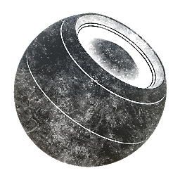

# Saleté

<table>
<tr style="border: 0;">
<td width="33.33%" style="border: 0;" valign="top">

{width="128px"}

<b>Entrée :</b> Générateurs basés sur le Maillage > Générateurs de masque

</td>
<td width="100.00%" style="border: 0;" valign="top">

## Description

Génère un masque noir et blanc en fonction des maps bakées et des paramètres utilisateur. Similaires aux [masques dynamiques](https://support.allegorithmic.com/documentation/display/SPDOC/Smart+Materials+and+Masks) dans [Painter](https://support.allegorithmic.com/documentation/display/SPDOC/Substance+Painter).

Ce masque représente les dirts dans les angles et bords occultés et enfoncés, en fonction de l&#39;AO et de la courbure bakés.

</td>
</tr>
</table>

## Entrées

|  |  |
|:---|:---|
| <b>Courbure</b> <i>Entrée en niveaux de gris</i> | Map bakée utilisée pour les effets internes et le masquage. Obligatoire ! |
| <b>Occlusion ambiante</b> <i>Entrée en niveaux de gris</i> | Map bakée utilisée pour les effets internes et le masquage. Obligatoire ! |
| <b>Entrée Usure/salissures</b> <i>Entrée en niveaux de gris</i> | Entrée de mappage usure/salissures personnalisée, facultative, activée par le paramètre. |
| <b>Masquer (facultatif)</b> <i>Entrée en niveaux de gris</i> | Emplacement de masque utilisé pour masquer les effets du nœud. |
| <b>Espace universel normal</b> <i>Entrée couleur</i> | Utilisé uniquement pour le format triplanaire. |
| <b>Position</b> <i>Entrée couleur</i> | Utilisé uniquement pour le format triplanaire. |

## Paramètres

|  |  |
|:---|:---|
| <b>Niveau Dirt</b> <i>0.0 - 1.0</i> | Contrôle principal pour le montant du dirt. |
| <b>Contraste du Dirt</b> <i>0.0 - 1.0</i> | Contrôle le contraste principal du dirt du masque. |
| <b>Quantité Usure/salissures</b> <i>0.0 - 1.0</i> | Définit le degré de grunge du dirt. Réglez la valeur sur 0 pour obtenir un dirt parfaitement lisse. |
| <b>Masquage des contours</b> <i>0.0 - 1.0</i> | Quantité de dirt à supprimer des bords relevés (en fonction de la map curvature). |
| <b>Utiliser l&#39;Usure/salissures personnalisée</b> <i>Faux/Vrai</i> | Permet d&#39;utiliser l&#39;entrée de mappage usure/salissures personnalisée au lieu de l&#39;Usure/salissures intégrée. |
| <b>Échelle Usure/salissures</b> <i>1 - 16</i> | Définit l’échelle de répétition des détails d’Usure/salissures. |
| <b>Utiliser le mode triplanaire</b> <i>Faux/Vrai</i> | Utiliser [Projection triplanaire](../../../../../../compositing-graphs/nodes-reference-for-com/node-library/mesh-based-generators/utilities-mesh-based-gen/tri-planar/tri-planar.md) pour le mappage Usure/salissures, supprime les seams. |
| <b>Contraste de fusion triplanaire</b> <i>0.001 - 1.0</i> | Définit le contraste de la Projection triplanaire. |

## Exemples

<table style="margin-top: 32px; margin-bottom: 32px">
    <tr style="border: 0">
        <td style="border: 0; background: transparent">
            
        </td>
    </tr>
</table>
