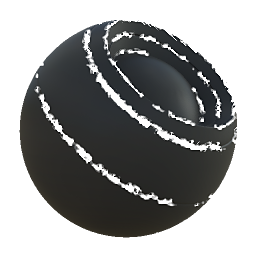

# Encoche de bord

<table>
<tr style="border: 0;">
<td style="border: 0;" valign="top">

{width="128px"}

## Encoche de bord

**Entrée :** *Générateurs basés sur le maillage**/Générateurs de masques*

**Simple**

</td>
<td style="border: 0;" valign="top">

## Description

Génère un masque noir et blanc en fonction des maps bakées et des paramètres utilisateur. Similaires aux [masques dynamiques](https://support.allegorithmic.com/documentation/display/SPDOC/Smart+Materials+and+Masks) dans [Painter](https://support.allegorithmic.com/documentation/display/SPDOC/Substance+Painter).

Ce masque représente un simple masque pour bords relevés, rompu par un bruit haute fréquence. Voir [Dirt du contour](../../../../../../compositing-graphs/nodes-reference-for-com/node-library/mesh-based-generators/mask-generators/edge-dirt/edge-dirt.md) ou [Dommages au contour](../../../../../../compositing-graphs/nodes-reference-for-com/node-library/mesh-based-generators/mask-generators/edge-damages/edge-damages.md) pour plus d&#39;options.

## Entrées

* **Courbure** : *Entrée en niveaux de gris*\
  Map bakée utilisée pour mettre en surbrillance les contours. Obligatoire !
* **Masque (facultatif)** : *Entrée en niveaux de gris*\
  Emplacement de masque utilisé pour masquer les effets du nœud.

## Paramètres

* **Niveau** : *0.0 - 1.0*\
  Définit le niveau de l’effet Encoche des contours.
* **Contraste** : *0,0 - 1,0*\
  Règle le contraste du résultat.

## Exemples d’images

</td>
</tr>
</table>
