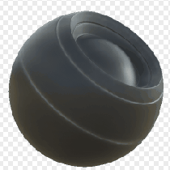

# Dirt sélectif

<table>
<tr style="border: 0;">
<td width="33.33%" style="border: 0;" valign="top">

{width="128px"}

<b>Entrée :</b> Générateurs basés sur le Maillage > Générateurs de masque

</td>
<td width="100.00%" style="border: 0;" valign="top">

## Description

Génère une image en noir et masque blanc en fonction des maps bakées et des paramètres utilisateur. Similaire à [Masques adaptables](https://support.allegorithmic.com/documentation/display/SPDOC/Smart+Materials+and+Masks) dans [Painter](https://support.allegorithmic.com/documentation/display/SPDOC/Substance+Painter).

Ce masque [Substance 3D Designer](https://www.adobe.com/fr/products/substance3d-designer.html) représente un effet de dirt simple sur les contours convexes.

</td>
</tr>
</table>

## Entrées

|  |  |
|:---|:---|
| <b>Courbure</b> <i>Entrée en niveaux de gris</i> | Map bakée utilisée pour les effets internes et le masquage. |
| <b>Masque de variation</b> <i>Entrée en niveaux de gris</i> | Carte de variation facultative, qui peut être activée via des paramètres. |
| <b>Masquer (facultatif)</b> <i>Entrée en niveaux de gris</i> | Emplacement de masque utilisé pour masquer les effets du nœud. |

## Paramètres

|  |  |
|:---|:---|
| <b>Niveau</b> <i>0.0 - 1.0</i> | Définit le niveau total de l’effet, qui s’affiche progressivement. |
| <b>Contraste</b> <i>0.0 - 1.0</i> | Règle le contraste du résultat. |
| <b>Variation</b> <i>0.0 - 1.0</i> | Définit la quantité de variation/usure/salissures à fusionner avec l’effet. |
| <b>Remplacer le masque de variation</b> <i>Faux/Vrai</i> | Permet de remplacer la variante par un emplacement d’entrée personnalisé. |

## Exemples

<table style="margin-top: 32px; margin-bottom: 32px">
    <tr style="border: 0">
        <td style="border: 0; background: transparent">
            
        </td>
    </tr>
</table>
