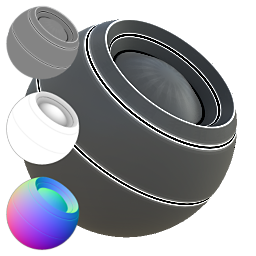

# Mélangeur de données de maillage de matériau

<table>
<tr style="border: 0;">
<td style="border: 0;" valign="top">

{width="128px"}

## Mélangeur de données de maillage de matériau

**Entrée :** *Générateurs Basés Sur Le Maillage**/Utilitaires*

**Complexe**

</td>
<td style="border: 0;" valign="top">

## Description

Ce nœud est destiné à faciliter l’ajout de détails basés sur des données récupérées. Il est fourni avec de nombreux curseurs pour modifier une entrée de matière complète, en fonction de toutes les maps bakées comme entrée. Faites des essais, car il y a beaucoup d&#39;options.

Elle est utile pour ajouter une mise en surbrillance des bords en fonction de la courbure ou d’autres cartes, pour fusionner certains AOP avec la couleur diffuse/de base, pour ajouter une Occlusion de Specular en fonction de la courbure et/ou de l’AOP, etc.

## Paramètres

### Entrées

* **Entrée de matériau complète (groupe « Matériau ») :** ensemble complet de cartes de matériau.\
  Ceux-ci sont modifiés par ce nœud, puis renvoyés en sortie.
* **Occlusion ambiante** : *Entrée en niveaux de gris*\
  Map bakée utilisée pour les effets internes et le masquage.
* **Courbure** : *Entrée en niveaux de gris*\
  Map bakée utilisée pour les effets internes et le masquage.
* **Height** : *Entrée en niveaux de gris*
* **Normal** : *Entrée Couleur*
* **Couleur du sommet** : *Entrée de couleur*
* **Espace universel normal** : *entrée de couleur*

### Paramètres

* **Canaux**
  * Activez et désactivez les canaux de matériau dans ce groupe, par exemple lorsque vous utilisez des cartes de Specular/brillance au lieu de cartes de métal/rugosité. Affecte la disponibilité des paramètres ci-dessous.
* **Maps bakées**
  * Indique si les maps bakées répertoriées doivent être utilisées pour les calculs. Affecte la disponibilité des paramètres ci-dessous.
* **Diffuse AO** : *0,0 - 1,0* quantité d&#39;Occlusion ambiante à fusionner avec la diffusion.
* **Contours nets diffus** : 0,0 - 1,0\
  Valeur de la courbe de référence à fusionner avec le diffus.
* **Couleur Diffuse À Partir De La Couleur Du Sommet** : 0,0 - 1,0\
  Degré de fusion de la couleur du sommet dans le mode Diffus.
* **Prééclairage Diffus** : 0,0 - 1,0\
  Quantité de (faux) pré-éclairage, en fonction des normales de l’espace universel.
* **Balance de l&#39;éclairage des dessins animés diffus** : 0,0 - 1,0\
  Permet de passer d’un éclairage réaliste à un éclairage caricatural pour le diffus.
* **Calques De Pré-Éclairage De Dessin Animé Diffus** : 0 - 10\
  Contrôle l’aspect des calculs d’éclairage du dessin animé.
* **Contours de dessin animé diffus** : 0,0 - 1,0\
  Contrôle l’aspect des calculs d’éclairage du dessin animé.
* **Couleur de base AO** : 0,0 - 1,0\
  Quantité d’Occlusion ambiante à fusionner avec la couleur de base.
* **Bords nets de la couleur de base** : 0,0 - 1,0\
  Quantité de courbe de référence à fusionner avec la couleur de base.
* **Couleur De Base À Partir De La Couleur Du Sommet** : 0,0 - 1,0\
  Degré de fusion de la couleur du sommet avec la couleur de base.
* **Intensité normale des matériaux** : 0,0 - 1,0\
  Intensité de fusion de la texture normale (tangente) cuite.
* **SpecularAO** : 0,0 - 1,0\
  Intensité de fusion de l&#39;AO dans le Specular.
* **Bords nets Specular clair** : 0,0 - 1,0\
  Intensité de fusion de la courbure dans le Specular.
* **Contours de dessin animé Specular** : 0,0 - 1,0\
  Intensité de fusion d’un effet de contour de Specular de dessin animé, en fonction de la courbe.
* **Netteté Des Bords Nets** : 0,0 - 1,0\
  Intensité de fusion de la courbure dans le brillant.
* **Rugosité Bords nets clairs** : 0,0 - 1,0\
  Intensité de fusion de la courbure dans la rugosité.
* **Contours de dessin animé de rugosité** : 0,0 - 1,0\
  Intensité de fusion de l’effet de contour de rugosité de dessin animé, en fonction de la courbure.
* **Bords nets lumineux métalliques** : 0,0 - 1,0\
  Intensité de fusion de la courbure dans le métallique.
* **Contours métalliques de dessin animé** : 0,0 - 1,0\
  Intensité de fusion d’un effet de contour métallique de dessin animé, basée sur la courbe.
* **Intensité du matériel AO** : 0,0 - 1,0\
  Fusionnez l&#39;intensité de la map bakée AO avec l&#39;intensité AO générée par la matière, le degré auquel combiner les deux cartes AO.
* **Intensité des matériaux Heights** : 0,0 - 1,0\
  Fusionnez l&#39;intensité de l&#39;Height de map bakée avec l&#39;Height généré par la matière, et déterminez le degré auquel combiner les deux cartes de hauteur.
* **Type De Fusion De Matière Height** : Renforcement, Interpolation\
  Mode de fusion pour combiner les deux cartes de hauteur.

## Exemples d’images

</td>
</tr>
</table>
