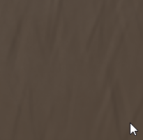

# Météo du cuir

<table>
<tr style="border: 0;">
<td width="33.33%" style="border: 0;" valign="top">

{width="128px"}

<b>Entrée :</b> Générateurs basés sur le Maillage > Altération

</td>
<td width="100.00%" style="border: 0;" valign="top">

## Description

Il s’agit d’un effet matériel qui fonctionne sur plusieurs canaux à la fois. Il ajoute un effet d&#39;usure aléatoire du cuir, avec un contrôle de l&#39;âge et de la saleté. Elle est similaire à la [altération du tissu](../../../../../../compositing-graphs/nodes-reference-for-com/node-library/mesh-based-generators/weathering/fabric-weathering/fabric-weathering.md), mais adaptée spécifiquement pour le cuir. Cet effet ne fonctionne pas très bien à moins que vous n&#39;ayez branché les cartes AO et Normal d&#39;Espace monde bakées appropriées, car elles sont nécessaires pour calculer et générer correctement l&#39;ensemble.

Assurez-vous de bien comprendre les [modes de création de liens](https://support.allegorithmic.com/documentation/display/SD5/Link+Creation+Modes) lorsque vous travaillez avec des matériaux complets.

</td>
</tr>
</table>

## Entrées

|  |  |
|:---|:---|
| <b>Occlusion ambiante</b> <i>Entrée en niveaux de gris</i> | Map bakée utilisée pour les effets internes et le masquage. |
| <b>Espace normal</b> <i>Entrée couleur</i> |  |
| <b>Masquer</b> <i>Entrée en niveaux de gris</i> | Emplacement de masque utilisé pour masquer les effets du nœud. Peut être basculé avec le paramètre « Mask ». |

## Paramètres

|  |  |
|:---|:---|
| <b>Canaux</b> | Activez et désactivez les canaux de matériau dans ce groupe, par exemple lorsque vous utilisez des cartes de Specular/brillance au lieu de cartes de métal/rugosité. |
| <b>Avancé</b> |  |
| <b>Format normal</b> <i>DirectX, OpenGL</i> | Bascule entre différents formats de mappage normal (inverse la couche verte). |
| <b>Masquer</b> <i>Faux/Vrai</i> | Active ou désactive l&#39;utilisation de la carte de masque. |
| <b>Effet</b> |  |
| <b>Dust</b> <i>0.0 - 1.0</i> | Fusions dans un effet de dust plus sombre, en fonction des zones orientées vers le haut dans l’Espace monde Normalmap. |
| <b>Sale</b> <i>0.0 - 1.0</i> | Fusions dans un effet global de dirt/doigt, reposant principalement sur les zones occultées (sombres) dans l’AO. |
| <b>Usure Des Bords</b> <i>0.0 - 1.0</i> | Ajoute un effet de netteté/intensification aux contours, en fonction de la Normale au Matériau. |
| <b>Utilisé</b> <i>0.0 - 1.0</i> | Fusions dans un look global en cuir usé. |
| <b>Âge</b> <i>0.0 - 1.0</i> | Les fusions en cuir usé ressemblent à des plis inspirés de l&#39;AO. Le placement est beaucoup influencé par le seuil d&#39;âge. |
| <b>Seuil d&#39;âge</b> <i>0.0 - 1.0</i> | Définit le seuil d’aspect de l’effet Age. |
| <b>Échelle des Fissures</b> <i>1.0 - 16.0</i> | Définit la profondeur du cuir usé à partir de l’effet Utilisé et Age. |
| <b>Intensité de déformation des Fissures</b> <i>0.0 - 1.0</i> | Définit l’intensité du cuir usé à partir de l’effet Utilisé et Age. |
| <b>Échelle Scratches Des Contours Nets</b> <i>1.0 - 32.0</i> |  |
| <b>Intensité de déformation Scratches des contours nets</b> <i>0.0 - 1.0</i> |  |
| <b>Désaturation Du Cuir Usé</b> <i>0.0 - 1.0</i> | Définit la saturation de l’aspect du cuir usé à partir des effets Age et Utilisé. |
| <b>Luminosité du cuir usagé</b> <i>0.0 - 1.0</i> | Définit la luminosité de l’aspect en cuir usé à partir des effets Age et Utilisé. |
| <b>Fusion</b> |  |
| <b>Intensité de Diffuse</b> <i>0.0 - 1.0</i> | Intensité de fusion du diffus. |
| <b>Intensité de la Base color</b> <i>0.0 - 1.0</i> | Intensité de fusion de la couleur de base. |
| <b>Intensité normale</b> <i>0.0 - 1.0</i> | Intensité de fusion de la normale. |
| <b>Intensité du Specular</b> <i>0.0 - 1.0</i> | Intensité de fusion du Specular. |
| <b>Intensité de la Brillance</b> <i>0.0 - 1.0</i> | Intensité de fusion du brillant. |
| <b>Intensité de la Rugosité</b> <i>0.0 - 1.0</i> | Intensité de fusion de la rugosité. |
| <b>Intensité de l&#39;Ambient occlusion</b> <i>0.0 - 1.0</i> | Intensité de fusion de l&#39;Occlusion ambiante. |
| <b>Intensité de l&#39;Height</b> <i>0.0 - 1.0</i> | Intensité de fusion de l&#39;Height. |

## Exemples

<table style="margin-top: 32px; margin-bottom: 32px">
    <tr style="border: 0">
        <td style="border: 0; background: transparent">
            
        </td>
        <td style="border: 0; background: transparent">
            
        </td>
    </tr>
</table>
