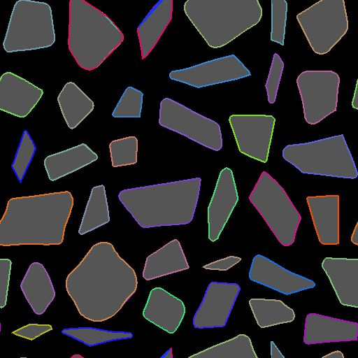

# Masquer sur les tracés

<table>
<tr style="border: 0;">
<td width="33.33%" style="border: 0;" valign="top">

<b>Entrée :</b> Outils Spline Et Tracé > Outils De Tracé

</td>
<td width="100.00%" style="border: 0;" valign="top">

## Description

Convertit un motif d&#39;entrée en niveaux de gris <b>Masque</b> en une liste de segments de tracé codés dans la sortie <b>Tracés</b>.

Des commandes permettant de définir la position de départ des tracés générés, ainsi que leur ordre dans la liste, sont disponibles.

Les tracés générés peuvent être traités ultérieurement à l’aide de nœuds dédiés, par exemple [Transformation 2D du tracé](../../../../../../compositing-graphs/nodes-reference-for-com/node-library/spline-paths-tools/path-tools/path-2d-transform/path-2d-transform.md), [Déformation des tracés](../../../../../../compositing-graphs/nodes-reference-for-com/node-library/spline-paths-tools/path-tools/paths-warp/paths-warp.md), ou convertis en splines à l’aide du nœud [Tracé vers spline](../../../../../../compositing-graphs/nodes-reference-for-com/node-library/spline-paths-tools/path-tools/paths-to-spline/paths-to-spline.md) pour mapper ou dispersion des formes le long de ceux-ci.

</td>
</tr>
</table>

>[!NOTE]
>
> La méthode utilisée pour coder les chemins est expliquée dans la page [Spécifications de format des chemins](../../../../../../compositing-graphs/nodes-reference-for-com/node-library/spline-paths-tools/path-tools/paths-format-spe/paths-format-specifications.md).

## Entrées

|  |  |
|:---|:---|
| <b>Masquer</b> <i>Niveaux de gris</i> | Motif d’entrée qui doit être converti en liste de tracés. |

## Sorties

|  |  |
|:---|:---|
| <b>Aperçu</b> <i>Couleur</i> | Un aperçu composé au-dessus du masque pour aider à visualiser les effets des paramètres. |
| <b>Tracés</b> <i>Couleur</i> | Liste des tracés codés dans une image couleur. chaque chemin décrit une liste de segments codés. Le résultat peut être traité à l&#39;aide d&#39;un autre nœud de traitement des tracés ou envoyé à un nœud [Tracés vers spline](../../../../../../compositing-graphs/nodes-reference-for-com/node-library/spline-paths-tools/path-tools/paths-to-spline/paths-to-spline.md) pour le traiter davantage en tant que splines. |

## Paramètres

|  |  |
|:---|:---|
| <b>Masque lisse</b> <i>Flotter</i> | Appliquez le lissage sur le masque d’entrée. Utile lorsque le motif d&#39;entrée a des bords très nets, ce qui provoque généralement des artefacts. |
| <b>Valeur du seuil du masque</b> <i>Flotter</i> | Valeur de niveaux de gris de <b>Masque</b> qui sera utilisée pour séparer l&#39;extérieur (valeurs &lt; valeur de seuil du masque) et l&#39;intérieur (valeurs > valeur de seuil du masque) de la forme. |
| <b>Décimer le chemin</b> <i>Flotter</i> | Contrôle implicitement le nombre de segments qui seront générés. Une quantité élevée de décimation rendra les formes arrondies quelque peu polygonales, tandis qu&#39;aucune décimation ne générera presque un segment par pixel. Une quantité raisonnable correspondra mieux à la forme des lignes droites et des courbes sans créer beaucoup de points intermédiaires pour les lignes droites. |
| <b>Fermer les tracés ouverts</b> <i>Booléen</i> | Créez un segment entre les vertex de début et de fin des tracés ouverts. La désactivation de cette option peut corriger les lignes indésirables traversant votre motif de manière inattendue, mais les tracés ne sont peut-être plus fermés. |
| <b>Seuil d&#39;angle</b> <i>Flotter</i> | Chaque sommet codé dans des tracés peut contenir un drapeau indiquant s’il est dur (c’est-à-dire s’il s’agit d’un coin) ou lisse. Ce paramètre vous permet de marquer plus ou moins d&#39;angles en fonction de l&#39;angle entre leurs segments adjacents. <i>Remarque :</i> cet indicateur d&#39;angle n&#39;est actuellement pris en charge par aucun nœud existant, mais il peut être utilisé dans un nœud [processeur de Vertex de chemin](../../../../../../compositing-graphs/nodes-reference-for-com/node-library/spline-paths-tools/path-tools/paths-vertex-processor/paths-vertex-processor.md). Vous pouvez également visualiser les coins avec le nœud [Tracés de prévisualisation](../../../../../../compositing-graphs/nodes-reference-for-com/node-library/spline-paths-tools/path-tools/preview-paths/preview-paths.md). |
| <b>Mode de démarrage du chemin</b> <i>Nombre entier</i> | Méthode de sélection du vertex devant être le début de chaque tracé généré autour des formes du masque. Cela a un impact significatif lors de la conversion des <b>tracés en splines</b> générés à l&#39;aide du nœud dédié, car plusieurs nœuds de splines utilisent le début et la fin des splines. *- vertex le plus aigu :* Le vertex formant l&#39;angle le plus bas avec ses vertex précédents et suivants  *- Vertex à l&#39;extrême d&#39;une direction spécifiée :* Le dernier vertex dans une direction donnée  *- Vertex le plus proche d&#39;une position spécifiée * Vertex le plus éloigné d&#39;une position spécifiée * démarrage personnalisé function:* Utilisez une fonction personnalisée pour sélectionner le vertex qui doit être utilisé comme début de chaque chemin |
| <b>Direction du démarrage</b> <i>Flotter</i> | Angle décrivant la direction utilisée pour sélectionner le vertex de démarrage. Pour chaque tracé, le dernier sommet dans cette direction est sélectionné. La valeur est un *nombre de tours* utilisé pour faire pivoter un vecteur X-direction gauche. Cela signifie que 0 définit un vecteur de direction de (-1, 0) et 0,25 (90 degrés) définit un vecteur de direction de (0, 1). <i>Remarque :</i> ce paramètre est disponible lorsque le <b>mode de démarrage du chemin</b> est défini sur « Vertex à l’extrême d’une direction spécifiée » |
| <b>Position cible au démarrage</b> <i>Float2</i> | Position dans l’image utilisée pour sélectionner le vertex de démarrage. Pour chaque chemin, le vertex le plus proche ou le plus éloigné de cette position est sélectionné, en fonction du <b>mode de démarrage du chemin</b> sélectionné. <i>Remarque :</i> ce paramètre est disponible lorsque le <b>mode de démarrage du chemin</b> est défini sur « Vertex le plus proche d’une position spécifiée » ou « Vertex le plus éloigné d’une position spécifiée » |
| <b>Fonction de démarrage</b> <i>Flotter</i> | Fonction utilisée pour sélectionner le vertex de démarrage. Elle renvoie une valeur de type Float. Pour chaque vertex, la fonction est exécutée et le vertex pour lequel la fonction renvoie le *résultat le plus élevé* est sélectionné. Variables disponibles : *-* vertex.cornerness(Flottant)*:* Le score du vertex en tant que candidat au statut de coin  *-* vertex.pos(Flottant 2)*:* La position du vertex dans l&#39;espace de l&#39;image <i>Remarque :</i> Ce paramètre est disponible lorsque le mode de démarrage du chemin est défini sur « Vertex le plus proche d&#39;une position spécifiée » ou « Fonction de démarrage personnalisée » |
| <b>Mode de commande</b> <i>Nombre entier</i> | Méthode d&#39;ordre des tracés générés. La position ou la taille du *cadre de sélection* des tracés (Bbox) peut être utilisée comme critère d&#39;ordre des tracés. Cela a un impact significatif lors de la conversion des <b>tracés en splines</b> générés à l&#39;aide du nœud dédié, car plusieurs nœuds de splines utilisent l&#39;ordre des splines. *- Hérité (rapide) :* La méthode utilisée dans la version précédente de ce nœud, qui offre des performances nettement supérieures  *- Par position centrale de la Bbox dans la direction :* les tracés sont ordonnés en fonction de la position du centre de leur Bbox, du premier au dernier dans la direction spécifiée  *- Par boîte Bbox position haut gauche selon la direction :* Les tracés sont classés selon la position du coin supérieur gauche de leur boîte Bbox, du premier au dernier selon la direction spécifiée  *- Par taille de boîte Bbox - Du plus grand au plus petit :* Les tracés sont classés selon la taille de leur boîte Bbox, du plus grand au plus petit  *- Par taille de boîte Bbox - Du plus petit au plus grand :* Les tracés sont classés selon la taille de leur boîte Bbox, du plus petit au plus grand  *- Ordre personnalisé function:* Utiliser une fonction personnalisée pour organiser les Chemins |
| <b>Sens de la commande</b> <i>Flotter</i> | Angle décrivant la direction utilisée pour ordonner les tracés du premier au dernier dans cette direction. La valeur est un *nombre de tours* utilisé pour faire pivoter un vecteur de direction X-gauche. Cela signifie que 0 définit un vecteur de direction de (-1, 0) et 0,25 (90 degrés) définit un vecteur de direction de (0, 1). |
| <b>Fonction de commande</b> <i>Flotter</i> | Fonction utilisée pour ordonner les tracés. Elle renvoie une valeur de type Float. Les tracés sont classés *par ordre croissant* en fonction de la valeur de cette fonction. En d&#39;autres termes, le résultat de la fonction pour chaque chemin d&#39;accès est la *clé de tri* utilisée pour organiser les chemins d&#39;accès. Variables disponibles : * bbox.center (Flottant 2) : position du centre * bbox.topleft (Flottant 2) : position du coin supérieur gauche * bbox.size (Flottant 2) : taille de la zone de chemin d&#39;accès (X : width, Y : height) |

## Exemples

<table>
<tr style="border: 0;">
<td style="border: 0;" valign="top">

<table>
  <tr>
    <td>
      
       <i>Avant</i>
    </td>
    <td>
      
       <i>Après</i>
    </td>
  </tr>
</table>

</td>
<td style="border: 0;" valign="top">

<table>
  <tr>
    <td>
      
       <i>Avant</i>
    </td>
    <td>
      
       <i>Après</i>
    </td>
  </tr>
</table>

</td>
</tr>
</table>

<table>
<tr style="border: 0;">
<td style="border: 0;" valign="top">

{zoomable="yes"}

</td>
<td style="border: 0;" valign="top">

{zoomable="yes"}

</td>
</tr>
</table>

<table>
<tr style="border: 0;">
<td style="border: 0;" valign="top">

{zoomable="yes"}

</td>
<td style="border: 0;" valign="top">

{zoomable="yes"}

</td>
</tr>
</table>
