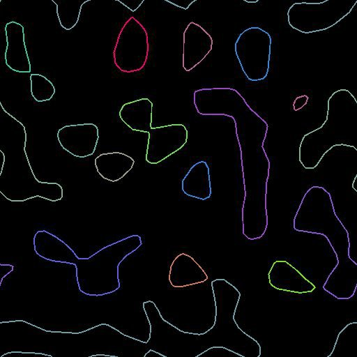

# Tracés d’aperçu

<table>
<tr style="border: 0;">
<td width="33.33%" style="border: 0;" valign="top">

<b>Entrée :</b> Outils Spline Et Tracé > Outils De Tracé

</td>
<td width="100.00%" style="border: 0;" valign="top">

## Description

Tracez des segments et des sommets du tracé au-dessus de l’arrière-plan donné. Une couleur aléatoire par tracé.

Vous obtiendrez un résultat similaire à la sortie <b>Aperçu</b> de l&#39;[option Masquer sur les tracés](../../../../../../compositing-graphs/nodes-reference-for-com/node-library/spline-paths-tools/path-tools/mask-to-paths/mask-to-paths.md), mais avec plus d&#39;options.

</td>
</tr>
</table>

## Entrées

|  |  |
|:---|:---|
| <b>Arrière-plan</b> <i>Couleur</i> | Une image d’arrière-plan au-dessus de avec affiche le tracé. Cela contrôle également la taille du rendu. |
| <b>Tracés</b> <i>Couleur</i> | Liste des chemins d’accès des segments codés. Connectez cette entrée au résultat d&#39;un [masque sur les tracés](../../../../../../compositing-graphs/nodes-reference-for-com/node-library/spline-paths-tools/path-tools/mask-to-paths/mask-to-paths.md) ou à un autre nœud de traitement de tracé. |

## Paramètres

|  |  |
|:---|:---|
| <b>Afficher les coins</b> <i>Booléen</i> | Affiche un carré sur chaque sommet marqué comme angle (fusion additive). |
| <b>Afficher les sommets</b> <i>Booléen</i> | Affiche une forme circulaire sur chaque sommet (fusion additive). Les coins sont toujours affichés sous forme de carrés. |
| <b>Thickness des segments (px)</b> <i>Flotter</i> | Ajuste le thickness des segments rendus en pixels. |

## Exemples

<table>
<tr style="border: 0;">
<td style="border: 0;" valign="top">

</td>
<td style="border: 0;" valign="top">

</td>
</tr>
</table>
