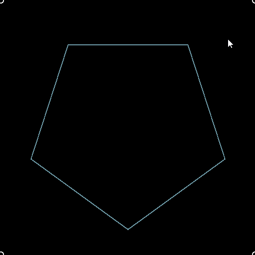

# Quad Transform on Path

<table>
<tr style="border: 0;">
<td width="33.33%" style="border: 0;" valign="top">

<b>Entrée :</b> Outils Spline Et Tracé > Outils De Tracé

</td>
<td width="100.00%" style="border: 0;" valign="top">

## Description

Déformez un tracé à l’aide de 4 poignées.

</td>
</tr>
</table>

## Connecteurs d’entrée

<b>Tracés</b> *Couleur*\
Liste des chemins d’accès des segments codés. Connectez cette entrée au résultat d&#39;un [masque aux tracés](../../../../../../compositing-graphs/nodes-reference-for-com/node-library/spline-paths-tools/path-tools/mask-to-paths/mask-to-paths.md) ou à un autre nœud de traitement de *tracé*.

## Connecteurs de sortie

<b>Tracés</b> *Couleur*\
Les tracés transformés. Vous pouvez utiliser [Prévisualiser les tracés](../../../../../../compositing-graphs/nodes-reference-for-com/node-library/spline-paths-tools/path-tools/preview-paths/preview-paths.md) pour vous faire une idée de ce que le résultat représente, utiliser un autre nœud de traitement des tracés ou l&#39;entrer dans un [Tracés de la spline](../../../../../../compositing-graphs/nodes-reference-for-com/node-library/spline-paths-tools/path-tools/paths-to-spline/paths-to-spline.md) pour continuer à le traiter en tant que splines.

## Paramètres

<b>p00</b> *Float2*\
Position de la poignée en haut à gauche.

<b>p01</b> *Float2*\
Position de la poignée en haut à droite.

<b>p02</b> *Float2*\
Position de la poignée inférieure gauche.

<b>p03</b> *Float2*\
Position de la poignée inférieure droite.

## Exemples

<table>
<tr style="border: 0;">
<td style="border: 0;" valign="top">

<table>
  <tr>
    <td>
      
       <i>Avant</i>
    </td>
    <td>
      
       <i>Après</i>
    </td>
  </tr>
</table>

</td>
<td style="border: 0;" valign="top">

<table>
  <tr>
    <td>
      
       <i>Avant</i>
    </td>
    <td>
      
       <i>Après</i>
    </td>
  </tr>
</table>

</td>
</tr>
</table>

<table>
<tr style="border: 0;">
<td style="border: 0;" valign="top">

</td>
<td style="border: 0;" valign="top">

</td>
</tr>
</table>
