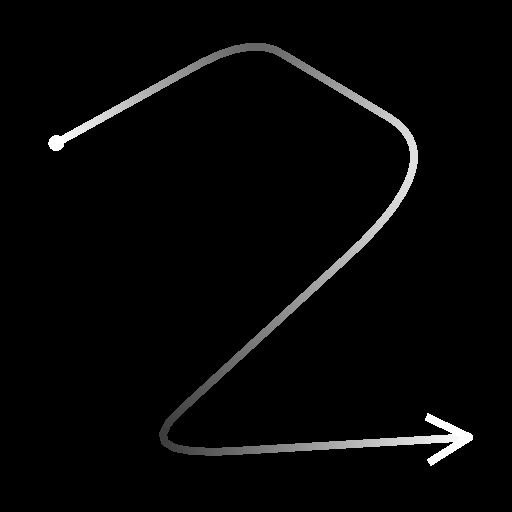

# Dispersion sur niveaux de gris spline

<table>
<tr style="border: 0;">
<td width="33.33%" style="border: 0;" valign="top">

<b>Entrée :</b> Outils Spline Et Tracé > Outils spline

</td>
<td width="100.00%" style="border: 0;" valign="top">

## Description

Trace le ou les motifs spécifiés le long des splines d&#39;entrée sur l&#39;arrière-plan d&#39;entrée.

</td>
</tr>
</table>

Le nœud offre des options de personnalisation avancées pour contrôler la façon dont les motifs sont dispersés.

Certains aspects de la diffusion peuvent être contrôlés à l&#39;aide d&#39;images provenant d&#39;autres nœuds dans le graphe pour améliorer l&#39;aspect dynamique du résultat.

>[!NOTE]
>
> Voir aussi [Dispersion sur la couleur de la spline](../../../../../../compositing-graphs/nodes-reference-for-com/node-library/spline-paths-tools/spline-tools/scatter-on-spline-color/scatter-on-spline-color.md).

## Entrées

|  |  |
|:---|:---|
| <b>Arrière-plan</b> <i>Niveaux De Gris</i> (Principal) | Image en niveaux de gris sur les splines à tracer. |
| <b>Couleurs splines</b> <i>Couleur</i> | Coordonnées des points des splines d&#39;entrée codés dans les canaux RVBA d&#39;une image couleur : <b>R</b> - position X <b>G</b> - position Y <b>B</b> - Height <b>A</b> - données compressées : - Signe : la spline est fermée (négative) ou ouverte (positive); - Valeur absolue : Thickness + 1. |
| <b>Données splines</b> <i>Couleur</i> | Données supplémentaires des splines d&#39;entrée codées dans les canaux RVBA d&#39;une image couleur. <b>R</b> - Tangentes X <b>G</b> - Tangentes Y <b>B</b> - Inutilisé <b>A</b> - Inutilisé |
| <b>Quantité de spline</b> <i>Entier</i> | Nombre de splines d&#39;entrée. |
| <b>Entrée de motif #</b> <i>Niveaux de gris</i> | Motif(s) devant être dispersé(s) le long des splines. |
| <b>Mappage d&#39;échelle</b> <i>Niveaux de gris</i> | La carte contrôlant l’échelle des motifs dispersés. L&#39;effet de cette carte est contrôlé par le paramètre Multiplicateur d&#39;entrée de carte d&#39;échelle et est combiné aux autres paramètres du groupe Taille. |
| <b>Mappage de l&#39;Height</b> <i>Niveaux de gris</i> | La carte contrôlant l&#39;height des motifs diffusés. L&#39;effet de cette courbe est contrôlé par le paramètre Multiplicateur d&#39;entrée Height et est associé aux autres paramètres Couleur du groupe Couleur. |
| <b>Mappage de masque</b> <i>Niveaux de gris</i> | La carte contrôlant le masquage des motifs diffusés. L&#39;effet de ce mappage est contrôlé par le paramètre Seuil de mappage de masque et est combiné aux autres paramètres Masque dans le groupe Couleur. |

## Sorties

|  |  |
|:---|:---|
| <b>Sortie</b> <i>Niveaux de gris</i> | Image représentant le ou les motifs dispersés le long de la ou des splines d&#39;entrée sur l&#39;arrière-plan d&#39;entrée. |

## Paramètres

|  |  |
|:---|:---|
| <b>Entrée spline</b> <i>Nombre entier</i> | Méthode de sélection des splines à utiliser pour les motifs de diffusion :  - <i>Toutes les splines</i> : utilisez toutes les splines dans la liste d&#39;entrée ; - <i>Spline unique</i> : utilisez uniquement la spline spécifiée dans la liste d&#39;entrée ; - <i>Plage de splines</i> : utilisez uniquement les splines dans la plage spécifiée à partir de la liste d&#39;entrée. |
| <b>Index Spline</b> <i>Entier</i> (disponible lorsque &#39;Spline Input&#39; est défini sur &#39;Single Spline&#39;) | Index de liste de la spline à utiliser pour les motifs de diffusion. |
| <b>Plage de splines</b> <i>Entier 2</i> (disponible lorsque « Spline Input » est défini sur « Spline Range ») | Plage d&#39;index de liste comprenant les splines qui doivent être utilisées pour les motifs de diffusion. |
| <b>Mode Dispersion</b> <i>Nombre entier</i> | Méthode de diffusion des motifs le long des splines, qui a un impact sur la quantité de motifs sur chaque spline :   - Quantité de forme : la quantité spécifiée de motifs régulièrement espacés est diffusée ;  - Espacement de la forme : le nombre de motifs est automatiquement ajusté pour s&#39;adapter à l&#39;espacement pair spécifié.  Dans les deux cas, le premier et le dernier motif se trouvent exactement au début et à la fin de chaque spline respectivement. |
| <b>Quantité de forme</b> <i>Entier</i> (disponible lorsque &#39;Mode Dispersion&#39; est défini sur &#39;Quantité de forme&#39;) | Spécifie la quantité de motifs régulièrement espacés le long de chaque spline. |
| <b>Répartition De La Forme Le Long De La Spline</b> <i>Entier</i> (disponible lorsque &#39;Mode Dispersion&#39; est défini sur &#39;Quantité de forme&#39;) | Méthode de répartition des motifs le long d&#39;une spline :  - <i>Source</i> : l&#39;espacement des motifs dépend des tangentes du point de spline, où les formes sont plus espacées à proximité des points avec des tangentes importantes ; - <i>Uniforme</i> : les motifs sont espacés de manière régulière le long de la spline, quelles que soient ses tangentes et sa trajectoire. |
| <b>Espacement des formes</b> <i>Flottant</i> (disponible lorsque &#39;Mode Dispersion&#39; est défini sur &#39;Espacement de la forme&#39;) | Distance minimale le long d&#39;une spline par laquelle les motifs doivent être espacés, tout en plaçant le premier et le dernier motif respectivement au début et à la fin de chaque spline. |
| <b>Démarrer</b> <i>Flotter</i> | Décale le point à partir du début d&#39;une spline où commence la diffusion. La valeur est la longueur normalisée de chaque spline. |
| <b>Fin</b> <i>Flotter</i> | Décale le point à partir du début d&#39;une spline à l&#39;endroit où se termine la diffusion. La valeur est la longueur normalisée de chaque spline. |
| <b>Pivot De Forme</b> <i>Float2</i> | Décale le pivot du motif X et Y dans l&#39;espace de tangente spline. En considérant que le pivot est ce qui est placé sur la spline, cela décale efficacement les motifs le long ou perpendiculairement à la spline. Remarque : les positions des pivots ont un impact sur l&#39;effet des paramètres &#39;Échelle&#39; et &#39;Rotation (Pivot)&#39;. |
| <b>Motif</b> |  |
| <b>Motif</b> <i>Nombre entier</i> | Le motif qui doit être dispersé le long des splines :  - <i>Entrée de motif</i> : utilisez les motifs fournis pour les entrées &#39;Entrée de motif #&#39;; - Carré ; - Disque ; - Paraboloïde ; - Cloche ; - Gaussien ; - Épine ; - Pyramide ; - Brique ; - Graduation ; - Ondes ; - Demi-cloche ; - Cloche striée ; - Croissant ; - Cône Capsule ; - Graduation ; -  w. offset; - Hemisphere. |
| <b>Numéro d&#39;entrée de motif</b> <i>Entier</i> (disponible lorsque &#39;Pattern&#39; est défini sur &#39;Pattern Input&#39;) | Sélectionne l&#39;index du motif d&#39;entrée qui doit être diffusé. |
| <b>Distribution d&#39;entrée de motif</b> <i>Entier</i> (disponible lorsque &#39;Pattern&#39; est défini sur &#39;Pattern Input&#39;) | Méthode utilisée pour sélectionner lequel des motifs d&#39;entrée doit être dispersé sur une spline donnée :  - <i>Aléatoire</i> : un motif est sélectionné de manière aléatoire ; - <i>Le long de la spline</i> : l&#39;index de motif augmente progressivement le long de la spline ; - <i>Index de motif</i> : passe sur l&#39;index des motifs d&#39;entrée le long de chaque spline ; - <i>Index de spline</i> : passe sur l&#39;index des motifs d&#39;entrée d&#39;une spline à la suivante dans la liste des splines d&#39;entrée. |
| <b>Variation de distribution</b> <i>Flottant</i> (disponible lorsque « Distribution d&#39;entrée de motif » est défini sur « Le long de la spline ») | Augmente ou diminue de manière aléatoire l&#39;index sélectionné des motifs sur la spline. |
| <b>Remplacer le premier motif</b> <i>Booléen</i> | Sélectionnez manuellement l&#39;index du motif à placer au début de chaque spline. |
| <b>Premier index d&#39;entrée de motif</b> <i>Entier</i> (disponible lorsque &#39;Override First Pattern&#39; est défini sur &#39;True&#39;) | Index du motif à placer au début de chaque spline. |
| <b>Remplacer le dernier motif</b> <i>Booléen</i> | Sélectionnez manuellement l&#39;index du motif à placer à l&#39;extrémité de chaque spline. |
| <b>Dernier index d&#39;entrée de motif</b> <i>Entier</i> (disponible lorsque &#39;Override Last Pattern&#39; est défini sur &#39;True&#39;) | Index du motif à placer à l&#39;extrémité de chaque spline. |
| <b>Doublons</b> |  |
| <b>Mode de distribution</b> <i>Nombre entier</i> | Méthode utilisée pour placer les motifs dupliqués :  - <i>Linéaire</i> : les duplicatas sont espacés de manière régulière le long de la normale de la spline à partir de l&#39;emplacement d&#39;origine du motif ; - <i>Circulaire</i> : les duplicatas sont disposés le long d&#39;un cercle virtuel centré sur la spline à l&#39;emplacement d&#39;origine du motif. |
| <b>Quantité de doublons</b> <i>Nombre entier</i> | Nombre de motifs dupliqués. |
| <b>Décalage</b> <i>Flottant 2</i> (disponible lorsque le mode de distribution est défini sur Linéaire) | Applique un décalage aux positions des duplicatas le long de la tangente (parallèle) et de la normale (perpendiculaire) de la spline. Les duplicatas de part et d&#39;autre de la spline sont déplacés dans des directions opposées. |
| <b>Décalage au centre</b> <i>Flottant 2</i> (disponible lorsque le mode de distribution est défini sur Linéaire) | Applique un décalage aux copies le long de la spline sur X (parallèle) et Y (perpendiculaire). |
| <b>Angle de répartition</b> <i>Flottant</i> (disponible lorsque le « Mode de distribution » est défini sur « Circulaire ») | L&#39;arc du cercle virtuel le long duquel les doublons sont distribués, comme l&#39;angle de cet arc où 1 est le cercle entier. |
| <b>Distance de décalage</b> <i>Flottant</i> (disponible lorsque le « Mode de distribution » est défini sur « Circulaire ») | Rayon du cercle virtuel le long duquel les doublons sont distribués. |
| <b>Rotation</b> <i>Flotter</i> | Fait pivoter le cercle virtuel le long duquel les doublons sont distribués. |
| <b>Atténuation Du Début/Fin Du Décalage</b> <i>Float2</i> | Tient compte de la distance entre le point médian de la spline et ses extrémités, lors de l&#39;application de décalages aux copies. Cela signifie que les décalages sont réduits pour les doublons situés plus près des extrémités d&#39;une spline. |
| <b>Décaler l&#39;atténuation par Thickness</b> <i>Flotter</i> | Facteurs dans le thickness de la spline lors de l&#39;application de décalages à des doublons. Cela signifie que les décalages sont réduits pour les doublons sur une partie d&#39;une spline avec un thickness inférieur. |
| <b>Taille</b> |  |
| <b>Mode Taille</b> <i>Nombre entier</i> | Méthode de définition de la taille des motifs diffusés :  - <i>Normal</i> : la taille est contrôlée uniformément à l&#39;aide d&#39;un paramètre d&#39;échelle global ; - <i>Utiliser le Thickness de la spline</i> : la taille est déterminée par le thickness de la spline. |
| <b>Le Thickness Affecte</b> <i>Entier</i> (disponible lorsque le mode Taille est défini sur Utiliser le Thickness à partir de la spline) | Spécifie quel axe de l&#39;échelle d&#39;un motif doit être piloté par le thickness de la spline :  - X &amp; Y : le Thickness est multiplié par rapport à la taille dans les axes X et Y ; - X : le Thickness est multiplié par rapport à la taille sur l&#39;axe X uniquement ; - Y : le Thickness est multiplié par rapport à la taille sur l&#39;axe Y uniquement.  Lorsqu’elle n’est pas multipliée, l’échelle d’origine du motif correspond à la totalité de l’image. Cela signifie qu&#39;en mode « X », la taille à l&#39;axe Y correspond à l&#39;étendue complète de l&#39;image et doit être modifiée à l&#39;aide du paramètre Taille. Il en va de même pour la taille à l’axe X lors de l’utilisation du mode « Y ». |
| <b>Taille</b> <i>Float2</i> | Taille d’origine des motifs en X et en Y avant que d’autres réglages ne soient effectués par d’autres paramètres. |
| <b>Taille aléatoire</b> <i>Float2</i> | Applique un multiplicateur aléatoire jusqu’à la valeur spécifiée pour réduire la taille des motifs dans X et Y. |
| <b>Échelle de Thickness</b> <i>Flottant</i> (disponible lorsque le mode Taille est défini sur Utiliser le Thickness à partir de la spline) | Multiplicateur supplémentaire pour l&#39;échelle des motifs lorsque piloté par le thickness de la spline. |
| <b>Échelle</b> <i>Flottant</i> (disponible lorsque &#39;Mode Taille&#39; est défini sur &#39;Normal&#39;) | Contrôle global de la taille de tous les motifs, où 1 correspond à l’étendue complète de l’image. La mise à l&#39;échelle est appliquée par rapport au pivot d&#39;un motif. La position de pivot peut être décalée à l&#39;aide du paramètre « Shape Pivot ». |
| <b>Échelle aléatoire</b> <i>Flotter</i> | Applique un multiplicateur aléatoire jusqu’à la valeur spécifiée pour réduire la taille des motifs. |
| <b>Multiplicateur d&#39;entrée de mappage d&#39;échelle</b> <i>Flotter</i> | Contrôle l’intensité de l’entrée de la carte d’échelle. Cette carte agit comme un multiplicateur pour la taille actuelle des motifs. L&#39;effet de cette carte est combiné aux autres paramètres du groupe Taille. |
| <b>Mode D&#39;Échantillonnage D&#39;Entrée À L&#39;Échelle</b> <i>Espace Texture</i> | Méthode de mappage des valeurs de la carte d&#39;échelle aux splines :  - <i>espace de Texture</i> : les valeurs sont appliquées aux splines où elles se trouveraient si elles étaient placées dans une texture à l&#39;aide des coordonnées d&#39;UV de la texture. Cela applique efficacement la valeur aux splines « en place »; - <i>Horizontalement le long de la spline</i> : les valeurs sont appliquées directement aux coordonnées des splines codées (voir Entrée des cordons de spline), où chaque ligne est appliquée à une spline différente de haut en bas ; - <i>Heure. le long de la spline (rand. offset X)</i> : les valeurs sont appliquées directement aux coordonnées des splines codées (voir Entrée des cordons de spline), avec un décalage horizontal aléatoire dans la carte d&#39;échelle pour chaque spline (c&#39;est-à-dire chaque ligne dans les cordons de spline); - <i>Hor. le long de la spline (rand. décalage Y)</i> : les valeurs sont appliquées directement aux coordonnées des splines codées (voir Entrée des cœurs de spline), avec un décalage vertical aléatoire dans la carte d&#39;échelle pour chaque spline (c&#39;est-à-dire chaque ligne dans les cœurs de spline). |
| <b>Atténuation Début/Fin</b> <i>Float2</i> | Tient compte de la distance entre le point médian de la spline et ses extrémités lors de la mise à l&#39;échelle des motifs. Cela signifie que la taille est réduite pour les motifs plus proches des extrémités d&#39;une spline. |
| <b>Position</b> |  |
| <b>Décalage local</b> <i>Flottant 2</i> | Applique un décalage aux positions des motifs le long de la tangente (parallèle) et de la normale (perpendiculaire) de la spline. |
| <b>Décalage local aléatoire</b> <i>Flottant 2</i> | Applique un décalage aléatoire supplémentaire aux positions des motifs le long de la tangente (parallèle) et de la normale (perpendiculaire) de la spline. |
| <b>Décalage local au centre aléatoire</b> <i>Flottant 2</i> | Décale le centre du décalage aléatoire appliqué par le paramètre Aléatoire de décalage local le long de la tangente (parallèle) et de la normale (perpendiculaire) de la spline. |
| <b>Atténuation du début/de la fin du décalage local</b> <i>Flottant 2</i> | Tient compte de la distance entre le point médian de la spline et ses extrémités lors de l&#39;application de décalages de position aux motifs. Cela signifie que les décalages sont diminués pour les motifs plus proches des extrémités d&#39;une spline. |
| <b>Atténuation du décalage local par Thickness</b> <i>Flottant</i> | Facteurs dans le thickness de la spline lors de l&#39;application de décalages aux motifs. Cela signifie que les décalages sont réduits pour les doublons sur une partie d&#39;une spline avec un thickness inférieur. |
| <b>Décalage sur la spline</b> <i>Flottant</i> | Applique un décalage de position aux motifs le long des splines. |
| <b>Décalage aléatoire sur la spline</b> <i>Flottant</i> | Applique un décalage de position supplémentaire aux motifs le long des splines. |
| <b>Rotation</b> |  |
| <b>Aligner sur la Tangente</b> <i>Booléen</i> | Fait pivoter les motifs en fonction de la direction de la spline à leur emplacement. |
| <b>Rotation (Pivot)</b> <i>Flotter</i> | Fait pivoter les motifs autour de leurs pivots. La position de pivot peut être décalée à l&#39;aide du paramètre « Shape Pivot ». |
| <b>Rotation Aléatoire (Pivot)</b> <i>Flotter</i> | Applique une rotation aléatoire supplémentaire aux motifs autour de leurs pivots. La position de pivot peut être décalée à l&#39;aide du paramètre « Shape Pivot ». |
| <b>Rotation aléatoire au centre (pivot)</b> <i>Flotter</i> | Fait pivoter autour du motif le centre des rotations aléatoires appliquées par le paramètre Rotation aléatoire. |
| <b>Rotation (au centre)</b> <i>Flotter</i> | Fait pivoter les motifs autour de leur centre. |
| <b>Rotation aléatoire (au centre)</b> <i>Flotter</i> | Applique une rotation aléatoire supplémentaire aux motifs autour de leur centre. |
| <b>Centre aléatoire de rotation (centre)</b> <i>Flotter</i> | Fait pivoter autour du centre du motif le centre des rotations aléatoires appliquées par le paramètre Rotation aléatoire. |
| <b>Couleur</b> |  |
| <b>Mode de fusion</b> <i>Nombre entier</i> | Méthode de fusion des couleurs des motifs avec à la fois l&#39;arrière-plan et d&#39;autres motifs qui se chevauchent :  - <i>Max</i> : utilisez la couleur la plus lumineuse ; - <i>Ajouter</i> : ajoutez les couleurs ensemble. |
| <b>Base color de forme</b> <i>Flottant</i> | Base color des motifs. |
| <b>Multiplicateur de Base color de forme</b> <i>Flottant</i> | Intensité de la Base color de forme des motifs. Remarque : la couleur de sortie est le résultat pondéré de tous les multiplicateurs de couleur. |
| <b>Multiplicateur de Thickness spline</b> <i>Flottant</i> | Intensité par laquelle la couleur de chaque motif est multipliée par rapport au thickness de la spline à son emplacement. Remarque : la couleur de sortie est le résultat pondéré de tous les multiplicateurs de couleur. |
| <b>Multiplicateur d&#39;index de forme</b> <i>Flottant</i> | Intensité par laquelle la couleur de chaque motif est multipliée par rapport à son index normalisé. Remarque : la couleur de sortie est le résultat pondéré de tous les multiplicateurs de couleur. |
| <b>Mode Height Hémisphère</b> <i>Entier</i> (disponible lorsque &#39;Pattern&#39; est défini sur &#39;Hemisphere&#39;) | Effet de l&#39;height de la spline sur un motif hémisphérique qui lui est éparpillé :  - <i>Décalage</i> : l&#39;height de la spline est ajouté à l&#39;height de l&#39;hémisphère ; - <i>Échelle</i> : l&#39;height de la spline est multiplié par rapport à l&#39;height de l&#39;hémisphère. |
| <b>Multiplicateur d&#39;Height spline</b> <i>Flottant</i> | Intensité par laquelle la couleur de chaque motif est multipliée par rapport à l&#39;height de la spline à son emplacement. Remarque : la couleur de sortie est le résultat pondéré de tous les multiplicateurs de couleur. |
| <b>Multiplicateur d&#39;échelle de forme</b> <i>Flottant</i> | Intensité par laquelle la couleur de chaque motif est multipliée par rapport à son échelle. Remarque : la couleur de sortie est le résultat pondéré de tous les multiplicateurs de couleur. |
| <b>Luminance aléatoire</b> <i>Flottant</i> | Applique un multiplicateur aléatoire jusqu&#39;à la valeur spécifiée pour diminuer la luminance des motifs. Remarque : la couleur de sortie est le résultat pondéré de tous les multiplicateurs de couleur. |
| <b>Multiplicateur d&#39;entrée Height</b> <i>Flotter</i> | Contrôle l’intensité de l’entrée de Map height. Cette map agit comme un multiplicateur pour la luminance actuelle des motifs. L&#39;effet de cette carte est combiné aux autres paramètres du groupe « Couleur ». Remarque : la couleur de sortie est le résultat pondéré de tous les multiplicateurs de couleur. |
| <b>Mode d&#39;échantillonnage d&#39;entrée de mappage d&#39;Height</b> <i>Nombre entier</i> | Méthode de mappage des valeurs de la Map height aux splines :  - <i>espace de Texture</i> : les valeurs sont appliquées aux splines où elles se trouveraient si elles étaient placées dans une texture à l&#39;aide des coordonnées d&#39;UV de la texture. Cela applique efficacement la valeur aux splines « en place »; - <i>Horizontalement le long de la spline</i> : les valeurs sont appliquées directement aux coordonnées des splines codées (voir Entrée des cordons de spline), où chaque ligne est appliquée à une spline différente de haut en bas ; - <i>Heure. le long de la spline (rand. offset X)</i> : les valeurs sont appliquées directement aux coordonnées des splines codées (voir Entrée des cordons de spline), avec un décalage horizontal aléatoire dans la carte d&#39;échelle pour chaque spline (c&#39;est-à-dire chaque ligne dans les cordons de spline); - <i>Hor. le long de la spline (rand. décalage Y)</i> : les valeurs sont appliquées directement aux coordonnées des splines codées (voir Entrée des cœurs de spline), avec un décalage vertical aléatoire dans la carte d&#39;échelle pour chaque spline (c&#39;est-à-dire chaque ligne dans les cœurs de spline). |
| <b>Masquer aléatoirement</b> <i>Flotter</i> | Ajuste la plage du masquage aléatoire des motifs, où 0 signifie qu’aucun motif n’est masqué et 1 signifie que tous les motifs le sont. |
| <b>Seuil de mappage de masque</b> <i>Flotter</i> | Les valeurs de la carte de masque inférieures à cette valeur seuil sont traitées en noir, tandis que les valeurs supérieures au seuil sont traitées en blanc. Cela signifie que tous les motifs dans les zones de la carte de masque inférieures à cette valeur seront masqués. |
| <b>Mode D&#39;Échantillonnage D&#39;Entrée De Mappage De Masque</b> <i>Nombre entier</i> | Méthode de mappage des valeurs du mappage de masque aux splines :  - <i>espace de Texture</i> : les valeurs sont appliquées aux splines où elles se trouveraient si elles étaient placées dans une texture à l&#39;aide des coordonnées d&#39;UV de la texture. Cela applique efficacement la valeur aux splines « en place »; - <i>Horizontalement le long de la spline</i> : les valeurs sont appliquées directement aux coordonnées des splines codées (voir Entrée des cordons de spline), où chaque ligne est appliquée à une spline différente de haut en bas ; - <i>Heure. le long de la spline (rand. offset X)</i> : les valeurs sont appliquées directement aux coordonnées des splines codées (voir Entrée des cordons de spline), avec un décalage horizontal aléatoire dans la carte d&#39;échelle pour chaque spline (c&#39;est-à-dire chaque ligne dans les cordons de spline); - <i>Hor. le long de la spline (rand. décalage Y)</i> : les valeurs sont appliquées directement aux coordonnées des splines codées (voir Entrée des cœurs de spline), avec un décalage vertical aléatoire dans la carte d&#39;échelle pour chaque spline (c&#39;est-à-dire chaque ligne dans les cœurs de spline). |
| <b>Inverser la carte de masque</b> <i>Booléen</i> | Inverse les valeurs de la carte de masque à l&#39;aide d&#39;une opération « Un moins » (1 - x). |
| <b>Inversion de masque</b> <i>Booléen</i> | Inverse le masquage des motifs. |
| <b>Correction Non Carrée</b> <i>Booléen</i> | Ajustez la position des points pour conserver la forme de la spline dans des résolutions autres que carrées. |

## Exemples

<table>
<tr style="border: 0;">
<td style="border: 0;" valign="top">

<table>
  <tr>
    <td>
      
       <i>Avant</i>
    </td>
    <td>
      
       <i>Après</i>
    </td>
  </tr>
</table>

</td>
<td style="border: 0;" valign="top">

<table>
  <tr>
    <td>
      
       <i>Avant</i>
    </td>
    <td>
      
       <i>Après</i>
    </td>
  </tr>
</table>

</td>
</tr>
</table>

<table>
<tr style="border: 0;">
<td style="border: 0;" valign="top">

</td>
<td style="border: 0;" valign="top">

</td>
</tr>
</table>
