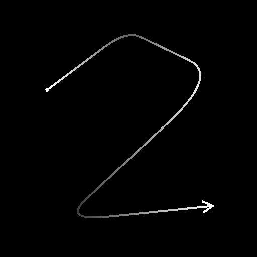

# Transforme 2D spline

<table>
<tr style="border: 0;">
<td width="33.33%" style="border: 0;" valign="top">

<b>Entrée :</b> Outils Spline Et Tracé > Outils spline

</td>
<td width="100.00%" style="border: 0;" valign="top">

## Description

Applique une transformation globale à toutes les splines d&#39;entrée, y compris l&#39;inversion de leur direction.

</td>
</tr>
</table>

## Entrées

|  |  |
|:---|:---|
| <b>Aperçu</b> <i>Niveaux de gris</i> | Aperçu des splines d&#39;entrée sous forme d&#39;image en niveaux de gris. |
| <b>Couleurs splines</b> <i>Couleur</i> | Coordonnées des points des splines d&#39;entrée codés dans les canaux RVBA d&#39;une image couleur : <b>R</b> - position X <b>G</b> - position Y <b>B</b> - Height <b>A</b> - données compressées : - Signe : la spline est fermée (négative) ou ouverte (positive); - Valeur absolue : Thickness + 1. |
| <b>Données splines</b> <i>Couleur</i> | Données supplémentaires des splines d&#39;entrée codées dans les canaux RVBA d&#39;une image couleur. <b>R</b> - Tangentes X <b>G</b> - Tangentes Y <b>B</b> - Inutilisé <b>A</b> - Inutilisé |
| <b>Quantité de spline</b> <i>Entier</i> | Nombre de splines d&#39;entrée. |

## Sorties

|  |  |
|:---|:---|
| <b>Aperçu</b> <i>Niveaux de gris</i> | Aperçu des splines de sortie sous forme d&#39;image en niveaux de gris. |
| <b>Couleurs splines</b> <i>Couleur</i> | Coordonnées des points des splines de sortie codés dans les canaux RVBA d&#39;une image couleur. <b>R</b> - Position X <b>G</b> - Position Y <b>B</b> - Height <b>A</b> - Données compressées : - Signe : la spline est fermée (négative) ou ouverte (positive); - Valeur absolue : Thickness + 1. |
| <b>Données splines</b> <i>Couleur</i> | Données supplémentaires des splines de sortie codées dans les canaux RVBA d&#39;une image couleur. <b>R</b> - Tangentes X <b>G</b> - Tangentes Y <b>B</b> - Inutilisé <b>A</b> - Inutilisé |
| <b>Quantité de spline</b> <i>Entier</i> | Nombre de splines de sortie. |

## Paramètres

|  |  |
|:---|:---|
| <b>Inverser la direction</b> <i>Booléen</i> | Inverse la direction de la spline. |
| <b>Matrice de transformation</b> <i>Flottant4</i> | Matrice de transformation appliquée aux splines. Trois modes de modification des paramètres de matrice sont disponibles :  - <i>gadget de transformation</i> : ajustez les poignées du widget affiché dans la vue 2D lorsque le nœud de Transforme Spline 2D est sélectionné ; - <i>Rotation/Étire</i> : contrôlez individuellement la rotation et le étiré des splines. Notez que les valeurs sont toujours appliquées par rapport à la transformation courante. Par exemple, l&#39;application d&#39;une largeur de 50 % deux fois donne une largeur de 25 %; - <i>Valeurs de matrice</i> : cliquez sur le bouton Modifier les valeurs de matrice pour saisir directement les valeurs numériques brutes de la matrice. |
| <b>Décalage</b> <i>Flottant 2</i> | Applique un décalage de position aux splines en X (horizontal) et Y (vertical). |
| <b>Aperçu</b> |  |
| <b>Afficher l&#39;Assistant de la direction</b> <i>Booléen</i> | Affiche un point au début de la spline et une flèche à sa fin dans la sortie Aperçu. |
| <b>Afficher l&#39;enveloppe de Thickness</b> <i>Booléen</i> | Affiche des lignes supplémentaires sur les bords du thickness de la spline. |
| <b>Quantité de segments</b> <i>Entier</i> | Ajuste le nombre de segments utilisés pour dessiner la visualisation de la spline dans la sortie Aperçu. Plus la valeur est élevée, plus la ligne est lisse. |
| <b>Thickness (px)</b> <i>Flottant</i> | Règle le thickness de visualisation de la spline en pixels dans la sortie Aperçu. |

## Exemples

<table>
<tr style="border: 0;">
<td style="border: 0;" valign="top">

<table>
  <tr>
    <td>
      
       <i>Avant</i>
    </td>
    <td>
      
       <i>Après</i>
    </td>
  </tr>
</table>

</td>
<td style="border: 0;" valign="top">

<table>
  <tr>
    <td>
      
       <i>Avant</i>
    </td>
    <td>
      
       <i>Après</i>
    </td>
  </tr>
</table>

</td>
</tr>
</table>

<table>
<tr style="border: 0;">
<td style="border: 0;" valign="top">

</td>
<td style="border: 0;" valign="top">

</td>
</tr>
</table>
