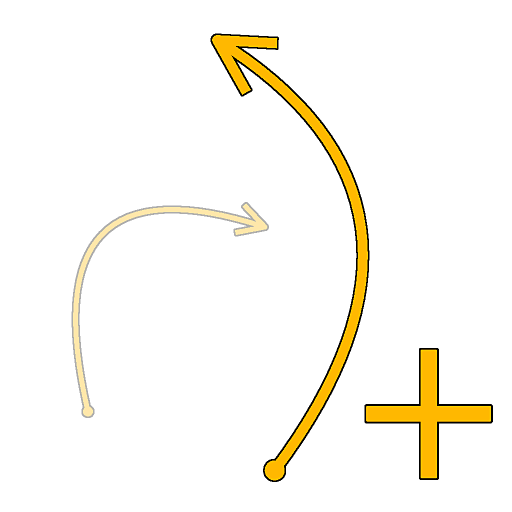
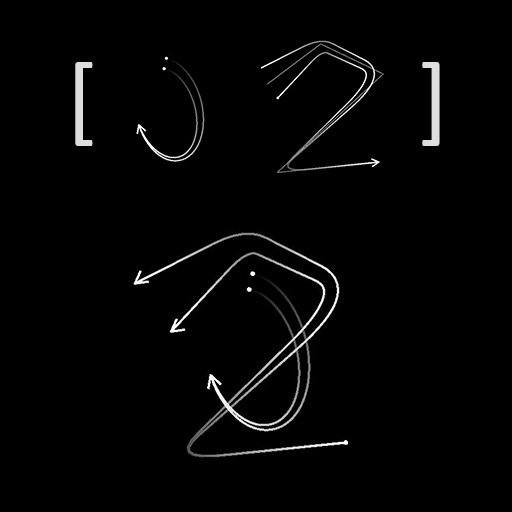

# Ajouter une spline

<table>
<tr style="border: 0;">
<td width="33.33%" style="border: 0;" valign="top">

<b>Entrée :</b> Outils Spline Et Tracé > Outils spline

</td>
<td width="100.00%" style="border: 0;" valign="top">

## Description

Les splines sont regroupées sous forme de liste. Ce nœud ajoute une liste de splines d&#39;entrée (#2) à une liste existante (#1).

L&#39;ordre des listes est conservé, c&#39;est-à-dire que l&#39;ajout d&#39;une liste D-E-F sur une liste A-B-C donne une liste A-B-C-D-E-F.

</td>
</tr>
</table>

>[!TIP]
>
> Soyez attentif à l&#39;ordre dans lequel vous ajoutez des splines, car cet ordre est pris en compte dans d&#39;autres nœuds, tels que les nœuds [Dispersion sur splines](../../../../../../compositing-graphs/nodes-reference-for-com/node-library/spline-paths-tools/spline-tools/scatter-on-spline-color/scatter-on-spline-color.md), [Spline Bridge](../../../../../../compositing-graphs/nodes-reference-for-com/node-library/spline-paths-tools/spline-tools/spline-bridge-list/spline-bridge-list.md), etc.

## Entrées

|  |  |
|:---|:---|
| <b>Aperçu #1</b> <i>Niveaux de gris</i> | Aperçu du premier jeu de splines d&#39;entrée sous la forme d&#39;une image en niveaux de gris. |
| <b>Spline #1 Coords</b> <i>Couleur</i> | Coordonnées du premier ensemble de points des splines d&#39;entrée codés dans les canaux RVBA d&#39;une image couleur. <b>R</b> - Position X <b>G</b> - Position Y <b>B</b> - Height <b>A</b> - Données compressées : - Signe : la spline est fermée (négative) ou ouverte (positive); - Valeur absolue : Thickness + 1. |
| <b>Données de #1 spline</b> <i>Couleur</i> | Données supplémentaires du premier ensemble de splines d&#39;entrée codées dans les canaux RVBA d&#39;une image couleur. <b>R</b> - Tangentes X <b>G</b> - Tangentes Y <b>B</b> - Inutilisé <b>A</b> - Inutilisé |
| <b>Quantité de #1 spline</b> <i>Nombre entier</i> | Nombre de splines d&#39;entrée dans le premier jeu. |
| <b>Aperçu #2</b> <i>Niveaux de gris</i> | Aperçu du deuxième jeu de splines d&#39;entrée sous la forme d&#39;une image en niveaux de gris. |
| <b>Spline #2 Coords</b> <i>Couleur</i> | Coordonnées du deuxième ensemble de points des splines d&#39;entrée codés dans les canaux RVBA d&#39;une image couleur. <b>R</b> - Position X <b>G</b> - Position Y <b>B</b> - Height <b>A</b> - Données compressées : - Signe : la spline est fermée (négative) ou ouverte (positive); - Valeur absolue : Thickness + 1. |
| <b>Données de #2 spline</b> <i>Couleur</i> | Données supplémentaires du deuxième ensemble de splines d&#39;entrée codées dans les canaux RVBA d&#39;une image couleur. <b>R</b> - Tangentes X <b>G</b> - Tangentes Y <b>B</b> - Inutilisé <b>A</b> - Inutilisé |
| <b>Quantité de #2 spline</b> <i>Nombre entier</i> | Nombre de splines d&#39;entrée dans le deuxième jeu. |

## Sorties

|  |  |
|:---|:---|
| <b>Aperçu</b> <i>Niveaux de gris</i> | Aperçu des splines de sortie sous forme d’image en niveaux de gris. |
| <b>Couleurs splines</b> <i>Couleur</i> | Coordonnées des points des splines de sortie codés dans les canaux RVBA d&#39;une image couleur. <b>R</b> - Position X <b>G</b> - Position Y <b>B</b> - Height <b>A</b> - Données compressées : - Signe : la spline est fermée (négative) ou ouverte (positive); - Valeur absolue : Thickness + 1. |
| <b>Données splines</b> <i>Couleur</i> | Données supplémentaires des splines de sortie codées dans les canaux RVBA d&#39;une image couleur. <b>R</b> - Tangentes X <b>G</b> - Tangentes Y <b>B</b> - Inutilisé <b>A</b> - Inutilisé |
| <b>Quantité de spline</b> <i>Nombre entier</i> | Nombre de splines de sortie. |

## Paramètres

|  |  |
|:---|:---|
| <b>Inverser la #1 spline</b> <i>Booléen</i> | Inverse la direction des splines du premier jeu. |
| <b>Inverser la #2 spline</b> <i>Booléen</i> | Inverse la direction des splines du deuxième jeu. |
| <b>Aperçu</b> |  |
| <b>Quantité de segments</b> <i>Nombre entier</i> | Ajuste le nombre de segments utilisés pour dessiner la visualisation de la spline dans la sortie Aperçu. Plus la valeur est élevée, plus la ligne est lisse. |
| <b>Afficher l&#39;assistant de direction</b> <i>Booléen</i> | Affiche un point au début de la spline et une flèche à sa fin dans la sortie Aperçu. |
| <b>Afficher l&#39;enveloppe de Thickness</b> <i>Booléen</i> | Affiche des lignes supplémentaires sur les bords du thickness de la spline. |
| <b>Thickness (px)</b> <i>Flotter</i> | Règle le thickness de visualisation de la spline en pixels dans la sortie Aperçu. |

## Exemples

<table>
<tr style="border: 0;">
<td style="border: 0;" valign="top">

</td>
<td style="border: 0;" valign="top">

</td>
</tr>
</table>

