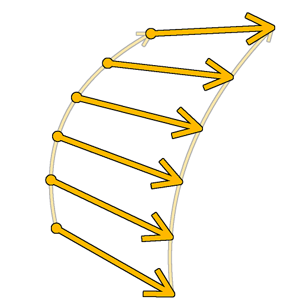

# Pont Spline (2 Splines)

<table>
<tr style="border: 0;">
<td width="33.33%" style="border: 0;" valign="top">

<b>Entrée :</b> Outils Spline Et Tracé > Outils spline

</td>
<td width="100.00%" style="border: 0;" valign="top">

## Description

Génère des splines de <b>#1 spline</b> à <b>#2 spline</b> le long de ces splines. Les splines générées peuvent être linéaires (droites) ou cubiques (courbes).

</td>
</tr>
</table>

>[!IMPORTANT]
>
> Si les données fournies aux entrées <b>Spline #1</b> et <b>Spline #2</b> contiennent plusieurs splines, seule la dernière spline de chaque liste est utilisée.

## Entrées

|  |  |
|:---|:---|
| <b>Aperçu #1</b> <i>Niveaux de gris</i> | L&#39;aperçu des splines d&#39;entrée #1 sous forme d&#39;image en niveaux de gris. |
| <b>Cœurs splines #1</b> <i>Couleur</i> | Les coordonnées des points des splines d&#39;entrée #1 codées dans les canaux RVBA d&#39;une image couleur. <b>R</b> - Position X <b>G</b> - Position Y <b>B</b> - Height <b>A</b> - Données compressées : - Signe : la spline est fermée (négative) ou ouverte (positive); - Valeur absolue : Thickness + 1. |
| <b>#1 de données splines</b> <i>Couleur</i> | Données supplémentaires des splines d&#39;entrée #1 codées dans les canaux RVBA d&#39;une image couleur. <b>R</b> - Tangentes X <b>G</b> - Tangentes Y <b>B</b> - Inutilisé <b>A</b> - Inutilisé |
| <b>Quantité de spline #1</b> <i>Nombre entier</i> | Nombre de splines d&#39;entrée #1. |
| <b>Aperçu #2</b> <i>Niveaux de gris</i> | L&#39;aperçu des splines d&#39;entrée #2 sous forme d&#39;image en niveaux de gris. |
| <b>Cœurs splines #2</b> <i>Couleur</i> | Coordonnées des points de #2 des splines d&#39;entrée codés dans les canaux RVBA d&#39;une image couleur. <b>R</b> - Position X <b>G</b> - Position Y <b>B</b> - Height <b>A</b> - Données compressées : - Signe : la spline est fermée (négative) ou ouverte (positive); - Valeur absolue : Thickness + 1. |
| <b>#2 de données splines</b> <i>Couleur</i> | Données supplémentaires des splines d&#39;entrée #2 codées dans les canaux RVBA d&#39;une image couleur. <b>R</b> - Tangentes X <b>G</b> - Tangentes Y <b>B</b> - Inutilisé <b>A</b> - Inutilisé |
| <b>Quantité de spline #2</b> <i>Nombre entier</i> | Nombre de splines d&#39;entrée #2. |
| <b>Courbe de longueur tangente de début</b> <i>Niveaux de gris</i> (disponible lorsque « Bridge Splines Type » est défini sur « Cubic Bézier ») | Image décrivant une courbe en utilisant les valeurs de sa première ligne de pixels. Cette entrée est utilisée pour contrôler la longueur des tangentes de sortie pour le point de départ de chaque spline générée le long des #1 de spline. Vous pouvez utiliser un nœud de courbe pour créer la courbe. |
| <b>Courbe de rotation tangente de départ</b> <i>Niveaux de gris</i> (disponible lorsque « Bridge Splines Type » est défini sur « Cubic Bézier ») | Image décrivant une courbe en utilisant les valeurs de sa première ligne de pixels. Cette entrée est utilisée pour contrôler la rotation des tangentes de sortie pour le point de départ de chaque spline générée le long de la spline #1. La valeur de niveaux de gris de l&#39;image représente un certain nombre de tours. Vous pouvez utiliser un nœud Courbe pour créer la courbe. |
| <b>Courbe de longueur tangente de fin</b> <i>Niveaux de gris</i> (disponible lorsque « Bridge Splines Type » est défini sur « Cubic Bézier ») | Image décrivant une courbe en utilisant les valeurs de sa première ligne de pixels. Cette entrée est utilisée pour contrôler la longueur des tangentes d&#39;entrée pour le point d&#39;extrémité de chaque spline générée le long de la spline #2. Vous pouvez utiliser un nœud Courbe pour créer la courbure. |
| <b>Courbe de rotation tangente de fin</b> <i>Niveaux de gris</i> (disponible lorsque « Bridge Splines Type » est défini sur « Cubic Bézier ») | Image décrivant une courbe en utilisant les valeurs de sa première ligne de pixels. Cette entrée est utilisée pour contrôler la rotation des tangentes d&#39;entrée pour le point d&#39;extrémité de chaque spline générée le long de la spline #2. La valeur de niveaux de gris de l&#39;image représente un certain nombre de tours. Vous pouvez utiliser un nœud Courbe pour créer la courbe. |

## Sorties

|  |  |
|:---|:---|
| <b>Aperçu</b> <i>Niveaux de gris</i> | Aperçu des splines de sortie sous forme d’image en niveaux de gris. |
| <b>Couleurs splines</b> <i>Couleur</i> | Coordonnées des points des splines de sortie codés dans les canaux RVBA d&#39;une image couleur. <b>R</b> - Position X <b>G</b> - Position Y <b>B</b> - Height <b>A</b> - Données compressées : - Signe : la spline est fermée (négative) ou ouverte (positive); - Valeur absolue : Thickness + 1. |
| <b>Données splines</b> <i>Couleur</i> | Données supplémentaires des splines de sortie codées dans les canaux RVBA d&#39;une image couleur. <b>R</b> - Tangentes X <b>G</b> - Tangentes Y <b>B</b> - Inutilisé <b>A</b> - Inutilisé |
| <b>Quantité de spline</b> <i>Nombre entier</i> | Nombre de splines de sortie. |

## Paramètres

|  |  |
|:---|:---|
| <b>Quantité de splines du pont</b> <i>Nombre entier</i> | Nombre de splines générées le long de la spline #1 à la spline #2. |
| <b>Type de splines Bridge</b> <i>Nombre entier</i> | Type de spline générée :  - Linéaire : spline droite du début à la fin ; - Cubique de Bézier : spline courbe du début à la fin, la courbe étant contrôlée par la longueur et l&#39;angle des points de début et de fin. |
| <b>Démarrer la spline #1</b> <i>Flotter</i> | Décale l&#39;emplacement le long des #1 splines à partir duquel les splines sont générées. Cette valeur correspond à la longueur normalisée des #1 splines. Plus la valeur est élevée, plus le même nombre de splines est tassé de manière serrée. |
| <b>Démarrer la spline #2</b> <i>Flotter</i> | Décale l&#39;emplacement le long des #2 splines à partir duquel les splines sont générées. Cette valeur correspond à la longueur normalisée des #2 splines. Plus la valeur est élevée, plus le même nombre de splines est tassé de manière serrée. |
| <b>Terminer la spline #1</b> <i>Flotter</i> | Décale l&#39;emplacement le long des #1 splines jusqu&#39;à l&#39;endroit où les splines sont générées. Cette valeur correspond à la longueur normalisée des #1 splines. Une valeur inférieure a pour effet de tasser un nombre identique de splines plus serrées. |
| <b>Terminer la spline #1</b> <i>Flotter</i> | Décale l&#39;emplacement le long des #2 splines jusqu&#39;à l&#39;endroit où les splines sont générées. Cette valeur correspond à la longueur normalisée des #2 splines. Une valeur inférieure a pour effet de tasser un nombre identique de splines plus serrées. |
| <b>Décaler la spline #1</b> <i>Flotter</i> | Applique un décalage au point de départ de toutes les splines situées le long des #1 splines. La valeur est la longueur normalisée de la spline #1. Les splines qui correspondent au début ou à la fin de la spline y sont laissées. |
| <b>Décaler la spline #2</b> <i>Flotter</i> | Applique un décalage au point de départ de toutes les splines situées le long des #2 splines. La valeur est la longueur normalisée de la spline #2. Les splines qui correspondent au début ou à la fin de la spline y sont laissées. |
| <b>Décalage aléatoire de début</b> <i>Flotter</i> | Applique un décalage aléatoire au point de départ de chaque spline le long du #1 de spline. Cette valeur correspond à la distance normalisée entre les splines sur les #1 #1 splines. Lorsqu&#39;on laisse la valeur 0, les splines sont espacées régulièrement entre les points de #1 Spline de début et Spline de fin. |
| <b>Décaler la fin aléatoire</b> <i>Flotter</i> | Applique un décalage aléatoire au point d&#39;extrémité de chaque spline le long du #2 de spline. Cette valeur correspond à la distance normalisée entre les splines sur les #2 #2 splines. Lorsqu&#39;on laisse la valeur 0, les splines sont espacées régulièrement entre les points de #2 Spline de début et Spline de fin. |
| <b>Début de la longueur tangente</b> <i>Flottant</i> (disponible lorsque « Bridge Splines Type » est défini sur « Cubic Bézier ») | Longueur de la tangente de sortie du point de départ sur la spline #1 de toutes les splines générées. |
| <b>Fin de longueur tangente</b> <i>Flottant</i> (disponible lorsque « Bridge Splines Type » est défini sur « Cubic Bézier ») | Longueur de la tangente d&#39;entrée du point d&#39;extrémité sur la spline #2 de toutes les splines générées. |
| <b>Début de rotation tangente</b> <i>Flottant</i> (disponible lorsque « Bridge Splines Type » est défini sur « Cubic Bézier ») | Rotation de la tangente de sortie du point de départ sur la spline #1 de toutes les splines générées. La valeur est un nombre de tours. |
| <b>Fin de la rotation de la Tangente</b> <i>Flottant</i> (disponible lorsque « Bridge Splines Type » est défini sur « Cubic Bézier ») | Rotation de la tangente d&#39;entrée du point d&#39;extrémité sur la spline #2 de toutes les splines générées. La valeur est un nombre de tours. |
| <b>Aperçu</b> |  |
| <b>Quantité de segments</b> <i>Nombre entier</i> | Ajuste le nombre de segments utilisés pour dessiner la visualisation de la spline dans la sortie Aperçu. Plus la valeur est élevée, plus la ligne est lisse. |
| <b>Afficher l&#39;assistant de direction</b> <i>Booléen</i> | Affiche un point au début de la spline et une flèche à sa fin dans la sortie Aperçu. |
| <b>Afficher l&#39;enveloppe de Thickness</b> <i>Booléen</i> | Affiche des lignes supplémentaires sur les bords du thickness de la spline. |
| <b>Thickness (px)</b> <i>Flotter</i> | Règle le thickness de visualisation de la spline en pixels dans la sortie Aperçu. |

## Exemples

<table>
<tr style="border: 0;">
<td style="border: 0;" valign="top">

<table>
  <tr>
    <td>
      
       <i>Avant</i>
    </td>
    <td>
      
       <i>Après</i>
    </td>
  </tr>
</table>

</td>
<td style="border: 0;" valign="top">

</td>
</tr>
</table>
