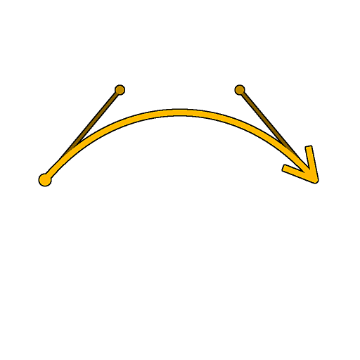

# Spline (Cubique)

<table>
<tr style="border: 0;">
<td width="33.33%" style="border: 0;" valign="top">

<b>Entrée :</b> Outils Spline Et Tracé > Outils spline

</td>
<td width="100.00%" style="border: 0;" valign="top">

## Description

Génère une spline unique entre deux points <b>p1 </b> et <b>p2</b> à des emplacements arbitraires.

La trajectoire de la spline est contrôlée par la tangente « out » de <b>p1</b> et la tangente « in » de <b>p2</b>.

</td>
</tr>
</table>

## Entrées

|  |  |
|:---|:---|
| <b>Aperçu</b> <i>Niveaux de gris</i> | Aperçu des splines d&#39;entrée sous forme d&#39;image en niveaux de gris. |
| <b>Couleurs splines</b> <i>Couleur</i> | Coordonnées des points des splines d&#39;entrée codés dans les canaux RVBA d&#39;une image couleur : <b>R</b> - position X <b>G</b> - position Y <b>B</b> - Height <b>A</b> - données compressées : - Signe : la spline est fermée (négative) ou ouverte (positive); - Valeur absolue : Thickness + 1. |
| <b>Données splines</b> <i>Couleur</i> | Données supplémentaires des splines d&#39;entrée codées dans les canaux RVBA d&#39;une image couleur. <b>R</b> - Tangentes X <b>G</b> - Tangentes Y <b>B</b> - Inutilisé <b>A</b> - Inutilisé |
| <b>Quantité de spline</b> <i>Nombre entier</i> | Nombre de splines d&#39;entrée. |

## Sorties

|  |  |
|:---|:---|
| <b>Aperçu</b> <i>Niveaux de gris</i> | Aperçu des splines de sortie sous forme d’image en niveaux de gris. |
| <b>Couleurs splines</b> <i>Couleur</i> | Coordonnées des points des splines de sortie codés dans les canaux RVBA d&#39;une image couleur. <b>R</b> - Position X <b>G</b> - Position Y <b>B</b> - Height <b>A</b> - Données compressées : - Signe : la spline est fermée (négative) ou ouverte (positive); - Valeur absolue : Thickness + 1. |
| <b>Données splines</b> <i>Couleur</i> | Données supplémentaires des splines de sortie codées dans les canaux RVBA d&#39;une image couleur. <b>R</b> - Tangentes X <b>G</b> - Tangentes Y <b>B</b> - Inutilisé <b>A</b> - Inutilisé |
| <b>Quantité de spline</b> <i>Nombre entier</i> | Nombre de splines de sortie. |

## Paramètres

|  |  |
|:---|:---|
| <b>Inverser la direction</b> <i>Booléen</i> | Inverse la direction de la spline. |
| <b>Ajouter une spline d&#39;entrée</b> <i>Booléen</i> | Ajoute la spline générée à la fin de la liste des splines connectées aux entrées de <b>spline</b>. |
| <b>Correction Non Carrée</b> <i>Booléen</i> | Ajustez la position et le thickness des points pour conserver la forme de la spline dans des résolutions autres que carrées. Cela a également un impact sur la distribution uniforme. |
| <b>Height</b> |  |
| <b>Height de démarrage</b> <i>Flotter</i> | Ajuste l’height du point p1 où une valeur plus faible signifie un emplacement plus bas ou plus profond. Cela a un impact sur l&#39;height de la spline en p1. |
| <b>Height final</b> <i>Flotter</i> | Ajuste l’height du point p2 où une valeur plus faible signifie un emplacement plus bas ou plus profond. Cela a un impact sur le thickness de la spline à p2. |
| <b>Height de tangence automatique</b> <i>Booléen</i> | Définit automatiquement l&#39;height d&#39;interpolation linéaire des tangentes splines entre l&#39;Height Début et l&#39;Height Fin. |
| <b>Height tangent p1</b> <i>Flottant</i> (disponible lorsque « Height de la Tangente automatique » a la valeur True) | Règle l’height de la tangente de « sortie » du point p1 où une valeur plus faible signifie un emplacement plus bas ou plus profond. Cela a un impact sur l&#39;height le long de la spline lorsqu&#39;il s&#39;éloigne de p1. |
| <b>Height tangent p2</b> <i>Flottant</i> (disponible lorsque « Height de la Tangente automatique » a la valeur True) | Règle l’height de la tangente « entrée » du point p2 où une valeur inférieure signifie un emplacement plus bas ou plus profond. Cela a un impact sur l&#39;height le long de la spline lorsqu&#39;il s&#39;éloigne de p2. |
| <b>Thickness</b> |  |
| <b>Démarrer le Thickness</b> <i>Flotter</i> | Ajuste le thickness du point p1. Cela a un impact sur le thickness de la spline à p1. Remarque : le Thickness est utilisé par des nœuds de spline spécifiques. |
| <b>Fin de Thickness</b> <i>Flotter</i> | Ajuste le thickness du point p2. Cela a un impact sur le thickness de la spline à p2. Remarque : le Thickness est utilisé par des nœuds de spline spécifiques. |
| <b>Thickness tangent automatique</b> <i>Booléen</i> | Définit automatiquement le thickness des tangentes de spline à interpoler linéairement du Thickness de début au Thickness de fin. Remarque : le Thickness est utilisé par des nœuds de spline spécifiques. |
| <b>Thickness tangent p1</b> <i>Flottant</i> (disponible lorsque « Thickness de Tangente automatique » a la valeur True) | Ajuste le thickness de la tangente « out » du point p1. Cela a un impact sur le thickness le long de la spline, car il s&#39;éloigne de p1. Remarque : le Thickness est utilisé par des nœuds de spline spécifiques. |
| <b>Thickness tangent p2</b> <i>Flottant</i> (disponible lorsque « Thickness de Tangente automatique » a la valeur True) | Ajuste le thickness de la tangente « entrée » du point p2. Cela a un impact sur le thickness le long de la spline, car il s&#39;éloigne de p2. Remarque : le Thickness est utilisé par des nœuds de spline spécifiques. |
| <b>Coordonnées Des Points</b> |  |
| <b>p1</b> <i>Float2</i> | Définit la position du point p1 dans l’espace de texture. |
| <b>p1 Tangente</b> <i>Float2</i> | Définit la position de la poignée de tangente « out » du point p1 dans l’espace de texture. |
| <b>p2</b> <i>Float2</i> | Définit la position du point p2 dans l’espace de texture. |
| <b>p2 tangente</b> <i>Float2</i> | Définit la position de la poignée de tangente « entrée » du point p2 dans l’espace de texture. |
| <b>Aperçu</b> |  |
| <b>Afficher les tangentes</b> <i>Booléen</i> | Affiche la tangente de sortie du point p1 et la tangente d’entrée du point p2 dans la sortie d’aperçu. |
| <b>Afficher l&#39;assistant de direction</b> <i>Booléen</i> | Affiche un point au début de la spline et une flèche à sa fin dans la sortie Aperçu. |
| <b>Quantité de segments</b> <i>Nombre entier</i> | Ajuste le nombre de segments utilisés pour dessiner la visualisation de la spline dans la sortie Aperçu. Plus la valeur est élevée, plus la ligne est lisse. |
| <b>Thickness (px)</b> <i>Flotter</i> | Règle le thickness en pixels de la visualisation de la spline dans la sortie Aperçu. |

## Exemples

<table>
<tr style="border: 0;">
<td style="border: 0;" valign="top">

</td>
<td style="border: 0;" valign="top">

</td>
</tr>
</table>

<table>
<tr style="border: 0;">
<td style="border: 0;" valign="top">

</td>
<td style="border: 0;" valign="top">

</td>
</tr>
</table>
