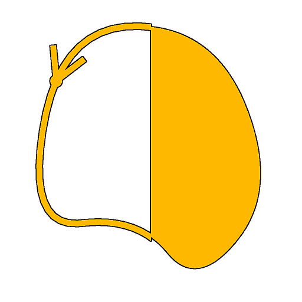

# Remplissage spline

<table>
<tr style="border: 0;">
<td width="33.33%" style="border: 0;" valign="top">

<b>Entrée :</b> Outils Spline Et Tracé > Outils spline

</td>
<td width="100.00%" style="border: 0;" valign="top">

## Description

Remplit l&#39;intérieur des splines d&#39;entrée avec du blanc uni. L&#39;extérieur est rempli de noir uni.

Les splines ouvertes sont fermées par une ligne droite du début à la fin. Les intersections où la spline se croise sont résolues en inversant les côtés intérieur et extérieur des lignes à ces jonctions.

</td>
</tr>
</table>

>[!IMPORTANT]
>
> Il n&#39;est pas recommandé d&#39;utiliser ce nœud sur les splines qui ne se trouvent pas dans la mosaïque [0 ,1]. Le processus de remplissage n&#39;est pas fiable dans ce cas.

## Entrées

|  |  |
|:---|:---|
| <b>Couleurs splines</b> <i>Couleur</i> | Coordonnées des points des splines d&#39;entrée codés dans les canaux RVBA d&#39;une image couleur : <b>R</b> - position X <b>G</b> - position Y <b>B</b> - Height <b>A</b> - données compressées : - Signe : la spline est fermée (négative) ou ouverte (positive); - Valeur absolue : Thickness + 1. |
| <b>Données splines</b> <i>Couleur</i> | Données supplémentaires des splines d&#39;entrée codées dans les canaux RVBA d&#39;une image couleur. <b>R</b> - Tangentes X <b>G</b> - Tangentes Y <b>B</b> - Inutilisé <b>A</b> - Inutilisé |
| <b>Quantité de spline</b> <i>Entier</i> | Nombre de splines d&#39;entrée. |

## Sorties

|  |  |
|:---|:---|
| <b>Sortie</b> <i>Niveaux de gris</i> | Image finale du remplissage des splines d’entrée avec un blanc plat sur un arrière-plan noir plat. |

## Exemples

<table>
<tr style="border: 0;">
<td style="border: 0;" valign="top">

<table>
  <tr>
    <td>
      
       <i>Avant</i>
    </td>
    <td>
      
       <i>Après</i>
    </td>
  </tr>
</table>

</td>
<td style="border: 0;" valign="top">

</td>
</tr>
</table>
