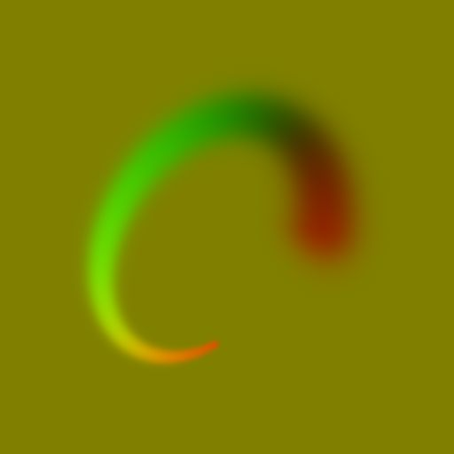

# Spline Flow Mapper

<table>
<tr style="border: 0;">
<td width="33.33%" style="border: 0;" valign="top">

<b>Entrée :</b> Outils Spline Et Tracé > Outils spline

</td>
<td width="100.00%" style="border: 0;" valign="top">

## Description

Dessine une carte d&#39;enchaînement où les données vectorielles d&#39;enchaînement sont dessinées le long des splines d&#39;entrée.

Cela vous permet d&#39;utiliser des splines pour contrôler la direction, la trajectoire, l&#39;intensité et le thickness du flux, ainsi que le dégradé utilisé pour fondre les données dessinées dans l&#39;arrière-plan neutre.

</td>
</tr>
</table>

>[!IMPORTANT]
>
> Il peut en résulter des artefacts indésirables en dehors de l&#39;enveloppe de la spline lors de l&#39;utilisation de valeurs de thickness très faibles. Il s’agit d’un problème connu.

## Connecteurs d’entrée

<b>Couleurs splines</b> *Couleur* Les coordonnées des points des splines d&#39;entrée codées dans les couches RVBA d&#39;une image couleur :\
<b> R</b> - Position X\
<b> G</b> - Position Y\
<b> B</b> - Height\
<b>A</b> - Données compressées :\
* Signe : la spline est fermée (négative) ou ouverte (positive);\
* Valeur absolue : Thickness + 1.

<b>Données splines</b> *Couleur* Données supplémentaires des splines d&#39;entrée codées dans les canaux RVBA d&#39;une image couleur.\
<b> R</b> - Tangentes X\
<b> G</b> - Tangentes Y\
<b> B</b> - Inutilisé\
<b> A</b> - Inutilisé

<b>Quantité de spline</b> *Nombre entier* Nombre de splines d&#39;entrée.

<b>Courbe De Profil D&#39;Atténuation</b> *Niveaux de gris* L&#39;image décrivant une courbe en utilisant les valeurs de sa première ligne de pixels.\
Lorsque le paramètre Profil d&#39;atténuation est défini sur Courbe de profil d&#39;entrée, cette entrée est utilisée pour contrôler la gamme de dégradé pour l&#39;atténuation des données vectorielles d&#39;écoulement dessinées le long de la spline.\
Vous pouvez utiliser un nœud [Courbe](../../../../../../compositing-graphs/nodes-reference-for-com/atomic-nodes/curve/curve.md) pour créer la courbe.

## Connecteurs de sortie

<b>Sortie</b> *Couleur* La carte de flux de sortie codée dans une image couleur.

## Paramètres

<b>Quantité de segments</b> Les splines *entières* sont simplifiées en segments avant que les données de flux vectoriel ne les traversent.\
Plus le nombre de segments est élevé, plus la cartographie de flux le long des courbes est fluide.

<b>Mode</b> *Entier* Méthode de sélection des splines le long desquelles les données de flux vectoriel doivent être dessinées :\
*- Dessiner la liste des splines* : toutes les splines de la liste d&#39;entrée sont utilisées ;\
*- Dessiner une seule spline* : seule la spline avec l&#39;index spécifié est utilisée ;\
*- Dessiner la plage de splines* : seules les splines dont l&#39;index est inclus dans la plage spécifiée sont utilisées.

<b>Dessiner l&#39;index spline</b> *Nombre entier* (disponible lorsque le mode est défini sur Tracer une seule spline)Index de la spline le long de laquelle les données de flux vectoriel doivent être tracées.

<b>Tracer la plage de splines</b> *Entier2* (disponible lorsque le mode est défini sur Tracer la plage de splines) Plage d&#39;index pour les splines le long desquelles les données de flux vectoriel doivent être tracées.

<b>Mode Thickness</b> *Entier* Méthode de définition du thickness des données de flux vectoriel dessinées\
*- Manuel* : définissez le thickness explicitement avec une valeur arbitraire ;\
*- À partir de la spline* : utilisez le thickness de la spline.

<b>Thickness</b> *Float* (disponible lorsque le mode Thickness est défini sur Manuel)Valeur arbitraire pour le thickness des données de flux vectoriel dessinées le long des splines.<b></b>

<b>Multiplicateur de Thickness</b> *Flottant* (disponible lorsque le mode Thickness est défini sur Spline)Multiplicateur global pour le thickness des données de flux vectoriel dessinées le long des splines, lorsque ce thickness est piloté par celui des splines.

<b>Direction</b> *Nombre entier* La direction du flux vectoriel par rapport à la spline.\
*- Tangente* : utilisez le vecteur tangent de la spline ;\
*- Normal* : utilisez le vecteur normal de la spline ;\
*- Mise en miroir normale* : utilisez la version mise en miroir du vecteur normal de la spline.

<b>Inverser la direction</b> *Booléen* Inverse la direction des splines, ce qui a également un impact sur la direction du vecteur d&#39;écoulement.

<b>Profil d&#39;atténuation</b> *Nombre entier* Le dégradé utilisé pour dessiner l&#39;atténuation des données vectorielles d&#39;écoulement dessinées le long de la spline :\
*- Linéaire* : utiliser une rampe de dégradé linéaire ;\
*- Gaussien* : utiliser un dégradé de dégradé gaussien\
*- Courbe de profil d&#39;entrée* : utilisez la courbe fournie à l&#39;entrée de la courbe de profil d&#39;atténuation comme dégradé.

<b>Démarrer l&#39;atténuation</b> *Booléen* Ajoute un demi-cercle au début de la spline. Le demi-cercle utilise la même atténuation que la spline.

<b>Fin de l&#39;atténuation</b> *Booléen* Ajoute un demi-cercle à l&#39;extrémité de la spline. Le demi-cercle utilise la même atténuation que la spline.

<b>Atténuation De L&#39;Height De La Spline</b> *Flottant* L’intensité des données vectorielles de flux dessinées le long de la spline est multipliée par rapport à l’height de la spline, où les données dessinées s’estompent jusqu’à la couleur neutre (0,5, 0,5, 0) de l’arrière-plan à mesure que l’height se rapproche de 0.

<b>Correction non carrée </b>*Booléenne* Ajustez la position et le thickness des points pour conserver la forme de spline dans des résolutions non carrées.\
Cela a également un impact sur la distribution uniforme.

## Exemples

<table>
<tr style="border: 0;">
<td style="border: 0;" valign="top">

<table>
  <tr>
    <td>
      
       <i>Avant</i>
    </td>
    <td>
      
       <i>Après</i>
    </td>
  </tr>
</table>

</td>
<td style="border: 0;" valign="top">

</td>
</tr>
</table>
