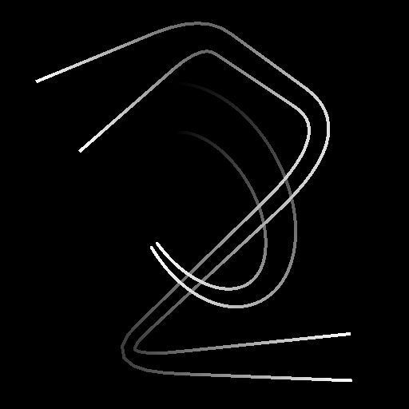

# Couleur du mappeur de spline

<table>
<tr style="border: 0;">
<td width="33.33%" style="border: 0;" valign="top">

<b>Entrée :</b> Outils Spline Et Tracé > Outils spline

</td>
<td width="100.00%" style="border: 0;" valign="top">

## Description

Permet de mapper une image couleur d’entrée sur une forme primitive étirée le long des splines d’entrée.

La forme primitive peut être un plan, un demi-cylindre ou un cylindre. Les cylindres peuvent être tordus le long de la spline pour déformer l&#39;image mappée en conséquence.

</td>
</tr>
</table>

Le nœud produit l&#39;image mappée sous la forme d&#39;une image couleur, ainsi que d&#39;autres informations telles que l&#39;height, les UV (c&#39;est-à-dire les coordonnées de l&#39;image) et un masque d&#39;ID pour sélectionner chaque spline mappée indépendamment.

>[!IMPORTANT]
>
> Il peut en résulter des artefacts indésirables en dehors de l&#39;enveloppe de la spline lors de l&#39;utilisation de valeurs de thickness très faibles. Il s’agit d’un problème connu.

>[!NOTE]
>
> Voir aussi [Niveaux de gris du mappeur de spline](../../../../../../compositing-graphs/nodes-reference-for-com/node-library/spline-paths-tools/spline-tools/spline-mapper-grayscale/spline-mapper-grayscale.md).

## Connecteurs d’entrée

<b>Couleurs splines</b> *Couleur* Les coordonnées des points des splines d&#39;entrée codées dans les couches RVBA d&#39;une image couleur :\
<b> R</b> - Position X\
<b> G</b> - Position Y\
<b> B</b> - Height\
    <b>A</b> - Données compressées :\
        * Signe : la spline est fermée (négative) ou ouverte (positive);\
        * Valeur absolue : Thickness + 1.

<b>Données splines</b> *Couleur* Données supplémentaires des splines d&#39;entrée codées dans les canaux RVBA d&#39;une image couleur.\
<b> R</b> - Tangentes X\
<b> G</b> - Tangentes Y\
<b> B</b> - Inutilisé\
<b> A</b> - Inutilisé

<b>Quantité de spline</b> *Nombre entier* Nombre de splines d&#39;entrée.

<b>Color Map</b> *Couleur* L&#39;image couleur d&#39;entrée qui doit être mappée le long des splines d&#39;entrée.

<b>Mappage de l&#39;Height</b> *Niveaux de gris* La courbe d&#39;height des niveaux de gris en entrée qui doit être mappée le long des splines en entrée.

<b>Twist curve</b> *Niveaux de gris* L&#39;image décrivant une courbe en utilisant les valeurs de sa première ligne de pixels.\
Lorsque le paramètre <b>Forme</b> est défini sur *Demi-cylindre* ou *Cylindre*, cette entrée est utilisée pour contrôler la torsion des UV autour de la forme. Son impact est contrôlé à l&#39;aide du paramètre <b>Multiplicateur de courbe de torsion des UV</b>.\
La courbe fournit un profil pour le degré de rotation le long de la spline, où le premier pixel de la ligne est la rotation au début de la spline, et le dernier est la rotation à la fin. La valeur Niveaux de gris représente un nombre de tours.\
Vous pouvez utiliser un nœud [Courbe](../../../../../../compositing-graphs/nodes-reference-for-com/atomic-nodes/curve/curve.md) pour créer la courbe.

## Connecteurs de sortie

<b>Couleur</b> *Couleur* Résultat du mappage de l&#39;image couleur d&#39;entrée sur les splines d&#39;entrée, en tant qu&#39;image couleur.

<b>Height</b> *Niveaux de gris* Résultat du mappage de l&#39;image d&#39;Height d&#39;entrée sur les splines d&#39;entrée, en tant qu&#39;image en niveaux de gris.

<b>UV</b> *Couleur* Les UV (c&#39;est-à-dire les coordonnées) du mappage sur les splines d&#39;entrée, codés dans une image couleur.

<b>ID</b> *Niveaux de gris* Un masque des images mappées le long des splines d&#39;entrée, où les valeurs de blanc sont incrémentées de 1 d&#39;une spline à la suivante afin que chaque forme puisse être sélectionnée indépendamment.

## Paramètres

<b>Quantité de segments</b> Les splines *entières* sont simplifiées en segments avant que les coordonnées de l&#39;image ne les traversent.\
Plus le nombre de segments est élevé, plus le placage le long des courbes est fluide.

<b>Mise à l&#39;échelle automatique des UV</b> *Booléen* Ajuste automatiquement l&#39;échelle des coordonnées pour conserver une image carrée lors du mappage le long des splines.<b></b>

<b>Échelle UV</b> *Float2* Ajuste l&#39;échelle des coordonnées mappées en X (horizontalement) et Y (verticalement).\
Plus la valeur est élevée, plus la mosaïque de l&#39;image est dense.<b></b>

<b>Mode</b> *Entier* Méthode de sélection des splines le long desquelles l&#39;image doit être mappée :\
*- Dessiner la liste des splines* : toutes les splines de la liste d&#39;entrée sont utilisées ;\
*- Dessiner une seule spline* : seule la spline avec l&#39;index spécifié est utilisée ;\
*- Dessiner la plage de splines* : seules les splines dont l&#39;index est inclus dans la plage spécifiée sont utilisées.

<b>Dessiner l&#39;index spline</b> *Nombre entier* (disponible lorsque le mode est défini sur Tracer une seule spline)Index de la spline le long de laquelle l&#39;image doit être mappée.

<b>Tracer la plage de splines</b> *Entier2* (disponible lorsque le mode est défini sur Tracer la plage de splines) Plage d&#39;index pour les splines le long desquelles l&#39;image doit être mappée.

<b>Démarrer</b> *Flottant* Décale le début de la partie de la spline qui doit être mappée.\
Cette valeur représente la longueur normalisée de la spline.

<b>Fin</b> *Flottant* Décale l&#39;extrémité de la partie de la spline qui doit être mappée.\
Cette valeur représente la longueur normalisée de la spline.

<b>Mode Thickness</b> *Entier* Méthode de définition du thickness de l&#39;image mappée :\
*- Manuel* : définissez le thickness explicitement avec une valeur arbitraire ;\
*- À partir de la spline* : utilisez le thickness de la spline.

<b>Thickness</b> *Flottant* (disponible lorsque le mode Thickness est défini sur Manuel)Valeur arbitraire pour le thickness de l&#39;image mappée le long des splines.<b></b>

<b>Multiplicateur de Thickness</b> *Flottant* (disponible lorsque le mode Thickness est défini sur Spline)Multiplicateur global pour le thickness de l&#39;image mappée le long des splines, lorsque ce thickness est piloté par celui des splines.

<b>Forme</b> *Nombre entier* Forme primitive utilisée pour mapper les coordonnées de l&#39;image le long des splines :\
*- Plan* : les coordonnées sont mappées à un plan plat ;\
*- Demi-cylindre* : les coordonnées sont mappées à un demi-cylindre dont l&#39;axe du cercle de base suit la direction de la spline ;\
*- Cylindre* : les coordonnées sont mappées à un cylindre dont l&#39;axe du cercle de base suit la direction de la spline.<b></b>

<b>Multiplicateur d&#39;Height du cylindre</b> *Flotter* (disponible lorsque « Forme » est défini sur « Demi-cylindre » ou « Cylindre »)Un multiplicateur pour l&#39;intensité de la contribution de l&#39;height du cylindre dans la sortie d&#39;Height.\
Les ajustements d’Height sont cumulatifs.

<b>Décalage de l&#39;Height du cylindre</b> *Flottant* (disponible lorsque l&#39;option Forme est définie sur Demi-cylindre ou Cylindre) \
Décale le centre du profil en forme de cylindre ou de demi-cylindre par rapport à la surface de la spline d&#39;un diamètre sous la surface.

<b>Intensité de torsion des UV</b> *Flotter* (disponible lorsque « Forme » est défini sur « Demi-cylindre » ou « Cylindre »)La torsion des coordonnées de l&#39;image autour du cylindre, en nombre de tours.\
La torsion consiste à faire tourner le cylindre uniquement à l&#39;extrémité de la cannelure. La rotation est ensuite interpolée le long de la spline.

<b>Multiplicateur de courbe de torsion UV</b> *Flotter* (disponible lorsque « Forme » est défini sur « Demi-cylindre » ou « Cylindre »)Un multiplicateur pour l’intensité de la contribution de l’entrée du Twist curve à la torsion du cylindre.\
La courbe fournit un profil pour le degré de rotation le long de la spline, où le premier pixel de la ligne est la rotation au début de la spline, et le dernier est la rotation à la fin. La valeur Niveaux de gris représente un nombre de tours.

<b>Décalage de la courbe de torsion UV</b> *Flotter* (disponible lorsque l&#39;option Forme est définie sur Demi-cylindre ou Cylindre)applique un décalage global aux valeurs de rotation fournies par le Twist curve, en nombre de tours.

<b>Multiplicateur d&#39;Height spline</b> *Flottant* Ajuste l’intensité de la contribution de l’entrée d’Height spline à la sortie d’Height.\
Les ajustements d&#39;Height sont cumulatifs.<b></b>

<b>Multiplicateur d&#39;Height d&#39;entrée</b> *Flottant* Ajuste l’intensité de la contribution de l’entrée de la carte d’Height à la sortie d’Height.\
Les ajustements d&#39;Height sont cumulatifs.<b></b>

<b>Couleur d&#39;arrière-plan</b> *Float4* La couleur de l’arrière-plan dans la sortie Couleur.

<b>Correction non carrée </b>*Booléenne* Ajustez la position et le thickness des points pour conserver la forme de spline dans des résolutions non carrées.\
Cela a également un impact sur la distribution uniforme.

## Exemples

<table>
<tr style="border: 0;">
<td style="border: 0;" valign="top">

<table>
  <tr>
    <td>
      
       <i>Avant</i>
    </td>
    <td>
      
       <i>Après</i>
    </td>
  </tr>
</table>

</td>
<td style="border: 0;" valign="top">

</td>
</tr>
</table>

<table>
<tr style="border: 0;">
<td style="border: 0;" valign="top">

</td>
<td style="border: 0;" valign="top">

</td>
</tr>
</table>
