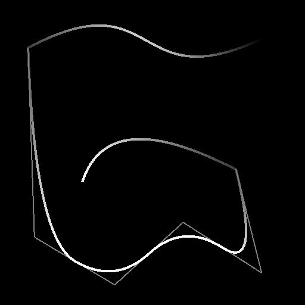

# Spline (polyquadratique)

<table>
<tr style="border: 0;">
<td width="33.33%" style="border: 0;" valign="top">

<b>Entrée :</b> Outils Spline Et Tracé > Outils spline

</td>
<td width="100.00%" style="border: 0;" valign="top">

## Description

Génère une spline sur plusieurs points. La quantité et les emplacements de ces points peuvent être arbitraires ou rassemblés à partir d&#39;un nœud [Liste de points](../../../../../../compositing-graphs/nodes-reference-for-com/node-library/spline-paths-tools/spline-tools/point-list/point-list.md).

</td>
</tr>
</table>

La trajectoire de la spline peut être lissée à partir de ses points intermédiaires, en ce sens que chaque point intermédiaire est le point de rencontre des tangentes « out » et « in » de ses voisins.

## Entrées

|  |  |
|:---|:---|
| <b>Aperçu</b> <i>Niveaux de gris</i> | Aperçu des splines d’entrée sous forme d’image en niveaux de gris. |
| <b>Couleurs splines</b> <i>Couleur</i> | Coordonnées des points des splines d&#39;entrée codés dans les canaux RVBA d&#39;une image couleur : <b>R</b> - position X <b>G</b> - position Y <b>B</b> - Height <b>A</b> - données compressées :  - signe : la spline est fermée (négative) ou ouverte (positive);  - Valeur absolue : Thickness + 1. |
| <b>Données splines</b> <i>Couleur</i> | Données supplémentaires des splines d&#39;entrée codées dans les canaux RVBA d&#39;une image couleur. <b>R</b> - Tangentes X <b>G</b> - Tangentes Y <b>B</b> - Inutilisé <b>A</b> - Inutilisé |
| <b>Quantité de spline</b> <i>Entier</i> | Nombre de splines d&#39;entrée. |
| <b>Aperçu Des Points</b> <i>Niveaux de gris</i> | Aperçu des points sous forme d’image en niveaux de gris. |
| <b>Liste des points d&#39;entrée</b> <i>Couleur</i> | (disponible lorsque l’option Utiliser la liste des points d’entrée a la valeur True) Liste de points codés dans les canaux RVBA d’une image couleur : <b>R</b> - Position X <b>G</b> - Position Y <b>B</b> - Height <b>A</b> - Données compressées :  - Partie Entier : Smoothness ;  - Partie fractionnaire : Thickness. |
| <b>Numéro De Point</b> <i>Nombre entier</i> | (disponible lorsque l’option Utiliser la liste des points d’entrée a la valeur True) Le nombre de points. |

>[!IMPORTANT]
>
> Les connecteurs <b>Liste de points</b> et <b>Numéro de point</b> ne sont *pas compatibles* avec les connecteurs <b>Cordon spline</b>, <b>Données spline</b> et <b>Quantité spline</b>, car ils reposent sur des données différentes.

## Sorties

|  |  |
|:---|:---|
| <b>Aperçu</b> <i>Niveaux de gris</i> | Aperçu des splines de sortie sous forme d’image en niveaux de gris. |
| <b>Couleurs splines</b> <i>Couleur</i> | Coordonnées des points des splines de sortie codés dans les canaux RVBA d&#39;une image couleur. <b>R</b> - Position X <b>G</b> - Position Y <b>B</b> - Height <b>A</b> - Données compressées :  - Signe : la spline est fermée (négative) ou ouverte (positive);  - Valeur absolue : Thickness + 1. |
| <b>Données splines</b> <i>Couleur</i> | Données supplémentaires des splines de sortie codées dans les canaux RVBA d&#39;une image couleur. <b>R</b> - Tangentes X <b>G</b> - Tangentes Y <b>B</b> - Inutilisé <b>A</b> - Inutilisé |
| <b>Quantité de spline</b> <i>Nombre entier</i> | Nombre de splines de sortie. |

## Paramètres

|  |  |
|:---|:---|
| <b>Quantité De Points</b> <i>Nombre entier</i> | Nombre arbitraire de points utilisés pour construire la spline. |
| <b>Mode de connexion Spline d&#39;entrée</b> <i>Nombre entier</i> | Méthode utilisée pour connecter les splines d&#39;entrée : - <i>Auto :</i> La fin de la dernière spline d&#39;entrée est connectée au début de la spline générée, et la fin de la spline générée est connectée au début de la première spline d&#39;entrée ; - <i>Manuel :</i> Vous pouvez spécifier quelles splines d&#39;entrée doivent être connectées aux extrémités de la spline générée, et où sur les splines d&#39;entrée ces connexions doivent atterrir. |
| <b>Fermer la spline</b> <i>Booléen</i> | Détermine si le point d&#39;extrémité de la spline doit être connecté à son point de départ. Le lissage appliqué à la spline aux points de départ et d&#39;arrivée est spécifié par les valeurs de Smoothness de ces points. |
| <b>Inverser la direction</b> <i>Booléen</i> | Inverse la direction de la spline. |
| <b>Utiliser la liste des points d&#39;entrée</b> <i>Booléen</i> | Utilisez la liste de points fournie dans les connecteurs d’entrée Liste des points d’entrée et Numéro de point au lieu d’une liste arbitraire de points. La liste de points peut être fournie par un nœud [Liste de points](../../../../../../compositing-graphs/nodes-reference-for-com/node-library/spline-paths-tools/spline-tools/point-list/point-list.md). |
| <b>Connecter le démarrage à la spline d&#39;entrée</b> <i>Booléen</i> | Lorsque la valeur est True, le début de la spline générée est connecté au dernier point de la dernière spline dans les splines d&#39;entrée. |
| <b>Démarrer l&#39;index spline de connexion</b> <i>Nombre entier</i> | (Disponible lorsque le mode de connexion de spline d&#39;entrée est défini sur Manuel et que le mode de connexion Démarrer sur spline d&#39;entrée est défini sur Vrai) L&#39;index de la spline d&#39;entrée qui doit être connectée au début de la spline générée. |
| <b>Démarrer la position de connexion</b> <i>Flotter</i> | (Disponible lorsque le mode de connexion de spline d&#39;entrée est défini sur Manuel et que le mode de connexion Démarrer sur spline d&#39;entrée est défini sur Vrai) Position sur la spline d&#39;entrée sélectionnée où la connexion au début de la spline générée doit atterrir. Cette valeur correspond à la longueur normalisée de la spline d&#39;entrée sélectionnée. |
| <b>Connecter la fin à la spline d&#39;entrée</b> <i>Booléen</i> | Lorsque la valeur est True, l&#39;extrémité de la spline générée est connectée au premier point de la première spline dans les splines d&#39;entrée. |
| <b>Fin de l&#39;index spline de connexion</b> <i>Nombre entier</i> | (Disponible lorsque le mode de connexion de spline d&#39;entrée est défini sur Manuel et que le mode de connexion Fin de spline d&#39;entrée est défini sur Vrai) L&#39;index de la spline d&#39;entrée qui doit être connectée à l&#39;extrémité de la spline générée. |
| <b>Terminer la position de connexion</b> <i>Flotter</i> | (Disponible lorsque l&#39;option Mode de connexion de spline d&#39;entrée est définie sur Manuel et l&#39;option Connecter l&#39;extrémité à la spline d&#39;entrée est définie sur Vrai) Position sur la spline d&#39;entrée sélectionnée où la connexion à l&#39;extrémité de la spline générée doit atterrir. Cette valeur correspond à la longueur normalisée de la spline d&#39;entrée sélectionnée. |
| <b>Distribution uniforme</b> <i>Booléen</i> | Lorsque la valeur est True, les points de la spline sont régulièrement espacés du début à la fin. |
| <b>Ajouter une spline d&#39;entrée</b> <i>Booléen</i> | Ajoute la spline générée à la fin de la liste des splines connectées aux entrées de <b>spline</b>. |
| <b>Correction Non Carrée</b> <i>Booléen</i> | Ajustez la position et le thickness des points pour conserver la forme de la spline dans des résolutions autres que carrées. Cela a également un impact sur la distribution uniforme. |
| <b>Ajustement du Smoothness global</b> <i>Flotter</i> | Applique un décalage uniforme à la valeur par smoothness de tous les points. La valeur de smoothness résultante est répartie sur la plage [0;1]. |
| <b>Propriétés des points</b> |  |
| <b>p# Propriétés</b> <i>Float3</i> | Définit les propriétés du point p#. - <i>Height :</i> Ajuste l&#39;height du point où une valeur inférieure signifie un emplacement plus bas ou plus profond ; - <i>Smoothness :</i> décale le début du lissage de la spline à p#, où une valeur de 0 entraîne une trajectoire dure et une valeur de 1 une trajectoire entièrement lisse ; - <i>Thickness :</i> ajuste le thickness de la spline à p#. Le thickness est utilisé par des nœuds Spline spécifiques. |
| <b>Coordonnées Des Points</b> |  |
| <b>p#</b> <i>Float2</i> | Définit la position du point p# dans l’espace de texture. |
| <b>Aperçu</b> |  |
| <b>Afficher les tangentes</b> <i>Booléen</i> | Affiche les tangentes des points p1 et p3 sur p2 dans la sortie Aperçu. |
| <b>Afficher l&#39;assistant de direction</b> <i>Booléen</i> | Affiche un point au début de la spline et une flèche à sa fin dans la sortie Aperçu. |
| <b>Afficher l&#39;enveloppe de Thickness</b> <i>Booléen</i> | Affiche des lignes supplémentaires sur les thickness de la spline. |
| <b>Afficher le libellé des points</b> <i>Booléen</i> | Pour chaque point, affiche le nom du point en regard de celui-ci dans la sortie « Aperçu ». |
| <b>Taille de l&#39;étiquette des points</b> <i>Flotter</i> | (Disponible lorsque l’option Afficher le libellé des points est définie sur Vrai) Taille du libellé de chaque point dans l’espace de texture, où 0,1 correspond à un dixième de la largeur de la texture. |
| <b>Afficher les points</b> <i>Booléen</i> | Affiche les points de contrôle de la spline. |
| <b>Taille Des Points</b> <i>Flotter</i> | (Disponible lorsque l’option Afficher les points est définie sur Vrai) Le rayon des points dans l’espace de texture, où 0,1 correspond à un dixième de la largeur de la texture. |
| <b>Quantité de segments</b> <i>Nombre entier</i> | Ajuste le nombre de segments utilisés pour dessiner la visualisation de la spline dans la sortie d&#39;aperçu. Plus la valeur est élevée, plus la ligne est lisse. |
| <b>Thickness (px)</b> <i>Flotter</i> | Règle le thickness de visualisation de la spline en pixels dans la sortie Aperçu. |

## Exemples

<table>
<tr style="border: 0;">
<td style="border: 0;" valign="top">

<table>
  <tr>
    <td>
      
       <i>Avant</i>
    </td>
    <td>
      
       <i>Après</i>
    </td>
  </tr>
</table>

</td>
<td style="border: 0;" valign="top">

</td>
</tr>
</table>
