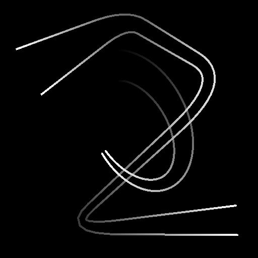

# Rendu spline

<table>
<tr style="border: 0;">
<td style="border: 0;" valign="top">

<table>
<tr style="border: 0;">
<td width="33.33%" style="border: 0;" valign="top">

<b>Entrée :</b> Outils Spline Et Tracé > Outils spline

</td>
<td width="100.00%" style="border: 0;" valign="top">

## Description

Trace des chaînes de segments le long des <b>splines</b> d&#39;entrée sur l&#39;<b>arrière-plan</b> d&#39;entrée.

</td>
</tr>
</table>

## Connecteurs d’entrée

<b>Arrière-plan </b>*en niveaux de gris* Image en niveaux de gris sur laquelle les splines doivent être dessinées.

<b>Couleurs splines</b> *Couleur* Les coordonnées des points des splines d&#39;entrée codées dans les couches RVBA d&#39;une image couleur :\
<b> R</b> - Position X\
<b> G</b> - Position Y\
<b> B</b> - Height\
    <b>A</b> - Données compressées :\
        * Signe : la spline est fermée (négative) ou ouverte (positive);\
        * Valeur absolue : Thickness + 1.

<b>Données splines</b> *Couleur* Données supplémentaires des splines d&#39;entrée codées dans les canaux RVBA d&#39;une image couleur.\
<b> R</b> - Tangentes X\
<b> G</b> - Tangentes Y\
<b> B</b> - Inutilisé\
<b> A</b> - Inutilisé

<b>Quantité de spline</b> *Nombre entier* Nombre de splines d&#39;entrée.

## Connecteurs de sortie

<b>Sortie</b> *Niveaux de gris*\
Image finale du dessin des splines d’entrée sur l’arrière-plan.

## Paramètres

<b>Mode</b> *Nombre entier* Méthode de sélection des splines à tracer :
* *Dessiner la liste des splines* : dessinez toutes les splines dans la liste d&#39;entrée ;
* *Dessiner une seule spline* : dessinez uniquement la spline spécifiée à partir de la liste d&#39;entrée ;
* *Dessiner une plage de splines* : dessinez uniquement les splines de la plage spécifiée à partir de la liste d&#39;entrée.

<b>Dessiner l&#39;index spline</b> *Nombre entier* (disponible lorsque le mode est défini sur Tracer une seule spline)Index de la spline à tracer.

<b>Tracer la plage de splines</b> *Entier2* (disponible lorsque le mode est défini sur Tracer la plage de splines) Plage d&#39;index des splines à tracer.

<b>Afficher l&#39;assistant de direction</b> *Booléen* Pour chaque spline, dessine un point au début de la spline et une pointe de flèche à son extrémité.

<b>Quantité de segments</b> *Nombre entier* Ajuste le nombre de segments dessinés le long des splines.\
Plus la valeur est élevée, plus les lignes sont lisses.

<b>Quantité de spline de l&#39;enveloppe</b> *Nombre entier*\
Nombre de segments dupliqués à tracer le long du thickness de chaque spline.

<b>Démarrer</b> *Flottant* Décale le début de la partie de la spline qui doit être dessinée.\
Cette valeur représente la longueur normalisée de la spline.

<b>Fin</b> *Flottant* Décale l&#39;extrémité de la partie de la spline qui doit être dessinée.\
Cette valeur représente la longueur normalisée de la spline.

<b>Mode Taille de Thickness</b> *Nombre entier* Méthode de calcul du thickness des segments dessinés :
* *Image* : la valeur est normalisée dans l&#39;espace de texture, où 1 correspond à la largeur totale de l&#39;image. le thickness est relatif à la résolution de texture;
* *Pixel* : la valeur est un nombre absolu de pixels dans la texture, où 1 est un pixel entier. Le thickness est distinct de la résolution de la texture.

<b>Thickness (image)</b> *Flottant* (disponible lorsque le mode Taille du Thickness est défini sur Image)Le thickness des segments dessinés est normalisé dans l’espace de texture, où 1 correspond à la largeur totale de l’image.

<b>Thickness (px)</b> *Flottant* (disponible lorsque le mode Taille du Thickness est défini sur Pixel)Le thickness des segments dessinés est un nombre absolu de pixels dans la texture, où 1 correspond à un pixel entier.

<b>Activer les liaisons</b> *Booléen* Comble les espaces entre les segments individuels dessinés le long des splines, à l&#39;aide de disques.

<b>Correction non carrée </b>*Booléenne* Ajustez la position et le thickness des points pour conserver la forme de spline dans des résolutions non carrées.\
Cela a également un impact sur la distribution uniforme.

+++Couleur
<b>Intensité de l&#39;arrière-plan</b> *Variable* Valeur multipliée par rapport à l’image d’entrée d’arrière-plan.

<b>Style de spline</b> *Nombre entier* Méthode utilisée pour colorer les splines :
* *Solide* : les segments sont dessinés à l&#39;aide d&#39;une valeur de niveaux de gris uniforme ;
* *Dégradé* : un dégradé du noir au blanc est appliqué le long de chaque chaîne de segments du début à la fin ;
* *Height* : l&#39;height des splines est utilisé comme valeur de niveaux de gris pour dessiner les segments.

<b>Couleur de la spline</b> *Flottant* Valeur de niveaux de gris uniforme utilisée pour dessiner les segments.\
Lorsqu’un style de spline autre que Uni est sélectionné, cette couleur est multipliée par rapport à la couleur stylisée.

<b>Luminance aléatoire</b> *Flottant* Pour chaque chaîne de segments non découpés dans une spline, applique un décalage aléatoire dans la plage spécifiée à la valeur de niveaux de gris utilisée pour dessiner cette chaîne.

<b>Mode de fusion</b> *Entier* Méthode de fusion des couleurs de l’arrière-plan et des segments qui se chevauchent dessinés le long des splines :
* *Max* : la valeur la plus lumineuse est utilisée ;
* *Ajouter* : les valeurs sont ajoutées ensemble.

+++

+++Segments aléatoires
<b>Début des segments aléatoires</b> *Flottant* Ajuste la probabilité que la chaîne de segments la plus proche du début de la spline soit coupée.

<b>Fin des segments aléatoires</b> *Flottant* Ajuste la probabilité que la chaîne de segments la plus proche de l&#39;extrémité de la spline soit coupée.

<b>Décalage aléatoire</b> *Flottant* Définit la quantité maximale de displacement appliquée à chaque segment coupé le long de sa normale.\
Ce paramètre n’a aucun effet lorsque les valeurs Début et Fin sont toutes deux définies sur 0.

<b>Décalage aléatoire au centre</b> *Flottant* Décale le centre du displacement aléatoire appliqué à chaque segment coupé le long de sa normale.

+++

## Exemples

<table>
<tr style="border: 0;">
<td style="border: 0;" valign="top">

<table>
  <tr>
    <td>
      
       <i>Avant</i>
    </td>
    <td>
      
       <i>Après</i>
    </td>
  </tr>
</table>

</td>
<td style="border: 0;" valign="top">

<table>
  <tr>
    <td>
      
       <i>Avant</i>
    </td>
    <td>
      
       <i>Après</i>
    </td>
  </tr>
</table>

</td>
</tr>
</table>

<table>
<tr style="border: 0;">
<td style="border: 0;" valign="top">

<table>
  <tr>
    <td>
      
       <i>Avant</i>
    </td>
    <td>
      
       <i>Après</i>
    </td>
  </tr>
</table>

</td>
<td style="border: 0;" valign="top">

</td>
</tr>
</table>

</td>
<td style="border: 0;" valign="top">

</td>
<td style="border: 0;" valign="top">

</td>
</tr>
</table>
