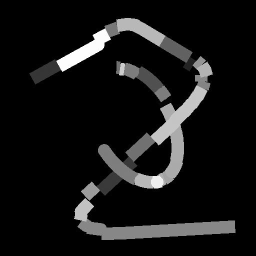
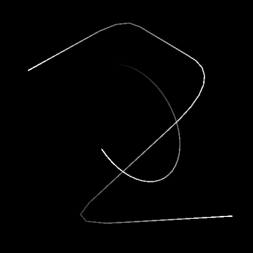

# Rendu spline

<table>
<tr style="border: 0;">
<td width="33.33%" style="border: 0;" valign="top">

<b>Entrée :</b> Outils Spline Et Tracé > Outils spline

</td>
<td width="100.00%" style="border: 0;" valign="top">

## Description

Trace des chaînes de segments le long des <b>splines</b> d&#39;entrée sur l&#39;<b>arrière-plan</b> d&#39;entrée.

</td>
</tr>
</table>

## Entrées

|  |  |
|:---|:---|
| <b>Arrière-plan</b> <i>Niveaux de gris</i> | Image en niveaux de gris sur les splines à tracer. |
| <b>Couleurs splines</b> <i>Couleur</i> | Coordonnées des points des splines d&#39;entrée codés dans les canaux RVBA d&#39;une image couleur : <b>R</b> - position X <b>G</b> - position Y <b>B</b> - Height <b>A</b> - données compressées :  - signe : la spline est fermée (négative) ou ouverte (positive);  - Valeur absolue : Thickness + 1. |
| <b>Données splines</b> <i>Couleur</i> | Données supplémentaires des splines d&#39;entrée codées dans les canaux RVBA d&#39;une image couleur. <b>R</b> - Tangentes X <b>G</b> - Tangentes Y <b>B</b> - Inutilisé <b>A</b> - Inutilisé |
| <b>Quantité de spline</b> <i>Nombre entier</i> | Nombre de splines d&#39;entrée. |

## Sorties

|  |  |
|:---|:---|
| <b>Sortie</b> <i>Niveaux de gris</i> | Image finale du dessin des splines d’entrée sur l’arrière-plan. |

## Paramètres

|  |  |
|:---|:---|
| <b>Mode</b> <i>Nombre entier</i> | Méthode de sélection des splines à tracer : - <i>Dessiner une spline</i> : tracez toutes les splines dans la liste d&#39;entrée ; - <i>Dessiner une spline</i> : tracez uniquement la spline spécifiée à partir de la liste d&#39;entrée ; - <i>Tracer une plage de splines</i> : tracez uniquement les splines dans la plage spécifiée à partir de la liste d&#39;entrée. |
| <b>Dessiner l&#39;index spline</b> <i>Nombre entier</i> | (Disponible lorsque le mode est défini sur Tracer une seule spline) L&#39;index de la spline qui doit être tracée. |
| <b>Tracer la plage de splines</b> <i>Entier2</i> | (Disponible lorsque le mode est défini sur Tracer la plage de splines) Plage d&#39;index des splines à tracer. |
| <b>Afficher l&#39;assistant de direction</b> <i>Booléen</i> | Pour chaque spline, dessine un point au début de la spline et une flèche à son extrémité. |
| <b>Quantité de segments</b> <i>Nombre entier</i> | Ajuste le nombre de segments dessinés le long des splines. Plus la valeur est élevée, plus les lignes sont lisses. |
| <b>Quantité de spline de l&#39;enveloppe</b> <i>Nombre entier</i> | Nombre de segments dupliqués à tracer le long du thickness de chaque spline. |
| <b>Démarrer</b> <i>Flotter</i> | Décale le début de la partie de la spline à dessiner. La valeur représente la longueur normalisée de la spline. |
| <b>Fin</b> <i>Flotter</i> | Décale l&#39;extrémité de la partie de la spline à dessiner. La valeur représente la longueur normalisée de la spline. |
| <b>Mode Taille de Thickness</b> <i>Nombre entier</i> | Méthode de calcul du thickness des segments dessinés : - <i>Image</i> : la valeur est normalisée dans l&#39;espace de texture, où 1 correspond à la largeur totale de l&#39;image. Le thickness est relatif à la résolution de la texture ; - <i>Pixel</i> : la valeur est un nombre absolu de pixels dans la texture, où 1 est un pixel entier. Le thickness est distinct de la résolution de la texture. |
| <b>Thickness (image)</b> <i>Flotter</i> | (disponible lorsque le mode Taille du Thickness est défini sur Image) Le thickness des segments dessinés est normalisé dans l’espace de texture, où 1 correspond à la largeur totale de l’image. |
| <b>Thickness (px)</b> <i>Flotter</i> | (disponible lorsque le mode Taille du Thickness est défini sur Pixel) Le thickness des segments dessinés est un nombre absolu de pixels dans la texture, où 1 est un pixel entier. |
| <b>Activer les liaisons</b> <i>Booléen</i> | Remplit les espaces entre les segments individuels dessinés le long des splines à l&#39;aide de disques. |
| <b>Correction Non Carrée</b> <i>Booléen</i> | Ajustez la position et le thickness des points pour conserver la forme de la spline dans des résolutions autres que carrées. Cela a également un impact sur la distribution uniforme. |
| <b>Couleur</b> |  |
| <b>Intensité de l&#39;arrière-plan</b> <i>Flotter</i> | Valeur multipliée par rapport à l’image d&#39;entrée Arrière-plan. |
| <b>Style de spline</b> <i>Nombre entier</i> | Méthode utilisée pour colorer les splines : - <i>Solide</i> : les segments sont dessinés à l&#39;aide d&#39;une valeur de niveaux de gris uniforme ; - <i>Dégradé</i> : un dégradé du noir au blanc est appliqué le long de chaque chaîne de segments du début à la fin ; - <i>Height</i> : l&#39;height des splines est utilisé comme valeur de niveaux de gris pour dessiner les segments. |
| <b>Couleur de la spline</b> <i>Flotter</i> | Valeur de niveaux de gris uniforme utilisée pour dessiner les segments. Lorsqu&#39;un style de spline autre que « Uni » est sélectionné, cette couleur est multipliée par rapport à la couleur stylisée. |
| <b>Luminance aléatoire</b> <i>Flotter</i> | Pour chaque chaîne de segments non découpés dans une spline, applique un décalage aléatoire dans la plage spécifiée à la valeur de niveaux de gris utilisée pour dessiner cette chaîne. |
| <b>Mode de fusion</b> <i>Nombre entier</i> | Méthode de fusion des couleurs de l&#39;arrière-plan et des segments superposés dessinés le long des splines : - <i>Max</i> : la valeur la plus lumineuse est utilisée ; - <i>Add</i> : les valeurs sont ajoutées ensemble. |
| <b>Segments Aléatoires</b> |  |
| <b>Début des segments aléatoires</b> <i>Flotter</i> | Règle la probabilité de coupure de la chaîne de segments la plus proche du début de la spline. |
| <b>Fin des segments aléatoires</b> <i>Flotter</i> | Règle la probabilité de coupure de la chaîne de segments la plus proche de l&#39;extrémité de la spline. |
| <b>Décalage aléatoire</b> <i>Flotter</i> | Définit la quantité maximale de displacement appliquée à chaque segment coupé le long de sa normale. Ce paramètre n&#39;a aucun effet lorsque Début et Fin sont tous deux définis sur 0. |
| <b>Décalage aléatoire au centre</b> <i>Flotter</i> | Décale le centre du displacement aléatoire appliqué à chaque segment coupé le long de sa normale. |

## Exemples

<table>
<tr style="border: 0;">
<td style="border: 0;" valign="top">

<table>
  <tr>
    <td>
      
       <i>Avant</i>
    </td>
    <td>
      
       <i>Après</i>
    </td>
  </tr>
</table>

</td>
<td style="border: 0;" valign="top">

<table>
  <tr>
    <td>
      
       <i>Avant</i>
    </td>
    <td>
      
       <i>Après</i>
    </td>
  </tr>
</table>

</td>
</tr>
</table>

<table>
<tr style="border: 0;">
<td style="border: 0;" valign="top">

<table>
  <tr>
    <td>
      
       <i>Avant</i>
    </td>
    <td>
      
       <i>Après</i>
    </td>
  </tr>
</table>

</td>
<td style="border: 0;" valign="top">

</td>
</tr>
</table>
