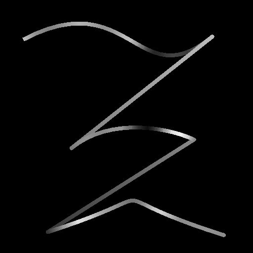

# Height d&#39;échantillon spline

<table>
<tr style="border: 0;">
<td style="border: 0;" valign="top">

<table>
<tr style="border: 0;">
<td width="33.33%" style="border: 0;" valign="top">

<b>Entrée :</b> Outils Spline Et Tracé > Outils spline

</td>
<td width="100.00%" style="border: 0;" valign="top">

## Description

Modifie l&#39;height des splines d&#39;entrée en mappant une courbe d&#39;Height d&#39;entrée sur elles.

L’effet de la courbe de transfert d’height mappée peut être ajusté en modifiant son mode de fusion et l’opacité de cet effet.

</td>
</tr>
</table>

## Connecteurs d’entrée

<b>Aperçu</b> *Niveaux de gris* Aperçu des splines d&#39;entrée sous la forme d&#39;une image en niveaux de gris.

<b>Couleurs splines</b> *Couleur* Les coordonnées des points des splines d&#39;entrée codées dans les couches RVBA d&#39;une image couleur :\
<b> R</b> - Position X\
<b> G</b> - Position Y\
<b> B</b> - Height\
<b>A</b> - Données compressées :\
* Signe : la spline est fermée (négative) ou ouverte (positive);\
* Valeur absolue : Thickness + 1.

<b>Données splines</b> *Couleur* Données supplémentaires des splines d&#39;entrée codées dans les canaux RVBA d&#39;une image couleur.\
<b> R</b> - Tangentes X\
<b> G</b> - Tangentes Y\
<b> B</b> - Inutilisé\
<b> A</b> - Inutilisé

<b>Quantité de spline</b> *Nombre entier* Nombre de splines d&#39;entrée.

<b>Mappage de l&#39;Height</b> *Niveaux de gris* Image en niveaux de gris utilisée pour modifier l&#39;height de la spline d&#39;entrée.

## Connecteurs de sortie

<b>Aperçu</b> *Niveaux de gris* L’aperçu des splines de sortie sous forme d’image en niveaux de gris.

<b>Couleurs splines</b> *Couleur* Les coordonnées des points splines de sortie sont codées dans les couches RVBA d&#39;une image couleur.\
<b>R</b> - Position X\
<b>G</b> - Position Y\
<b>B</b> - Height\
<b>A</b> - Données compressées :\
* Signe : la spline est fermée (négative) ou ouverte (positive);\
* Valeur absolue : Thickness + 1.

<b>Données splines</b> *Couleur* Données supplémentaires des splines de sortie codées dans les canaux RVBA d&#39;une image couleur.\
<b>R</b> - Tangentes X\
<b>G</b> - Tangentes Y\
<b>B</b> - Inutilisé\
<b>A</b> - Inutilisé

<b>Quantité de spline</b> *Nombre entier* Nombre de splines de sortie.

## Paramètres

<b>Mode d&#39;échantillonnage</b> *Entier* Méthode de mappage des valeurs de l&#39;Height Mapper sur les splines :\
*- Espace de texture* : les valeurs sont appliquées aux splines où elles se trouveraient si elles étaient placées dans une texture à l&#39;aide des coordonnées UV de la texture. Cela applique effectivement la valeur aux cannelures « en place »;\
*- Horizontal le long de la spline* : les valeurs sont appliquées directement aux coordonnées des splines codées (voir Entrée des cordons de spline), où chaque ligne est appliquée à une spline différente de haut en bas ;\
*- Heure. le long de la spline (rand. offset X)* : les valeurs sont appliquées directement aux coordonnées des splines codées (voir entrée Spline Coords), avec un décalage horizontal aléatoire dans la carte d&#39;échelle pour chaque spline (c&#39;est-à-dire chaque ligne dans Spline Coords);\
*- Heure. le long de la spline (rand. décalage Y)* : les valeurs sont appliquées directement aux coordonnées des splines codées (voir Entrée des cœurs de spline), avec un décalage vertical aléatoire dans la carte d&#39;échelle pour chaque spline (c&#39;est-à-dire chaque ligne dans les cœurs de spline).

<b>Opacité</b> *Variable* Multiplicateur de l&#39;intensité de la contribution de l&#39;entrée de courbe de transfert d&#39;Height à l&#39;height de la spline.<b></b>

<b>Mode de fusion</b> *Entier* Méthode de fusion des données de la courbe de transfert d&#39;Height avec l&#39;height de la spline d&#39;entrée :\
*- Copier* : remplacer l&#39;height de la spline par les valeurs de courbe de transfert d&#39;Height ;\
*- Add* : ajoutez les valeurs de courbe d&#39;Height à l&#39;height de la spline ;\
*- Soustraire* : soustrayez les valeurs de courbe d&#39;Height à l&#39;height de la spline ;\
*- Multiplier* : multipliez les valeurs de courbe d&#39;Height par rapport à l&#39;height de la spline.

+++Prévisualiser
<b>Quantité de segments</b> *Nombre entier* Ajuste le nombre de segments utilisés pour dessiner la visualisation de la spline dans la sortie d&#39;aperçu.\
Plus la valeur est élevée, plus la ligne est lisse.

<b>Afficher l&#39;assistant de direction</b> *Booléen* Affiche un point au début de la spline et une flèche à sa fin dans la sortie Aperçu.

<b>Afficher l&#39;enveloppe de Thickness</b> *Booléen*\
Affiche des lignes supplémentaires sur les thickness de la spline.

<b>Thickness (px)</b> *Flottant* Ajuste le thickness de la visualisation de la spline en pixels dans la sortie d&#39;aperçu.

+++

## Exemples

<table>
<tr style="border: 0;">
<td style="border: 0;" valign="top">

<table>
  <tr>
    <td>
      
       <i>Avant</i>
    </td>
    <td>
      
       <i>Après</i>
    </td>
  </tr>
</table>

</td>
<td style="border: 0;" valign="top">

<table>
  <tr>
    <td>
      
       <i>Avant</i>
    </td>
    <td>
      
       <i>Après</i>
    </td>
  </tr>
</table>

</td>
</tr>
</table>

<table>
<tr style="border: 0;">
<td style="border: 0;" valign="top">

</td>
<td style="border: 0;" valign="top">

</td>
</tr>
</table>

</td>
<td style="border: 0;" valign="top">

</td>
<td style="border: 0;" valign="top">

</td>
</tr>
</table>
