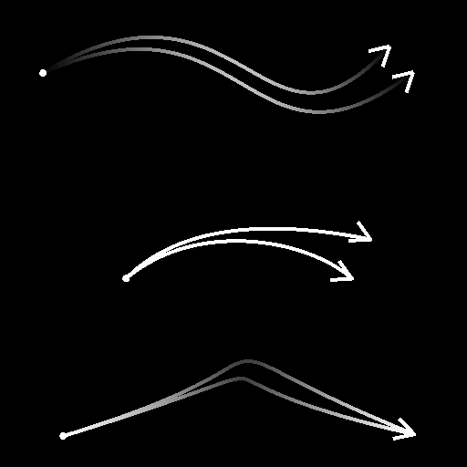

# Sélection spline

<table>
<tr style="border: 0;">
<td style="border: 0;" valign="top">

<table>
<tr style="border: 0;">
<td width="33.33%" style="border: 0;" valign="top">

<b>Entrée :</b> Outils Spline Et Tracé > Outils spline

</td>
<td width="100.00%" style="border: 0;" valign="top">

## Description

Sélectionne les splines dans la liste d&#39;entrée en fonction des critères spécifiés et génère une nouvelle liste incluant uniquement les splines sélectionnées.

Les splines sélectionnées peuvent également être rognées.

</td>
</tr>
</table>

## Connecteurs d’entrée

<b>Aperçu</b> *Niveaux de gris* Aperçu des splines d&#39;entrée sous la forme d&#39;une image en niveaux de gris.

<b>Couleurs splines</b> *Couleur* Les coordonnées des points des splines d&#39;entrée codées dans les couches RVBA d&#39;une image couleur :\
<b> R</b> - Position X\
<b> G</b> - Position Y\
<b> B</b> - Height\
    <b>A</b> - Données compressées :\
        * Signe : la spline est fermée (négative) ou ouverte (positive);\
        * Valeur absolue : Thickness + 1.

<b>Données splines</b> *Couleur* Données supplémentaires des splines d&#39;entrée codées dans les canaux RVBA d&#39;une image couleur.\
<b> R</b> - Tangentes X\
<b> G</b> - Tangentes Y\
<b> B</b> - Inutilisé\
<b> A</b> - Inutilisé

<b>Quantité de spline</b> *Nombre entier* Nombre de splines d&#39;entrée.

## Connecteurs de sortie

<b>Aperçu</b> *Niveaux de gris* L’aperçu des splines de sortie sous forme d’image en niveaux de gris.

<b>Couleurs splines</b> *Couleur* Les coordonnées des points splines de sortie sont codées dans les couches RVBA d&#39;une image couleur.\
    <b>R</b> - Position X\
    <b>G</b> - Position Y\
    <b>B</b> - Height\
    <b>A</b> - Données compressées :\
        * Signe : la spline est fermée (négative) ou ouverte (positive);\
        * Valeur absolue : Thickness + 1.

<b>Données splines</b> *Couleur* Données supplémentaires des splines de sortie codées dans les canaux RVBA d&#39;une image couleur.\
    <b>R</b> - Tangentes X\
    <b>G</b> - Tangentes Y\
    <b>B</b> - Inutilisé\
    <b>A</b> - Inutilisé

<b>Quantité de spline</b> *Nombre entier* Nombre de splines de sortie.

## Paramètres

<b>Mode de sélection</b> *Nombre entier* Méthode de sélection des splines dans la liste d&#39;entrée :\
*- First* : sélectionne la première spline dans la liste ;\
*- Last* : sélectionne la dernière spline dans la liste ;\
*- Index* : sélectionne la spline avec l&#39;index spécifié ;\
*- Plage* : sélectionne les splines dont les index sont inclus dans la plage spécifiée.

<b>Index Spline</b> *Nombre entier* (disponible lorsque le mode de sélection est défini sur Index)L&#39;index de la spline qui doit être sélectionné.

<b>Début de la plage</b> *Nombre entier* (disponible lorsque le mode de sélection est défini sur Plage)Index le plus bas dans la plage de splines sélectionnées.

<b>Fin de plage</b> *Nombre entier* (disponible lorsque le mode de sélection est défini sur Plage)Index le plus élevé dans la plage de splines sélectionnées.<b></b>

<b>Démarrer</b> *Flottant* Décale le début de la partie de la spline qui doit être sélectionnée. Cela permet de raccorder efficacement la spline.\
Cette valeur représente la longueur normalisée de la spline.

<b>Fin</b> *Flottant* Décale l&#39;extrémité de la partie de la spline qui doit être sélectionnée. Cela permet de raccorder efficacement la spline.\
Cette valeur représente la longueur normalisée de la spline.

+++Prévisualiser
<b>Quantité de segments</b> *Nombre entier* Ajuste le nombre de segments utilisés pour dessiner la visualisation de la spline dans la sortie d&#39;aperçu.\
Plus la valeur est élevée, plus la ligne est lisse.

<b>Afficher l&#39;assistant de direction</b> *Booléen* Affiche un point au début de la spline et une flèche à sa fin dans la sortie Aperçu.

<b>Afficher l&#39;enveloppe de Thickness</b> *Booléen*\
Affiche des lignes supplémentaires sur les thickness de la spline.

<b>Thickness (px)</b> *Flottant* Ajuste le thickness de la visualisation de la spline en pixels dans la sortie d&#39;aperçu.

+++

## Exemples

<table>
<tr style="border: 0;">
<td style="border: 0;" valign="top">

<table>
  <tr>
    <td>
      
       <i>Avant</i>
    </td>
    <td>
      
       <i>Après</i>
    </td>
  </tr>
</table>

</td>
<td style="border: 0;" valign="top">

<table>
  <tr>
    <td>
      
       <i>Avant</i>
    </td>
    <td>
      
       <i>Après</i>
    </td>
  </tr>
</table>

</td>
</tr>
</table>

<table>
<tr style="border: 0;">
<td style="border: 0;" valign="top">

</td>
<td style="border: 0;" valign="top">

</td>
</tr>
</table>

</td>
<td style="border: 0;" valign="top">

</td>
<td style="border: 0;" valign="top">

</td>
</tr>
</table>
