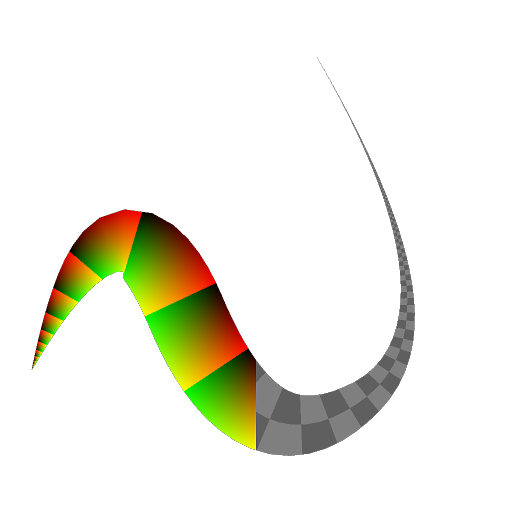
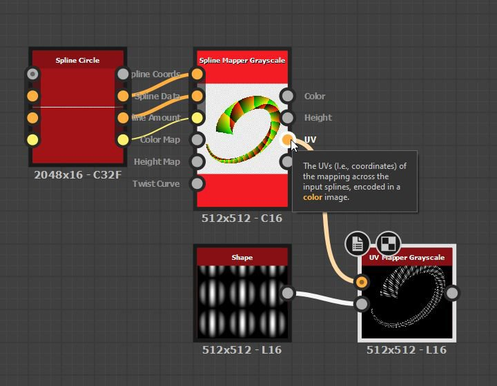

# Mappeur d’UV en niveaux de gris

<table>
<tr style="border: 0;">
<td width="33.33%" style="border: 0;" valign="top">

<b>Entrée :</b> Outils Spline Et Tracé > Outils spline

</td>
<td width="100.00%" style="border: 0;" valign="top">

## Description

Mappe l’image en niveaux de gris d’entrée en utilisant les coordonnées fournies dans l’entrée d’UV.

</td>
</tr>
</table>

>[!NOTE]
>
> Voir aussi [Couleur du mappeur d&#39;UV](../../../../../../compositing-graphs/nodes-reference-for-com/node-library/spline-paths-tools/spline-tools/uv-mapper-color/uv-mapper-color.md).

## Entrées

|  |  |
|:---|:---|
| <b>UV</b> <i>Couleur</i> | Coordonnées d’image codées dans les couches rouge (U) et vert (V) d’une image couleur. |
| <b>Entrée</b> <i>Couleur</i> | Image en niveaux de gris qui doit être mappée aux coordonnées fournies dans l&#39;entrée UV. |

## Sorties

|  |  |
|:---|:---|
| <b>Sortie</b> <i>Couleur</i> | Résultat du mappage de l’Image d&#39;entrée à l’aide des coordonnées d’UV d’entrée, sous la forme d’une image en niveaux de gris. |

## Exemples

<table>
<tr style="border: 0;">
<td style="border: 0;" valign="top">

<table>
  <tr>
    <td>
      
       <i>Avant</i>
    </td>
    <td>
      
       <i>Après</i>
    </td>
  </tr>
</table>

</td>
<td style="border: 0;" valign="top">

<table>
  <tr>
    <td>
      
       <i>Avant</i>
    </td>
    <td>
      
       <i>Après</i>
    </td>
  </tr>
</table>

</td>
</tr>
</table>

