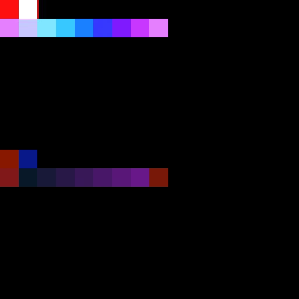

# Utilisation des tracés et des Outils spline

Le jeu d’outils Tracés et splines est une collection de nœuds qui vous permet de créer et de modifier des formes et des courbes indépendantes de la résolution, utilisées pour dessiner, mapper et dispersion des images.

## Vue d’ensemble

### Que sont les tracés et les splines ?

Les <b>tracés</b> sont une série de points connectés en lignes droites.

Les <b>splines</b> sont des courbes lisses dont les trajectoires sont formées par des points de contrôle et les tangentes de ces points.\
Chaque point contrôle également les attributs d&#39;height et de thickness d&#39;une spline, qui sont utilisés pour piloter la mise en correspondance, la déformation et la diffusion des images.

Chacun peut créer des formes fermées ou ouvertes.

<table>
<tr style="border: 0;">
<td width="100.00%" style="border: 0;" valign="top">

### Sortie du nœud

Les nœuds produisent des images qui contiennent des <b>données codées</b> représentant des chemins et des splines.

Par exemple, l&#39;image de droite représente la sortie de l&#39;image par un nœud [Polygone des tracés](../../../../../compositing-graphs/nodes-reference-for-com/node-library/spline-paths-tools/path-tools/paths-polygon/paths-polygon.md).

</td>
<td width="33.33%" style="border: 0;" valign="top">

</td>
</tr>
</table>

Ainsi, les images qu’ils produisent ne sont pas directement utilisables en tant qu’élément graphique. Ils doivent être traités par d&#39;autres nœuds de la palette d&#39;outils qui peuvent les convertir en un résultat graphique qui peut ensuite être utilisé avec les autres nœuds disponibles pour les graphiques de Substance.

Lorsque vous travaillez avec des tracés et des splines, vous pouvez prévisualiser ces objets mappés dans une image à l&#39;aide du nœud [Tracés d&#39;aperçu](../../../../../compositing-graphs/nodes-reference-for-com/node-library/spline-paths-tools/path-tools/preview-paths/preview-paths.md) dédié pour les tracés et de la sortie <b>Aperçu</b> dédiée pour les splines.

<table>
<tr style="border: 0;">
<td width="100.00%" style="border: 0;" valign="top">

### Interaction avec la vue 2D

Un grand nombre de nœuds dans l&#39;ensemble d&#39;outils permettent d&#39;effectuer des modifications directement dans la [vue 2D](../../../../../interface/2d-view/2d-view.md) à l&#39;aide de gadgets de contrôle. Ces gadgets comprennent le widget de position et la matrice de transformation.

Par exemple, les nœuds de génération de splines tels que [Spline (cubique)](../../../../../compositing-graphs/nodes-reference-for-com/node-library/spline-paths-tools/spline-tools/spline-cubic/spline-cubic.md) ou [Spline (polyquadratique)](../../../../../compositing-graphs/nodes-reference-for-com/node-library/spline-paths-tools/spline-tools/spline-poly-quadratic/spline-poly-quadratic.md) vous permettent de déplacer les points de contrôle des splines. Pour les tracés, la commande [Quad Transform on Path](../../../../../compositing-graphs/nodes-reference-for-com/node-library/spline-paths-tools/path-tools/quad-transform-on-path/quad-transform-on-path.md) possède des options similaires lorsqu&#39;elle est sélectionnée.

</td>
<td width="33.33%" style="border: 0;" valign="top">

</td>
</tr>
</table>

### Performance

Les tracés et les outils spline nécessitent des calculs intensifs, à tel point que vous devez tenir compte de quelques paramètres pour assurer les meilleures performances et réactivité lorsque vous travaillez avec l’ensemble d’outils :

1. L&#39;ensemble d&#39;outils utilise largement les fonctionnalités de <b>Substance Engine</b> qui s&#39;exécutent beaucoup plus rapidement sur le GPU. Par conséquent, utilisez la version GPU du moteur pour votre système : <b>Direct3D</b> (Windows) ou <b>OpenGL</b> (macOS).\
   Vous pouvez changer de moteur en appuyant sur la touche <b>F9</b> ou en accédant à <b>Outils > Changer de moteur...</b> dans la barre de menus principale.
1. Ensuite, nous vous recommandons vivement de désactiver la <b>modification contextuelle</b> dans la section <b>Graphe</b> des [Préférences](../../../../../interface/preferences-window/preferences-window.md) (accédez à <b>Modifier > Préférences...</b> dans la barre de menus principale pour accéder à cette fenêtre).\
   L&#39;édition contextuelle vous permet d&#39;ouvrir des instanciers dans le cadre du graphe hôte, ce qui est certes très pratique, mais a pour effet secondaire d&#39;augmenter de manière exponentielle les calculs requis par le cache d&#39;image de l&#39;ensemble d&#39;outils.

Vous remarquerez une amélioration significative des performances lorsque vous modifierez l’un de ces deux paramètres sur l’état recommandé.

## Outils Path

### Génération de tracés

Le [polygone des tracés](../../../../../compositing-graphs/nodes-reference-for-com/node-library/spline-paths-tools/path-tools/paths-polygon/paths-polygon.md) génère un tracé sous la forme d’un polygone dont le rayon et le nombre de côtés sont spécifiés.

Vous pouvez également extraire des tracés d&#39;une image en niveaux de gris à l&#39;aide du nœud [Masquer sur les tracés](../../../../../compositing-graphs/nodes-reference-for-com/node-library/spline-paths-tools/path-tools/mask-to-paths/mask-to-paths.md).\
Il s&#39;agit actuellement de la seule façon de produire des formes complexes. Elle vous permet d&#39;exploiter l&#39;ensemble de la bibliothèque de [nœuds de graphe de Substance](../../../../../compositing-graphs/nodes-reference-for-com/nodes-reference-for-substance-compositing-graphs.md) pour produire les formes qui seront converties en tracés.

{width="600px"}

### Modification des tracés

[Transforme 2D de tracé](../../../../../compositing-graphs/nodes-reference-for-com/node-library/spline-paths-tools/path-tools/path-2d-transform/path-2d-transform.md), [Déformation de tracé](../../../../../compositing-graphs/nodes-reference-for-com/node-library/spline-paths-tools/path-tools/paths-warp/paths-warp.md) et [Transforme quadruple sur tracé](../../../../../compositing-graphs/nodes-reference-for-com/node-library/spline-paths-tools/path-tools/quad-transform-on-path/quad-transform-on-path.md) vous permettent de modifier la forme des tracés.

Vous pouvez également supprimer les chemins indésirables en sélectionnant des chemins par index ou par longueur, à l&#39;aide du nœud [Sélection de chemins](../../../../../compositing-graphs/nodes-reference-for-com/node-library/spline-paths-tools/path-tools/paths-select/paths-select.md).

Un traitement plus complexe peut être effectué sur chaque point d&#39;un tracé à l&#39;aide du nœud [Processeur de Vertex des tracés](../../../../../compositing-graphs/nodes-reference-for-com/node-library/spline-paths-tools/path-tools/paths-vertex-processor/paths-vertex-processor.md). Il existe une version [plus simple](../../../../../compositing-graphs/nodes-reference-for-com/node-library/spline-paths-tools/path-tools/paths-vertex-processor-1/paths-vertex-processor-simple.md) pour des réglages plus légers.

<table>
<tr style="border: 0;">
<td width="100.00%" style="border: 0;" valign="top">

### Nœud Chemins de prévisualisation

L&#39;aperçu du résultat des nœuds Chemins se fait à l&#39;aide du nœud [Chemins d&#39;aperçu](../../../../../compositing-graphs/nodes-reference-for-com/node-library/spline-paths-tools/path-tools/preview-paths/preview-paths.md) dédié.\
Ce nœud n&#39;a pas de sorties. Double-cliquez sur LMB sur le nœud pour afficher l&#39;aperçu dans la [vue 2D](../../../../../interface/2d-view/2d-view.md).

Les tracés distincts ont une couleur unique dans l’aperçu pour distinguer facilement chaque tracé.

</td>
<td width="33.33%" style="border: 0;" valign="top">

</td>
</tr>
</table>

### Tracés à spline

Vous pouvez tirer parti de l&#39;ensemble d&#39;outils dédié aux splines avec des tracés, en convertissant les tracés en splines à l&#39;aide du nœud [Tracés en spline](../../../../../compositing-graphs/nodes-reference-for-com/node-library/spline-paths-tools/path-tools/paths-to-spline/paths-to-spline.md).

Gardez à l’esprit que les splines sont des courbes et ne peuvent donc pas conserver la netteté des tracés. Un lissage des formes est attendu lors de la conversion de tracés en splines.

Une combinaison très utile pour exploiter l&#39;ensemble d&#39;outils de splines à travers les tracés est la suivante :

<b>Masquer > Masquer sur tracés > Tracés sur spline</b>

### Spécifications de format de chemin d’accès

Le nœud Tracés de prévisualisation est requis, car les nœuds Tracés produisent les données des tracés codés dans une image couleur.\
Ce codage suit une spécification décrite dans la page [Spécifications de format des chemins](../../../../../compositing-graphs/nodes-reference-for-com/node-library/spline-paths-tools/path-tools/paths-format-spe/paths-format-specifications.md).

Vous pouvez utiliser cette spécification pour produire vos propres nœuds à l&#39;aide de ce format et tirer le meilleur parti des nœuds du [processeur de sommets de tracés](../../../../../compositing-graphs/nodes-reference-for-com/node-library/spline-paths-tools/path-tools/paths-vertex-processor/paths-vertex-processor.md).

## Outils Spline

### Génération de splines

Les splines peuvent être générées à l&#39;aide de nœuds tels que [cercle spline](../../../../../compositing-graphs/nodes-reference-for-com/node-library/spline-paths-tools/spline-tools/spline-circle/spline-circle.md), [spline (cubique)](../../../../../compositing-graphs/nodes-reference-for-com/node-library/spline-paths-tools/spline-tools/spline-cubic/spline-cubic.md) ou [spline (polyquadratique)](../../../../../compositing-graphs/nodes-reference-for-com/node-library/spline-paths-tools/spline-tools/spline-poly-quadratic/spline-poly-quadratic.md). Ces nœuds vous permettent de dessiner une spline d&#39;une trajectoire arbitraire à l&#39;aide de différentes commandes en fonction du nœud.

Vous pouvez également extraire les splines des tracés à l&#39;aide du nœud [Tracés vers spline](../../../../../compositing-graphs/nodes-reference-for-com/node-library/spline-paths-tools/path-tools/paths-to-spline/paths-to-spline.md).\
Gardez à l’esprit que les splines sont des courbes et ne peuvent donc pas conserver la netteté des tracés. Un lissage des formes est attendu lors de la conversion de tracés en splines.

Une combinaison très utile pour exploiter l&#39;ensemble d&#39;outils de splines à travers les tracés est la suivante :

<b>Masquer > Masquer sur tracés > Tracés sur spline</b>

Les splines peuvent également vous aider à en générer d&#39;autres. Par exemple, les [ponts splines (2 splines)](../../../../../compositing-graphs/nodes-reference-for-com/node-library/spline-paths-tools/spline-tools/spline-bridge-2-splines/spline-bridge-2-splines.md) et les [ponts splines (liste)](../../../../../compositing-graphs/nodes-reference-for-com/node-library/spline-paths-tools/spline-tools/spline-bridge-list/spline-bridge-list.md) génèrent des splines qui traversent une liste de splines dans l&#39;ordre.

### Modification des splines

[Transformation 2D spline](../../../../../compositing-graphs/nodes-reference-for-com/node-library/spline-paths-tools/spline-tools/spline-2d-transform/spline-2d-transform.md) et [Déformation spline](../../../../../compositing-graphs/nodes-reference-for-com/node-library/spline-paths-tools/spline-tools/spline-warp/spline-warp.md) vous permettent de modifier la forme des splines.

Vous pouvez également supprimer les splines indésirables en sélectionnant des tracés par index, ainsi qu&#39;en rognant les splines, à l&#39;aide du nœud [Sélection de spline](../../../../../compositing-graphs/nodes-reference-for-com/node-library/spline-paths-tools/spline-tools/spline-select/spline-select.md).

En plus de sa trajectoire, les propriétés d&#39;height et de thickness des splines peuvent être ajustées après coup à l&#39;aide du [Height d&#39;échantillon de spline](../../../../../compositing-graphs/nodes-reference-for-com/node-library/spline-paths-tools/spline-tools/spline-sample-height/spline-sample-height.md) et du [Thickness d&#39;échantillon de spline](../../../../../compositing-graphs/nodes-reference-for-com/node-library/spline-paths-tools/spline-tools/spline-sample-thickness/spline-sample-thickness.md).

Enfin, des splines distinctes peuvent être fusionnées en une seule spline grâce au nœud [Liste de fusion de splines](../../../../../compositing-graphs/nodes-reference-for-com/node-library/spline-paths-tools/spline-tools/spline-merge-list/spline-merge-list.md).

### Ajout de splines

Lorsque vous créez et modifiez des splines, vous devrez peut-être combiner plusieurs splines afin de les ajuster ou de les utiliser toutes à la fois.

Il est important de garder à l&#39;esprit que les splines sont stockées et traitées en tant que <b>liste triée</b>.

La combinaison des splines est effectuée à l&#39;aide du nœud [Spline Append](../../../../../compositing-graphs/nodes-reference-for-com/node-library/spline-paths-tools/spline-tools/spline-append/spline-append.md). L&#39;ajout est le fait d&#39;ajouter quelque chose à la fin d&#39;une entité ordonnée. En effet, le nœud combine deux listes de splines en ajoutant le deuxième ensemble à la fin du premier ensemble.

Par conséquent, il est très important de tenir compte de l&#39;ordre dans lequel vous ajoutez des splines.

Cela a un impact sur les nœuds qui doivent combiner des splines, tels que [Spline Bridge (List)](../../../../../compositing-graphs/nodes-reference-for-com/node-library/spline-paths-tools/spline-tools/spline-bridge-list/spline-bridge-list.md), [Spline Bridge Mapper](../../../../../compositing-graphs/nodes-reference-for-com/node-library/spline-paths-tools/spline-tools/spline-bridge-mapper-gra/spline-bridge-mapper-grayscale.md) et [Spline Merge List](../../../../../compositing-graphs/nodes-reference-for-com/node-library/spline-paths-tools/spline-tools/spline-merge-list/spline-merge-list.md).

### Entrées et sorties splines

Les splines sont transmises d&#39;un nœud à un autre à l&#39;aide d&#39;un groupe de connecteurs :

* <b>Couleurs des splines </b>*Color* Les coordonnées des points des splines d&#39;entrée sont codées dans les couches RVBA d&#39;une image couleur.
* <b>Données de spline </b>*Couleur* Des données supplémentaires des splines d&#39;entrée codées dans les canaux RVBA d&#39;une image couleur.
* <b>Quantité de splines </b>*Entier* Nombre de splines d&#39;entrée.

Chaque connecteur de sortie du nœud source doit être connecté au connecteur d&#39;entrée du nom correspondant dans le nœud cible.

Pour accélérer ces connexions, vous pouvez utiliser du <b>matériau</b> ou du <b>matériau compact</b> [modes de création de liens](../../../../../interface/the-graph-view/link-creation-modes/link-creation-modes.md). Cela vous permet de connecter les trois connecteurs de spline en une seule opération.

<table>
<tr style="border: 0;">
<td style="border: 0;" valign="top">

### Aperçu de la sortie

La plupart des nœuds offrent une sortie <b>Aperçu</b> qui restitue les splines dans une image afin que vous puissiez vous faire une idée de leurs trajectoires et de leurs propriétés.

Cet aperçu peut être modifié dans les paramètres du nœud, à l&#39;aide des paramètres du groupe <b>Aperçu</b>.

</td>
<td style="border: 0;" valign="top">

</td>
</tr>
</table>

<table>
<tr style="border: 0;">
<td width="100.00%" style="border: 0;" valign="top">

### Rendu sous forme de segments

Les splines sont des courbes sans résolution inhérente, ce qui signifie qu&#39;elles peuvent être agrandies ou réduites indéfiniment, la seule limite pour les représenter avec précision étant la précision utilisée pour stocker leurs données.

Pour dessiner une spline en pixels, l&#39;outil les simplifie en lignes ou en segments dessinés le long de la trajectoire des splines.

</td>
<td width="33.33%" style="border: 0;" valign="top">

</td>
</tr>
</table>

Cela signifie que vous devrez peut-être prêter attention au nombre de segments utilisés pour dessiner une spline dans une image, car ce nombre peut être trop faible pour dessiner des courbes lisses, ou trop élevé et gaspillé pour la résolution cible.

Les nœuds qui dessinent des splines dans une image ont un paramètre <b>Quantité de segments</b> qui vous permet de contrôler cette quantité de segments. Plus la valeur est élevée, plus les courbes sont lisses, au détriment des performances.

### Création d’images à partir de splines

Lorsque vous avez terminé de créer et de modifier des splines, elles peuvent être utilisées pour produire des images qui peuvent exploiter le reste des nœuds du graphe de Substance.

Il existe trois façons principales d&#39;utiliser les splines pour générer des graphiques :

* Effectuez le rendu de la spline à l&#39;aide de sa forme et de ses propriétés avec le nœud [Rendu de spline](../../../../../compositing-graphs/nodes-reference-for-com/node-library/spline-paths-tools/spline-tools/spline-render/spline-render.md) ou [Remplissage de spline](../../../../../compositing-graphs/nodes-reference-for-com/node-library/spline-paths-tools/spline-tools/spline-fill/spline-fill.md) ;
* Mappez des images le long des splines avec des nœuds de mappage tels que [Spline Mapper](../../../../../compositing-graphs/nodes-reference-for-com/node-library/spline-paths-tools/spline-tools/spline-mapper-grayscale/spline-mapper-grayscale.md), [Spline Bridge Mapper](../../../../../compositing-graphs/nodes-reference-for-com/node-library/spline-paths-tools/spline-tools/spline-bridge-mapper-gra/spline-bridge-mapper-grayscale.md) et [Spline Flow Mapper](../../../../../compositing-graphs/nodes-reference-for-com/node-library/spline-paths-tools/spline-tools/spline-flow-mapper/spline-flow-mapper.md) ;
* Dispersion de motifs le long de splines avec le nœud [Dispersion sur spline](../../../../../compositing-graphs/nodes-reference-for-com/node-library/spline-paths-tools/spline-tools/scatter-spline-grayscale/scatter-on-spline-grayscale.md).
