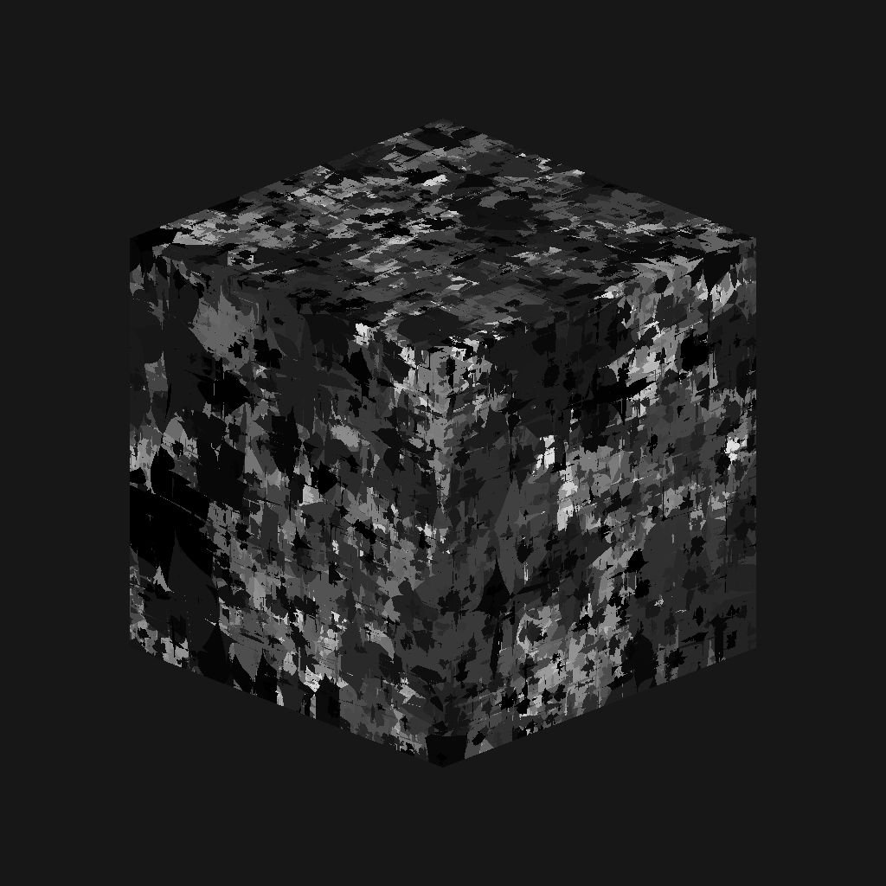

# 3D voronoi fractal

<table>
<tr style="border: 0;">
<td width="41.60%" style="border: 0;" valign="top">

{width="200px"}

**Entrée :** *Générateurs De Textures* */Bruits*

**Intermédiaire**

</td>
<td width="58.30%" style="border: 0;" valign="top">

## Description

Le nœud **3D voronoi fractal** génère un bruit de Voronoi *fractal* dans l&#39;espace 3D en fonction de l&#39;entrée **Carte de position**.

Ce nœud peut être testé avec [Cube 3D GBuffers](../../../../../../compositing-graphs/nodes-reference-for-com/node-library/texture-generators/patterns/cube-3d-gbuffers/cube-3d-gbuffers.md) en entrée au lieu d&#39;une map bakée réelle (comme illustré dans l&#39;exemple ci-dessous).

>[!WARNING]
>
> Ce bruit est destiné à être utilisé avec le *moteur GPU uniquement* (c&#39;est-à-dire **Direct3D** ou **OpenGL**). Accédez à **Outils > Changer de moteur...** ou appuyez sur la touche **F9** pour sélectionner le moteur souhaité.

</td>
</tr>
</table>

## Paramètres

* **Inverser** *Booléen*\
  Inverse l’image de sortie.
* **Échelle** *Flottant*\
  Contrôle l’échelle du bruit de Voronoï 3D fractal.\
  *Remarque* : lorsque la fonctionnalité **Mosaïque** est activée sur *n&#39;importe quel axe*, l&#39;ajustement de l&#39;échelle est *gradué*. C&#39;est ce qui est attendu.
* **Taille** *Float3*\
  Contrôle la taille du bruit de Voronoï 3D fractal sur les axes **X**, **Y** et **Z**. Les valeurs non uniformes entraînent un effet d&#39;*étirement ou de compression*.\
  *Remarque* : lorsque la **mosaïque** est activée sur *n&#39;importe quel axe*, le réglage de la taille est *par paliers*. C&#39;est ce qui est attendu.
* **Décalage** *Float3*\
  Applique un décalage à la *position* du bruit de Voronoï 3D fractal sur les axes **X**, **Y** et **Z**.
* **Désordre** *Float3*\
  Intensité du *décalage aléatoire* appliqué à chaque point du bruit sur les axes **X**, **Y** et **Z**.
* **Intensité de la Distorsion** *Flottant*\
  Contrôle l&#39;intensité d&#39;un *effet de déformation* appliqué sur le bruit de Voronoï 3D fractal.
* **Multiplicateur D&#39;Échelle De Distorsion** *Flottant*\
  Contrôle l&#39;échelle du *motif de déformation* utilisé dans l&#39;effet de déformation contrôlé par l&#39;**intensité de la Distorsion**.
* **Niveau Min** *Nombre Entier*\
  *niveau minimum de répétition* utilisé dans le motif fractal. Une plage minimale/maximale plus large donne un motif *plus riche* avec une variation sur davantage de plages de fréquences.
* **Niveau Max** *Nombre Entier*\
  *niveau de répétition* maximum utilisé dans le motif fractal. Une plage minimale/maximale plus large donne un motif *plus riche* avec une variation sur davantage de plages de fréquences.
* **Rugosité** *Flotter*\
  Contrôle l&#39;*équilibre* entre les *niveaux de répétition* bas et élevés dans le motif fractal.\
  *Remarque* : une valeur de **0** entraîne une sortie *non conforme* à d&#39;autres valeurs faibles qui la suivent. C&#39;est ce qui est attendu.\
  *Remarque 2* : ce paramètre est disponible uniquement lorsque le paramètre **Mode de fusion** est défini sur *Ajouter*.
* **Lacunarité** *Flottant*\
  Contrôle la façon dont le motif fractal appliqué *remplit l&#39;espace*. Une valeur *plus élevée* entraîne *moins d&#39;espaces* dans le motif et un bruit *plus dense*.
* **Opacité globale** *Flottant*\
  Contrôle la *plage* des valeurs de bruit de Perlin 3D fractal de 0.
* **Courbe Arrondie** *Flottant*\
  Arrondit la *pente* autour de chaque point du bruit pour le rendre *convexe*.\
  *Remarque* : ce paramètre n&#39;est pas disponible lorsque le paramètre **Style** est défini sur *Edge*.
* **Échelle de distance** *Flottant*\
  Ajuste la *distance du dégradé* autour de chaque point du bruit.
* **Mode Distance** *Nombre entier*\
  Définit la méthode pour *calculer le gradient de distance* autour de chaque point du bruit :
  * *Euclidéen*
  * *Manhattan*
  * *Tchebychev*
  * *Minkowski*
* **Nombre de Minkowski** *Flottant*\
  Ordre *p* de la distance de Minkowski. Si nous divisons le dégradé de distance en quadrants, ce nombre a l&#39;impact suivant sur ces quadrants :
  * p est *exactement* 1 : droit
  * p est *inférieur* à 1 : concave
  * p est *supérieur* à 1 : convexe\
    Valeurs intéressantes :\
    *-1.0* : distance de Manhattan\
    *-2.0* : distance euclidienne\
    *- Infini* : distance de Tchebychev\
    *Remarque* : ce paramètre n&#39;est disponible que lorsque le paramètre **Mode distance** est défini sur *Minkowski*.
* **Mode de fusion** *Entier*\
  Définit la méthode de fusion des valeurs des *cellules se chevauchant* dans l&#39;espace 3D :
  * *Ajouter* : ajoutez les valeurs
  * *Max* : conserver la valeur *la plus élevée*
  * *Min* : conserver la valeur *la plus basse*
* **Style** *Entier* Définit la méthode *de rendu des données* du bruit fractal de Voronoi 3D, étant donné que le bruit est basé sur un ensemble de points dans l’espace 3D :
  * *F1* : distance jusqu&#39;au *point le plus proche* dans l&#39;espace 3D
  * *F2* : distance jusqu&#39;au *deuxième point le plus proche* dans l&#39;espace 3D
  * *F2-F1*- *F1\* F2 *-* F1/F2 *-* Bord *: le* bord entre chaque cellule* du bruit dans l&#39;espace 3D
  * *Couleur aléatoire* : attribuez une *couleur plate aléatoire* à chaque cellule du bruit dans l&#39;espace 3D
* **Thickness des contours** *Flotter* Ajuste le thickness des contours détectés entre les cellules du bruit fractal de Voronoï 3D. Les arêtes sont détectées dans les axes X, Y et Z, de sorte que certaines épaisseurs peuvent augmenter plus rapidement que d&#39;autres en fonction de la *profondeur* des cellules.\
  *Remarque* : ce paramètre est uniquement disponible lorsque le paramètre **Style** est défini sur *Edge*.
* **Activer les limites** *booléennes*\
  Ajuste le bruit de Voronoï 3D fractal de sorte que son motif résultant *se répète* sur les axes X, Y et Z.

## Exemples d’images

<table>
<tr style="border: 0;">
<td style="border: 0;" valign="top">

{width="256px"}

</td>
<td style="border: 0;" valign="top">

{width="256px"}

</td>
<td style="border: 0;" valign="top">

{width="256px"}

</td>
<td style="border: 0;" valign="top">

{width="256px"}

</td>
<td style="border: 0;" valign="top">

{width="256px"}

</td>
<td style="border: 0;" valign="top">

{width="256px"}

</td>
</tr>
</table>
