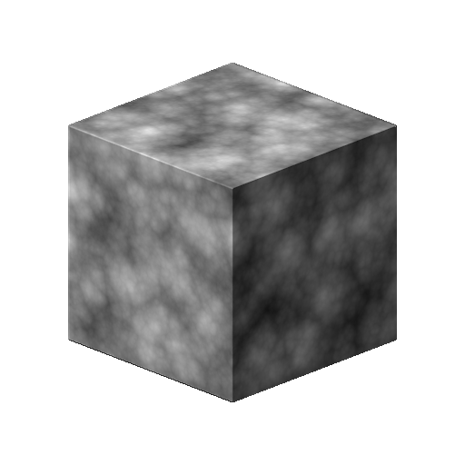
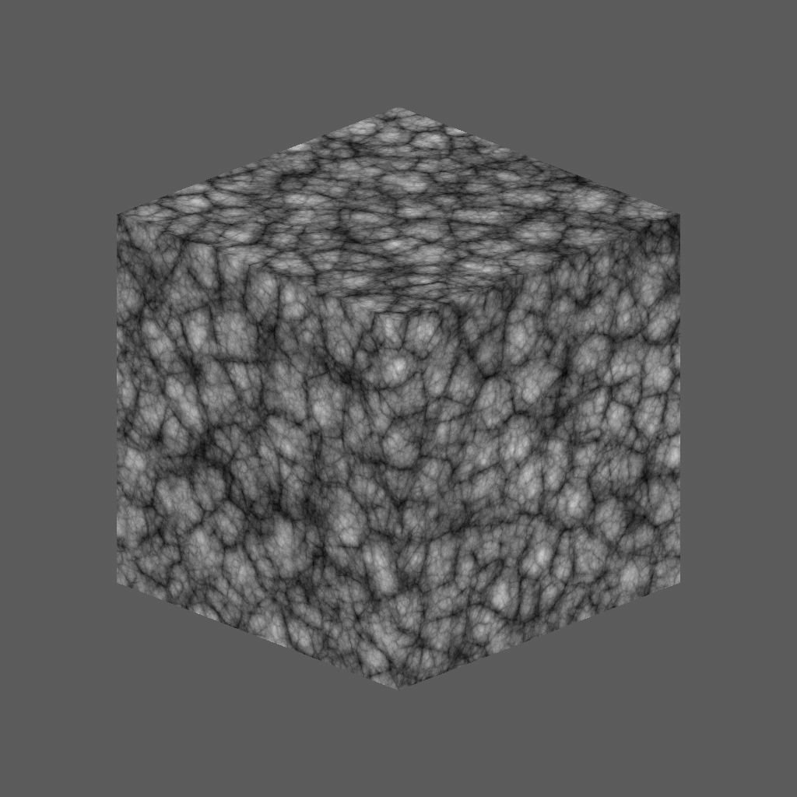
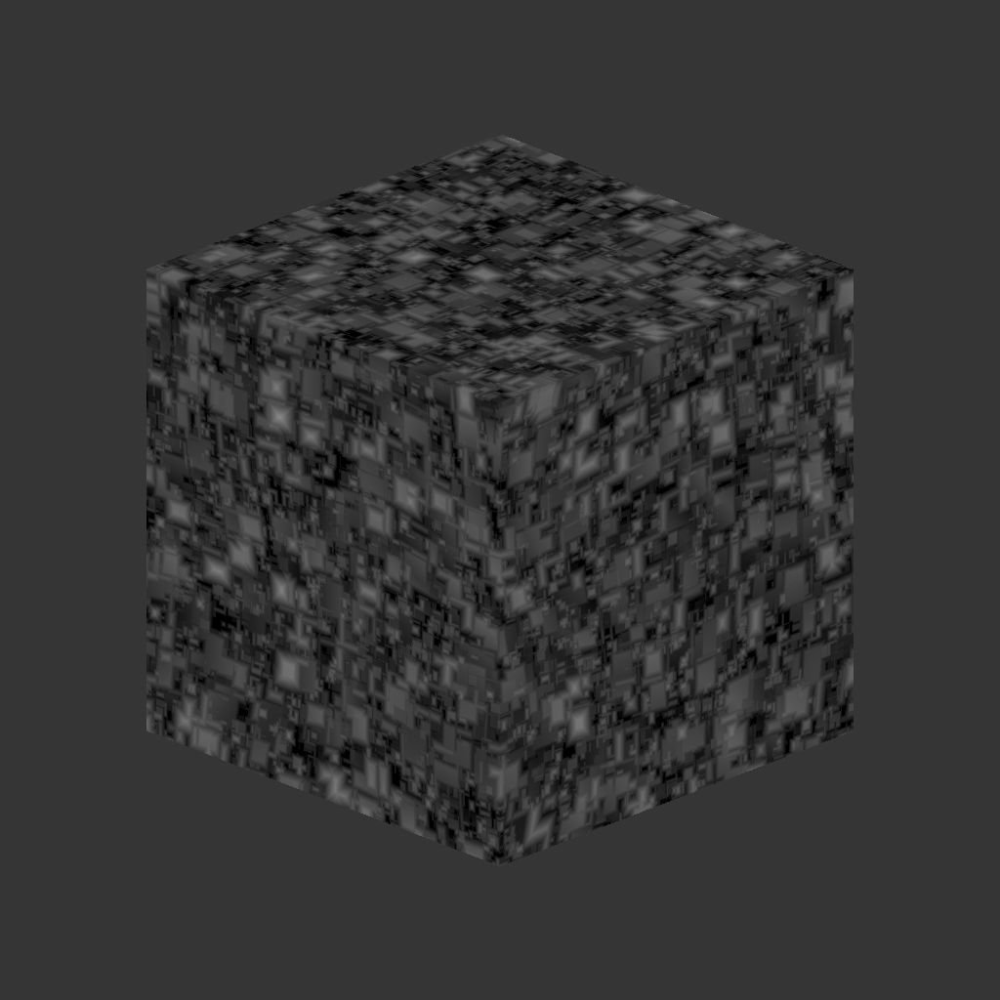

# 3D voronoi fractal

<table>
<tr style="border: 0;">
<td width="33.33%" style="border: 0;" valign="top">

{width="200px"}

<b>Entrées :</b> Générateurs de Textures > Bruits

</td>
<td width="100.00%" style="border: 0;" valign="top">

## Description

Le nœud <b>3D voronoi fractal</b> génère un bruit de Voronoi <i>fractal</i> dans l&#39;espace 3D en fonction de l&#39;entrée <b>Carte de position</b>.

Ce nœud peut être testé avec [Cube 3D GBuffers](../../../../../../compositing-graphs/nodes-reference-for-com/node-library/texture-generators/patterns/cube-3d-gbuffers/cube-3d-gbuffers.md) en entrée au lieu d&#39;une map bakée réelle (comme illustré dans l&#39;exemple ci-dessous).

</td>
</tr>
</table>

>[!WARNING]
>
> Ce bruit est destiné à être utilisé avec le <i>moteur GPU uniquement</i> (c&#39;est-à-dire <b>Direct3D</b> ou <b>OpenGL</b>). Accédez à <b>Outils > Changer de moteur...</b> ou appuyez sur la touche <b>F9</b> pour sélectionner le moteur souhaité.

## Paramètres

|  |  |
|:---|:---|
| <b>Inverser</b> <i>Booléen</i> | Inverse l’image de sortie. |
| <b>Échelle</b> <i>Flotter</i> | Contrôle l&#39;échelle du bruit fractal 3D Voronoi.  <i>Remarque</i> : lorsque la <b>Répétition</b> est activée sur <i>n&#39;importe quel axe</i>, l&#39;ajustement de l&#39;échelle est <i>gradué</i>. C&#39;est ce qui est attendu. |
| <b>Taille</b> <i>Float3</i> | Contrôle la taille du bruit de Voronoï 3D fractal sur les axes <b>X</b>, <b>Y</b> et <b>Z</b>. Les valeurs non uniformes entraînent un effet de <i>étiré ou d&#39;écrasement</i>.  <i>Remarque</i> : lorsque la <b>Répétition</b> est activée sur <i>n&#39;importe quel axe</i>, le réglage de la taille est <i>par paliers</i>. C&#39;est ce qui est attendu. |
| <b>Décalage</b> <i>Float3</i> | Applique un décalage à la <i>position</i> du bruit de Voronoï 3D fractal sur les axes <b>X</b>, <b>Y</b> et <b>Z</b>. |
| <b>Désordre</b> <i>Float3</i> | Intensité du <i>décalage aléatoire</i> appliqué à chaque point du bruit sur les axes <b>X</b>, <b>Y</b> et <b>Z</b>. |
| <b>Intensité de la Distorsion</b> <i>Flotter</i> | Contrôle l&#39;intensité d&#39;un <i>effet de déformation</i> appliqué sur le bruit de Voronoï 3D fractal. |
| <b>Multiplicateur d&#39;échelle de Distorsion</b> <i>Flotter</i> | Contrôle l&#39;échelle du <i>motif de déformation</i> utilisé dans l&#39;effet de déformation contrôlé par l&#39;<b>intensité de la Distorsion</b>. |
| <b>Niveau Min</b> <i>Nombre entier</i> | <i>niveau minimum de répétition</i> utilisé dans le motif fractal. Une plage minimale/maximale plus large donne un motif <i>plus riche</i> avec une variation sur davantage de plages de fréquences. |
| <b>Niveau Max</b> <i>Nombre entier</i> | <i>niveau de répétition</i> maximum utilisé dans le motif fractal. Une plage minimale/maximale plus large donne un motif <i>plus riche</i> avec une variation sur davantage de plages de fréquences. |
| <b>Rugosité</b> <i>Flotter</i> | Contrôle l&#39;<i>équilibre</i> entre les <i>niveaux de répétition</i> bas et élevés dans le motif fractal.  <i>Remarque</i> : une valeur de <b>0</b> entraîne une sortie <i>non alignée</i> avec d&#39;autres valeurs faibles qui la suivent. C&#39;est ce qui est attendu.  <i>Remarque 2</i> : ce paramètre est disponible uniquement lorsque le paramètre <b>Mode de fusion</b> est défini sur <i>Ajouter</i>. |
| <b>Lacunarité</b> <i>Flotter</i> | Contrôle la façon dont le motif fractal appliqué <i>remplit l&#39;espace</i>. Une valeur <i>plus élevée</i> entraîne <i>moins d&#39;espaces</i> dans le motif et un bruit <i>plus dense</i>. |
| <b>Opacité globale</b> <i>Flotter</i> | Contrôle la <i>plage</i> des valeurs de bruit de Perlin 3D fractal de 0. |
| <b>Courbe Arrondie</b> <i>Flotter</i> | Arrondit la <i>pente</i> autour de chaque point du bruit pour le rendre <i>convexe</i>.  <i>Remarque</i> : ce paramètre n&#39;est pas disponible lorsque le paramètre <b>Style</b> est défini sur <i>Edge</i>. |
| <b>Échelle de distance</b> <i>Flotter</i> | Ajuste la <i>distance du dégradé</i> autour de chaque point du bruit. |
| <b>Mode Distance</b> <i>Nombre entier</i> | Définit la méthode pour <i>calculer le gradient de distance</i> autour de chaque point du bruit :  - <i>euclidien</i> - <i>Manhattan</i> - <i>Tchebychev</i> - <i>Minkowski</i> |
| <b>Nombre de Minkowski</b> <i>Flotter</i> | Ordre <i>p</i> de la distance de Minkowski. Si nous divisons le gradient de distance en quadrants, ce nombre a un impact sur ces quadrants comme suit :  - p est <i>exactement</i> 1 : droit - p est <i>inférieur</i> à 1 : concave - p est <i>supérieur</i> à 1 : convexe  valeurs intéressantes : - <i>1.0</i> : distance de Manhattan - <i>2.0</i> : distance euclidienne - <i>Infini</i> : distance de Tchebychev  <i>Remarque</i> : ce paramètre est uniquement disponible lorsque le paramètre <b>Mode de distance</b> est défini sur <i>Minkowski</i>. |
| <b>Mode de fusion</b> <i>Nombre entier</i> | Définit la méthode de fusion des valeurs de <i>cellules se chevauchant</i> dans l&#39;espace 3D :  -<i>Ajouter</i> : ajouter les valeurs -<i>Max</i> : conserver la <i>valeur la plus élevée</i> -<i>Min</i> : conserver la <i>valeur la plus basse</i> |
| <b>Style</b> <i>Nombre entier</i> | Définit la méthode <i>de rendu des données</i> du bruit fractal 3D de Voronoi, en tenant compte du fait que le bruit est fondé sur un ensemble de points dans l&#39;espace 3D :  - <i>F1</i> : la distance au <i>point le plus proche</i> dans l&#39;espace 3D - <i>F2</i> : la distance au <i>deuxième point le plus proche</i> dans l&#39;espace 3D - <i>F2-F1</i> - <i>F1\*F2</i> - <i>F1/F2</i> - <i>Bord</i> : le <i>bord entre chaque cellule</i> du bruit dans l&#39;espace 3D - <i>Couleur aléatoire</i> : attribuez une <i>couleur plate aléatoire</i> à chaque cellule du bruit dans l&#39;espace 3D |
| <b>Thickness Edge</b> <i>Flotter</i> | Ajuste le thickness des contours détectés entre les cellules du bruit fractal 3D Voronoi. Les arêtes sont détectées dans les axes X, Y et Z. Certaines épaisseurs peuvent donc augmenter plus rapidement que d&#39;autres en fonction de la <i>profondeur</i> des cellules.  <i>Remarque</i> : ce paramètre n&#39;est disponible que lorsque le paramètre <b>Style</b> est défini sur <i>Arête</i>. |
| <b>Activer la Répétition</b> <i>Booléen</i> | Ajuste le bruit de Voronoï 3D fractal de sorte que son motif résultant <i>se répète</i> sur les axes X, Y et Z. |

## Exemples

<table style="margin-top: 32px; margin-bottom: 32px">
    <tr style="border: 0">
        <td style="border: 0; background: transparent">
            
        </td>
        <td style="border: 0; background: transparent">
            
        </td>
        <td style="border: 0; background: transparent">
            
        </td>
    </tr>
    <tr style="border: 0; background: transparent">
        <td style="border: 0; background: transparent">
            
        </td>
        <td style="border: 0; background: transparent">
            
        </td>
        <td style="border: 0; background: transparent">
            
        </td>
    </tr>
</table>
