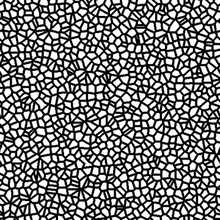

# CELLULES 2

<table>
<tr style="border: 0;">
<td style="border: 0;" valign="top">

<table>
<tr style="border: 0;">
<td width="33.33%" style="border: 0;" valign="top">

{width="200px"}

<b>Entrée :</b> Générateurs de textures > Bruits

</td>
<td width="100.00%" style="border: 0;" valign="top">

## Description

Variante des bruits murés des <b>Cellules</b>.

Masque binaire des cellules avec un thickness mural réglable.

Voir aussi : [Cellules 1](../../../../../../compositing-graphs/nodes-reference-for-com/node-library/texture-generators/noises/cells-1/cells-1.md), [Cellules 3](../../../../../../compositing-graphs/nodes-reference-for-com/node-library/texture-generators/noises/cells-3/cells-3.md), [Cellules 4](../../../../../../compositing-graphs/nodes-reference-for-com/node-library/texture-generators/noises/cells-4/cells-4.md)

</td>
</tr>
</table>

## Sorties

|  |  |
| --- | --- |
| <b>Sortie</b> *Niveaux de gris* | Le bruit généré est une image bitmap en niveaux de gris. |

## Paramètres

|  |  |
| --- | --- |
| Entier <b>Échelle</b> | Subdivision de la grille utilisée pour générer les carreaux de bruit.    Plus la valeur est élevée, plus le nombre de carreaux dessinés est important et plus le bruit est dense. |
| <b>Largeur du contour</b> flottant | Ajuste le thickness des parois entre les cellules, en tant que rapport de la grille. (C&#39;est-à-dire non dépendant de la résolution) |
| <b>Inverser</b> Booléen | Bascule entre les noirs et les blancs dans l’image de sortie. |
| <b>Désordre</b> Flottant | Déplace les ingrédients du bruit.    Cela peut être utilisé pour animer le bruit. |
| <b>Désorganiser la vitesse</b> Flotter | Ajuste la distance de displacement appliquée par le paramètre <b>Désordre</b>.    Cela permet de contrôler la vitesse du displacement lors de l’animation du bruit. |
| <b>Expansion non carrée</b> booléenne | Dans les images non carrées, la mosaïque générée reste carrée et étend la génération de bruit aux limites de l’image. |

## Exemples

<table>
<tr style="border: 0;">
<td style="border: 0;" valign="top">

{zoomable="yes"}

</td>
<td style="border: 0;" valign="top">

{zoomable="yes"}

</td>
</tr>
</table>

</td>
<td style="border: 0;" valign="top">

</td>
<td style="border: 0;" valign="top">

</td>
</tr>
</table>
