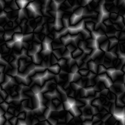

# Cristal 1

<table>
<tr style="border: 0;">
<td width="33.33%" style="border: 0;" valign="top">

{width="128px"}

<b>Entrées :</b> Générateurs de Textures > Bruits

</td>
<td width="100.00%" style="border: 0;" valign="top">

## Description

Génère un bruit de type Worlye Voronoi, avec une mesure de distance légèrement plus angular. Il peut être utile pour certains angulars et à des fins géométriques.

</td>
</tr>
</table>

## Paramètres

|  |  |
|:---|:---|
| <b>Échelle</b> <i>1 - 256</i> | Définit l’échelle globale de l’effet. |
| <b>Désordre</b> <i>0.0 - 1.0</i> | Déphasez le bruit pour introduire une faible variation. |
| <b>Extension non carrée</b> <i>Faux/Vrai</i> | Permet la compensation de la courbure et de l’étirement avec des proportions non carrées. |

## Exemples

<table style="margin-top: 32px; margin-bottom: 32px">
    <tr style="border: 0">
        <td style="border: 0; background: transparent">
            
        </td>
    </tr>
</table>
