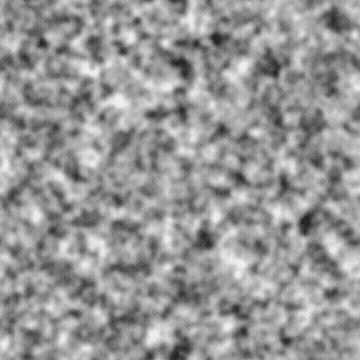

# SOMME FRACTALE 4

<table>
<tr style="border: 0;">
<td width="33.33%" style="border: 0;" valign="top">

{width="200px"}

<b>Entrée :</b> générateurs de Textures > Bruits

</td>
<td width="100.00%" style="border: 0;" valign="top">

## Description

Variante des bruits de <b>Somme fractale</b>.

Voir aussi : [Somme fractale de base](../../../../../../compositing-graphs/nodes-reference-for-com/node-library/texture-generators/noises/fractal-sum-base/fractal-sum-base.md), [Somme fractale 1](../../../../../../compositing-graphs/nodes-reference-for-com/node-library/texture-generators/noises/fractal-sum-1/fractal-sum-1.md), [Somme fractale 2](../../../../../../compositing-graphs/nodes-reference-for-com/node-library/texture-generators/noises/fractal-sum-2/fractal-sum-2.md), [Somme fractale 3](../../../../../../compositing-graphs/nodes-reference-for-com/node-library/texture-generators/noises/fractal-sum-3/fractal-sum-3.md)

</td>
</tr>
</table>

## Sorties

|  |  |
|:---|:---|
| <b>Sortie</b> <i>Niveaux de gris</i> | Le bruit généré est un bitmap en niveaux de gris. |

## Paramètres

|  |  |
|:---|:---|
| <b>Désordre</b> <i>Flottant</i> | Déplace les ingrédients du bruit.    Cela permet d’animer le bruit. |
| <b>Désorganiser la vitesse</b> <i>Flottant</i> | Ajuste la distance de displacement appliquée par le paramètre <b>Désordre</b>.    Cela permet de contrôler la vitesse du displacement lors de l’animation du bruit. |
| <b>Expansion non carrée</b> <i>Booléen</i> | Dans les images non carrées, la mosaïque générée reste carrée et étend la génération de bruit aux limites de l’image. |

## Exemples

<table>
<tr style="border: 0;">
<td style="border: 0;" valign="top">

{zoomable="yes"}

</td>
<td style="border: 0;" valign="top">

{zoomable="yes"}

</td>
</tr>
</table>
