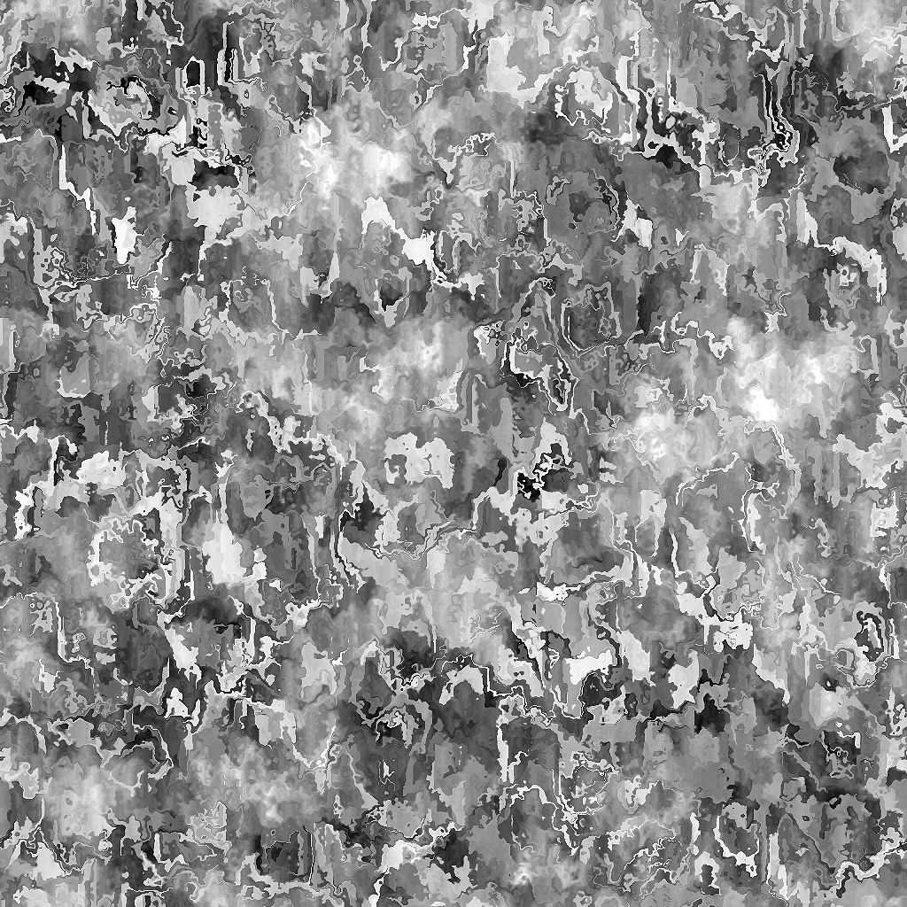

# Usure/salissures Galvanic Small

<table>
<tr style="border: 0;">
<td width="41.60%" style="border: 0;" valign="top">

{width="200px"}

**Entrée :** *Générateurs De Texture**/Bruits*

**Simple**

</td>
<td width="58.30%" style="border: 0;" valign="top">

## Description

Le nœud **Usure/salissures Galvanic Small** génère une carte d&#39;usure/salissures semblable au motif de l&#39;acier densément galvanisé.

</td>
</tr>
</table>

## Paramètres

* **Balance** *Flottant* Ajuste la balance entre les valeurs sombres et claires.
* **Contraste** *Flottant* Ajuste le contraste de l&#39;image.
* **Inverser** *Booléen* Inverse la sortie de l&#39;image, à l&#39;aide d&#39;une opération `1-x`.
* **Extension non carrée** *booléenne* Permet la compensation de l&#39;écrasement et de l&#39;étirement avec des rapports autres que carrés.
* Advanced
  * **Netteté** *Flottant* Règle la netteté et la netteté des formes galvanisées.
  * **Dirt** *Flottant* Ajuste l&#39;opacité de l&#39;incrustation du dirt.
  * **Micro-Distorsion** *Flottant* Règle l&#39;intensité de l&#39;effet de déformation haute fréquence.

## Exemples d’images

<table>
<tr style="border: 0;">
<td style="border: 0;" valign="top">

{width="256px"}

</td>
<td style="border: 0;" valign="top">

{width="256px"}

</td>
</tr>
</table>
