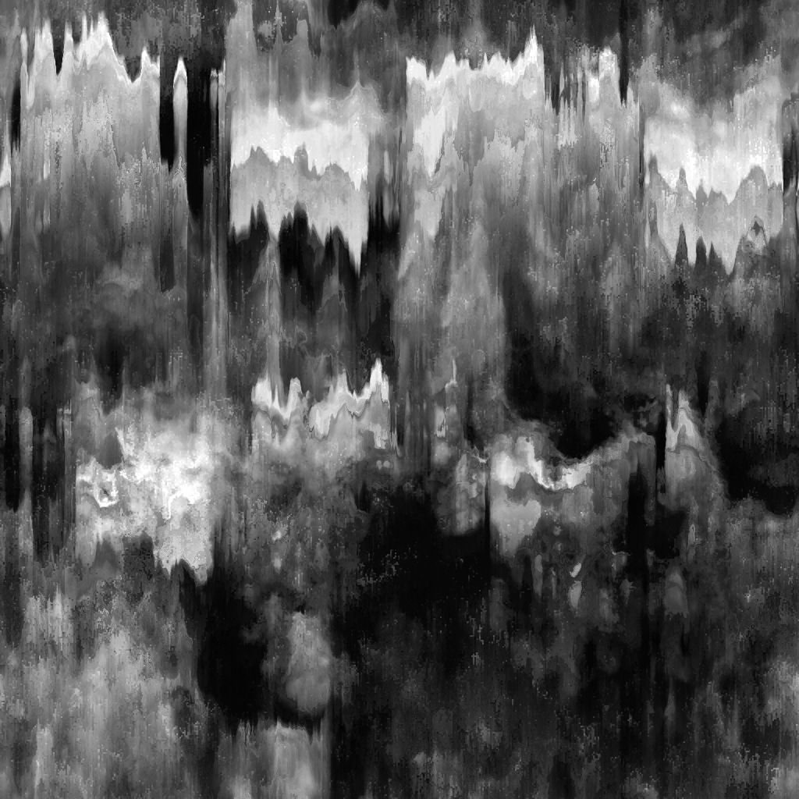

# Fuites d’Usure/salissures

<table>
<tr style="border: 0;">
<td width="41.60%" style="border: 0;" valign="top">

{width="200px"}

**Entrée :** *Générateurs De Textures* */Bruits*

**Simple**

</td>
<td width="58.30%" style="border: 0;" valign="top">

## Description

Le nœud **Usure/salissures Leaks** génère une carte usure/salissures semblable à un goutte-à-goutte sur une surface grasse.

</td>
</tr>
</table>

## Paramètres

* **Balance** *Flottant* Ajuste la balance entre les valeurs sombres et claires.
* **Contraste** *Flottant* Ajuste le contraste de l&#39;image.
* **Inverser** *Booléen* Inverse la sortie de l&#39;image, à l&#39;aide d&#39;une opération `1-x`.
* **Extension non carrée** *booléenne* Permet la compensation de l&#39;écrasement et de l&#39;étirement avec des rapports autres que carrés.
* Advanced
  * **Longueur du goutte à goutte** *Flottant* Ajuste la longueur des traînées de goutte à goutte.
  * **Contraste de forme** *Flottant* Varie entre les formes claires et sombres, en contrastant entre les gouttes.
  * **Netteté des gouttes** *Flottant* Ajuste la netteté et l&#39;irrégularité des gouttes.
  * **Netteté** *Flottement* Ajustez la brillance générale de l&#39;image.

## Exemples d’images

<table>
<tr style="border: 0;">
<td style="border: 0;" valign="top">

{width="256px"}

</td>
<td style="border: 0;" valign="top">

{width="256px"}

</td>
</tr>
</table>
