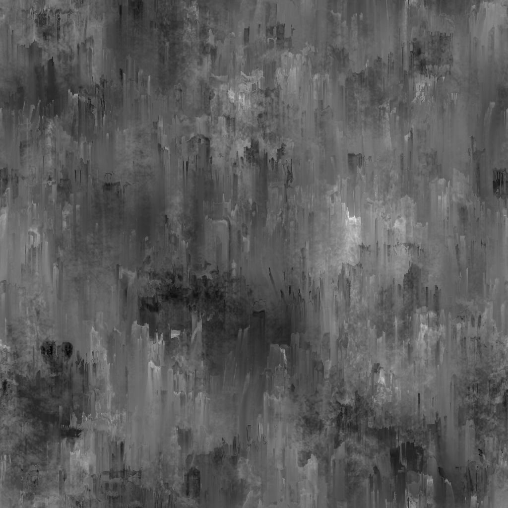

# Peinture de fuite d&#39;Usure/salissures

<table>
<tr style="border: 0;">
<td width="33.33%" style="border: 0;" valign="top">

{width="200px"}

<b>Entrée :</b> générateurs de Textures > Bruits

</td>
<td width="100.00%" style="border: 0;" valign="top">

## Description

Le nœud **Usure/salissures Leaky Peinture** génère une carte usure/salissures semblable à la peinture qui s&#39;écoule à travers les fuites.

</td>
</tr>
</table>

## Paramètres

|  |  |
|:---|:---|
| <b>Balance</b> <i>Flottant</i> | Règle la balance entre les valeurs sombres et claires. |
| <b>Contraste</b> <i>Flottant</i> | Règle le contraste de l’image. |
| <b>Inverser</b> <i>Booléen</i> | Inverse la sortie de l&#39;image, à l&#39;aide d&#39;une opération `1-x`. |
| <b>Extension non carrée</b> <i>Booléen</i> | Active la compensation de la courbure et de la étire avec des proportions non carrées. |
| <b>Avancé</b> |  |
| <b>Intensité de la fuite</b> <i>Flottant</i> | Règle la densité et l’intensité des gouttes. |
| <b>Échelle de fuite</b> <i>Entier</i> | Règle l’échelle de la séparation des gouttes. |
| <b>Angle de fuite aléatoire</b> <i>Flotter</i> | Ajuste l&#39;*angle maximal* auquel les gouttes peuvent être tournées de manière aléatoire, en *nombre de tours*. |
| <b>Netteté de la fuite</b> <i>Flotter</i> | Règle la netteté et la netteté des gouttes. |

## Exemples

<table style="margin-top: 32px; margin-bottom: 32px">
    <tr style="border: 0">
        <td style="border: 0; background: transparent">
            
        </td>
        <td style="border: 0; background: transparent">
            
        </td>
    </tr>
</table>
