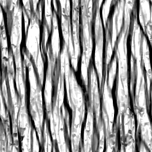

# Carte Usure/salissures 005

<table>
<tr style="border: 0;">
<td style="border: 0;" valign="top">

{width="128px"}

## Carte Usure/salissures 005

**Entrée :** *Générateurs De Texture**/Bruits*

**Intermédiaire**

</td>
<td style="border: 0;" valign="top">

## Description

Cela génère une carte de bruit combinée complexe. Il peut être très utile en tant que procédure détaillée, mais gardez à l&#39;esprit qu&#39;ils sont très exigeants en termes de performances et donc plus lents à générer.

## Paramètres

* **Solde** : *0,0 - 1,0*\
  Déplace la balance du résultat entre le noir et le blanc, comme dans le cas d’un réglage de luminosité.
* **Contraste** : *0,0 - 1,0*\
  Règle le contraste du résultat.
* **Trouble** : *0,0 - 1,0*\
  Déphasez le bruit pour introduire une faible variation.
* **Inverser** : *Faux/Vrai*\
  Inverse le résultat.
* **Motif de pinceau** : *0.0 - 1.0*\
  Ajoute un masque autour des bords, par exemple lorsqu’il est utilisé comme alpha de pinceau.
* **Extension non carrée** : *Faux/Vrai*\
  Permet la compensation de la courbure et de l’étirement avec des proportions non carrées.

## Exemples d’images

</td>
</tr>
</table>
