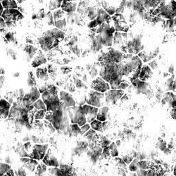

# Carte Usure/salissures 008

<table>
<tr style="border: 0;">
<td width="33.33%" style="border: 0;" valign="top">

{width="128px"}

<b>Entrées :</b> Générateurs de Textures > Bruits

</td>
<td width="100.00%" style="border: 0;" valign="top">

## Description

Cela génère une carte de bruit combinée complexe. Il peut être très utile en tant que procédural détaillé, mais gardez à l’esprit qu’ils sont très exigeants en termes de performances et donc plus lents à générer.

</td>
</tr>
</table>

## Paramètres

|  |  |
|:---|:---|
| <b>Balance</b> <i>0.0 - 1.0</i> | Déplace la balance du résultat entre le noir et le blanc, comme dans le cas d’un réglage de luminosité. |
| <b>Contraste</b> <i>0.0 - 1.0</i> | Règle le contraste du résultat. |
| <b>Inverser</b> <i>Faux/Vrai</i> | Inverse le résultat. |
| <b>Motif de pinceau</b> <i>0.0 - 1.0</i> | Ajoute un masque autour des bords, par exemple lorsqu’il est utilisé comme alpha de pinceau. |
| <b>Extension non carrée</b> <i>Faux/Vrai</i> | Active la compensation de la courbure et de la étire avec des proportions non carrées. |

## Exemples

<table style="table-layout:fixed">
    <tr style="border: 0;">
        <td style="border: 0;">
            
        </td>
        <td style="border: 0;"></td>
        <td style="border: 0;"></td>
    </tr>
</table>
