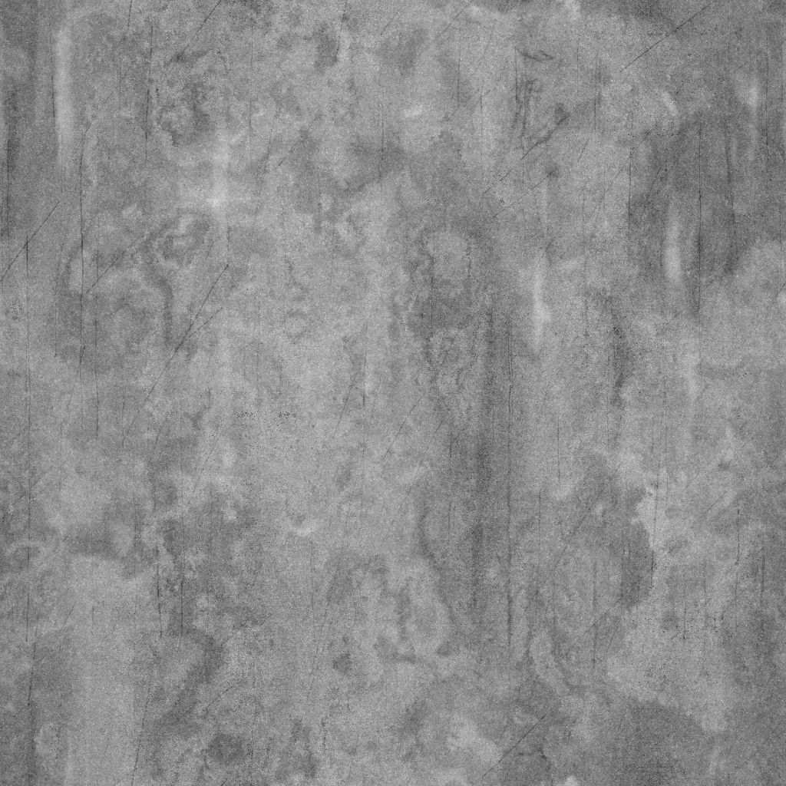
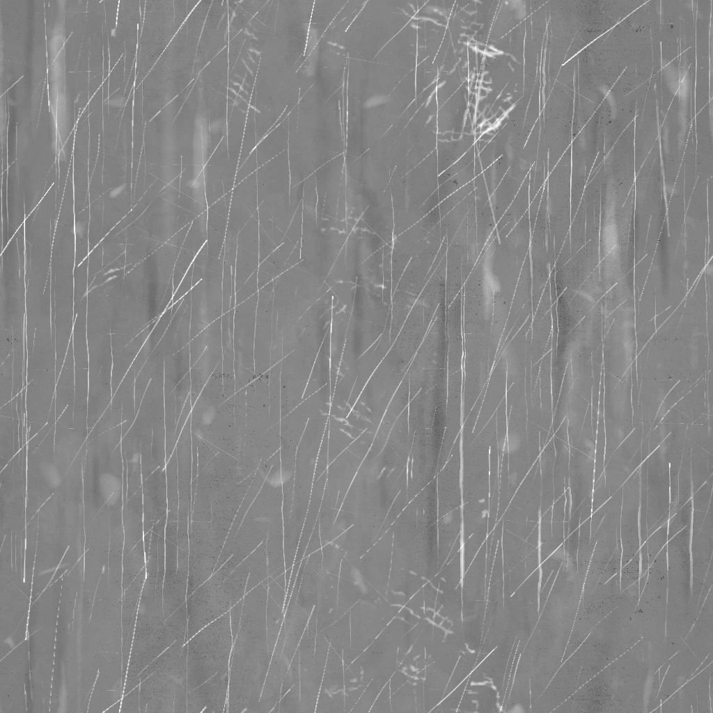

# Usure/salissures Rough Dirty

<table>
<tr style="border: 0;">
<td width="33.33%" style="border: 0;" valign="top">

{width="200px"}

<b>Entrées :</b> Générateurs de Textures > Bruits

</td>
<td width="100.00%" style="border: 0;" valign="top">

## Description

Le nœud **Usure/salissures Rough Dirty** génère une carte usure/salissures semblable à une surface sale rugueuse avec de fines rayures parallèles.

</td>
</tr>
</table>

## Paramètres

|  |  |
|:---|:---|
| <b>Balance</b> <i>Flottant</i> | Règle la balance entre les valeurs sombres et claires. |
| <b>Contraste</b> <i>Flottant</i> | Règle le contraste de l’image. |
| <b>Inverser</b> <i>Booléen</i> | Inverse la sortie de l&#39;image, à l&#39;aide d&#39;une opération `1-x`. |
| <b>Extension non carrée</b> <i>Booléen</i> | Active la compensation de la courbure et de la étire avec des proportions non carrées. |
| <b>Avancé</b> |  |
| <b>Intensité d&#39;Usure/salissures principale</b> <i>Flottant</i> | Règle l’intensité de la texture d’usure/salissures principale utilisée pour rompre la surface. |
| <b>Inverser les mots de Scratches</b> <i>Booléen</i> | Inverse la luminance des rayures sur la surface. |
| <b>Intensité Scratches</b> <i>Flottant</i> | Règle l’intensité des rayures sur la surface. |
| <b>Intensité du grain</b> <i>Flottant</i> | Règle l’intensité de l’effet de grain global. |

## Exemples

<table style="table-layout:fixed">
    <tr style="border: 0;">
        <td style="border: 0;">
            
        </td>
        <td style="border: 0;">
            
        </td>
        <td style="border: 0;"></td>
    </tr>
</table>
