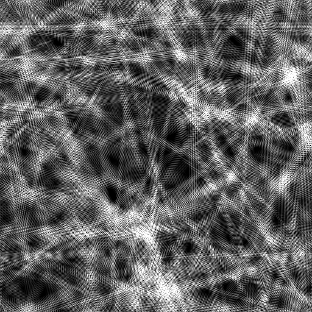
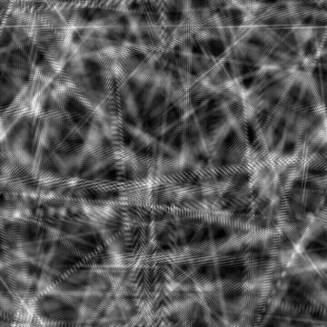

# Fibres désordonnées 2

<table>
<tr style="border: 0;">
<td width="33.33%" style="border: 0;" valign="top">

{width="200px"}

<b>Entrée :</b> Générateurs de textures > Bruits

</td>
<td width="100.00%" style="border: 0;" valign="top">

## Description

Variante des bruits structurés de <b>fibres désordonnées</b>.

Voir aussi : [Fibres désordonnées 1](../../../../../../compositing-graphs/nodes-reference-for-com/node-library/texture-generators/noises/messy-fibers-1/messy-fibers-1.md), [Fibres désordonnées 3](../../../../../../compositing-graphs/nodes-reference-for-com/node-library/texture-generators/noises/messy-fibers-3/messy-fibers-3.md)

</td>
</tr>
</table>

## Sorties

|  |  |
| --- | --- |
| <b>Sortie</b> *Niveaux de gris* | Le bruit généré est une image bitmap en niveaux de gris. |

## Paramètres

|  |  |
| --- | --- |
| Entier <b>Échelle</b> | Subdivision de la grille utilisée pour générer les carreaux de bruit.    Plus la valeur est élevée, plus le nombre de carreaux dessinés est important et plus le bruit est dense. |
| <b>Désordre</b> Flottant | Déplace les ingrédients du bruit.    Cela peut être utilisé pour animer le bruit. |
| <b>Désorganiser la vitesse</b> Flotter | Ajuste la distance de displacement appliquée par le paramètre <b>Désordre</b>.    Cela permet de contrôler la vitesse du displacement lors de l’animation du bruit. |
| <b>Désordre anisotropie</b> Flottant | Contrôle l&#39;étendue des directions du displacement appliqué par le paramètre <b>Désordre</b>, où une valeur plus élevée entraîne une direction plus étroite et plus définie.    La direction est contrôlée par le paramètre <b>Désorganiser l&#39;angle d&#39;anisotropie</b>. |
| <b>Modification de l&#39;angle d&#39;anisotropie</b> Flottant | Contrôle la direction du displacement appliqué par le paramètre <b>Disorder</b>, lorsque le paramètre « Disorder anisotropie » n&#39;est pas nul. |
| <b>Angle</b> Flottant | Angle utilisé pour définir la direction des filetages, en nombre de tours et à partir de l&#39;horizontale droite. |
| <b>Angle aléatoire</b> Flottant | Quantité maximale de variation aléatoire appliquée à la valeur <b>Angle</b>, en nombre de tours. |
| flottant <b>nombre de lignes</b> | Quantité de répétition appliquée aux filetages de base, où une valeur plus élevée produit des filetages plus denses et plus fins. |
| <b>Décalage de mosaïque</b> Float2 | Définit la position de la partie du plan infini utilisée pour le rendu du bruit. |
| <b>Expansion non carrée</b> booléenne | Dans les images non carrées, la mosaïque générée reste carrée et étend la génération de bruit aux limites de l’image. |

## Exemples

<table>
<tr style="border: 0;">
<td style="border: 0;" valign="top">

{zoomable="yes"}

</td>
<td style="border: 0;" valign="top">

{zoomable="yes"}

</td>
</tr>
</table>

<table>
<tr style="border: 0;">
<td style="border: 0;" valign="top">

{zoomable="yes"}

</td>
<td style="border: 0;" valign="top">

{zoomable="yes"}

</td>
</tr>
</table>
