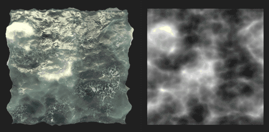

# Voronoi Fractal

<table>
<tr style="border: 0;">
<td width="33.33%" style="border: 0;" valign="top">

{width="200px"}

<b>Entrées :</b> Générateurs de Textures > Bruits

</td>
<td width="100.00%" style="border: 0;" valign="top">

## Description

Le nœud **fractal Voronoi** génère un bruit de Voronoi 3D *fractal* mappé à une image 2D à l&#39;aide d&#39;une *projection orthographique Z-down*.

Ce nœud peut être testé avec [Cube GBuffers](../../../../../../compositing-graphs/nodes-reference-for-com/node-library/texture-generators/patterns/cube-3d-gbuffers/cube-3d-gbuffers.md) en entrée au lieu d&#39;une map bakée réelle (comme illustré dans l&#39;exemple ci-dessous).

>[!WARNING]
>
> Ce bruit est destiné à être utilisé avec le *moteur GPU uniquement* (c&#39;est-à-dire **Direct** ou **OpenGL**). Accédez à **Outils > Changer de moteur...** ou appuyez sur la touche **F9** pour sélectionner le moteur souhaité.

</td>
</tr>
</table>

## Paramètres

|  |  |
|:---|:---|
| <b>Inverser</b> <i>Booléen</i> | Inverse l’image de sortie. |
| <b>Échelle</b> <i>Flotter</i> | Contrôle l&#39;échelle du bruit fractal de Voronoi.  *Remarque* : lorsque la **Répétition** est activée sur *n&#39;importe quel axe*, l&#39;ajustement de l&#39;échelle est *échelonné*. C&#39;est ce qui est attendu. |
| <b>Taille</b> <i>Float3</i> | Contrôle la taille du bruit fractal de Voronoï sur les axes **X**, **Y** et **Z**. Les valeurs non uniformes entraînent un effet de *étiré ou d&#39;écrasement*.  *Remarque* : lorsque la **Répétition** est activée sur *n&#39;importe quel axe*, le réglage de la taille est *par paliers*. C&#39;est ce qui est attendu. |
| <b>Décalage</b> <i>Float3</i> | Applique un décalage à la *position* du bruit fractal de Voronoï sur les axes **X**, **Y** et **Z**. |
| <b>Désordre</b> <i>Float3</i> | Intensité du *décalage aléatoire* appliqué à chaque point du bruit dans les axes **X**, **Y** et **Z**. |
| <b>Intensité de la Distorsion</b> <i>Flotter</i> | Contrôle l&#39;intensité d&#39;un *effet de déformation* appliqué sur le bruit fractal de Voronoi. |
| <b>Multiplicateur d&#39;échelle de Distorsion</b> <i>Flotter</i> | Contrôle l&#39;échelle du *motif de déformation* utilisé dans l&#39;effet de déformation contrôlé par l&#39;**intensité de la Distorsion**. |
| <b>Niveau Min</b> <i>Nombre entier</i> | *niveau minimum de répétition* utilisé dans le motif fractal. Une plage minimale/maximale plus large donne un motif *plus riche* avec une variation sur davantage de plages de fréquences. |
| <b>Niveau Max</b> <i>Nombre entier</i> | *niveau de répétition* maximum utilisé dans le motif fractal. Une plage minimale/maximale plus large donne un motif *plus riche* avec une variation sur davantage de plages de fréquences. |
| <b>Rugosité</b> <i>Flotter</i> | Contrôle l&#39;*équilibre* entre les *niveaux de répétition* bas et élevés dans le motif fractal.  *Remarque* : une valeur de **0** entraîne une sortie *non alignée* avec d&#39;autres valeurs faibles qui la suivent. C&#39;est ce qui est attendu.  *Remarque 2* : ce paramètre est disponible uniquement lorsque le paramètre **Mode de Fusion** est défini sur *Ajouter*. |
| <b>Lacunarité</b> <i>Flotter</i> | Contrôle la façon dont le motif fractal appliqué *remplit l&#39;espace*. Une valeur *plus élevée* entraîne *moins d&#39;espaces* dans le motif et un bruit *plus dense*. |
| <b>Opacité globale</b> <i>Flotter</i> | Contrôle la *plage* des valeurs fractales de bruit de Perlin à partir de 0. |
| <b>Courbe Arrondie</b> <i>Flotter</i> | Arrondit la *pente* autour de chaque point du bruit pour le rendre *convexe*.  *Remarque* : ce paramètre n&#39;est pas disponible lorsque le paramètre **Style** est défini sur *Edge*. |
| <b>Échelle de distance</b> <i>Flotter</i> | Ajuste la *distance du dégradé* autour de chaque point du bruit. |
| <b>Mode Distance</b> <i>Nombre entier</i> | Définit la méthode pour *calculer le gradient de distance* autour de chaque point du bruit :  - *euclidien* - *Manhattan* - *Tchebychev* - *Minkowski* |
| <b>Nombre de Minkowski</b> <i>Flotter</i> | Ordre *p* de la distance de Minkowski. Si nous divisons le gradient de distance en quadrants, ce nombre a un impact sur ces quadrants comme suit :  - p est *exactement* 1 : droit - p est *inférieur* à 1 : concave - p est *supérieur* à 1 : convexe  valeurs intéressantes :  - *1.0* : distance de Manhattan - *2.0* : distance euclidienne - *Infini* : distance de Tchebychev   *Remarque* : ce paramètre est uniquement disponible lorsque le paramètre **Mode de distance** est défini sur *Minkowski*. |
| <b>Mode de fusion</b> <i>Nombre entier</i> | Définit la méthode de fusion des valeurs des *cellules se chevauchant* dans l&#39;espace :  -*Ajouter* : ajouter les valeurs -*Max* : conserver la *valeur la plus élevée* -*Min* : conserver la *valeur la plus basse* |
| <b>Style</b> <i>Nombre entier</i> | Définit la méthode *de rendu des données* du bruit fractal de Voronoi, en tenant compte du fait que le bruit est fondé sur un ensemble de points dans l&#39;espace :  - *F1* : la distance au *point le plus proche* dans l&#39;espace - *F2* : la distance au *deuxième point le plus proche* dans l&#39;espace - *F2-F1* - *F1\* F2 * -* F1/F2 * -* Bord *: le* bord entre chaque cellule *du bruit dans l&#39;espace -* Couleur aléatoire *: attribuez une* couleur plate aléatoire* à chaque cellule du bruit dans l&#39;espace |
| <b>Thickness Edge</b> <i>Flotter</i> | Ajuste le thickness des contours détectés entre les cellules du bruit fractal de Voronoï. Les arêtes sont détectées dans les axes X, Y et Z. Certaines épaisseurs peuvent donc augmenter plus rapidement que d&#39;autres en fonction de la *profondeur* des cellules.  *Remarque* : ce paramètre n&#39;est disponible que lorsque le paramètre **Style** est défini sur *Arête*. |
| <b>Mode générateur de couleurs aléatoire</b> <i>Nombre entier</i> | Définit la méthode d&#39;*acquisition* de la valeur de départ aléatoire pour le choix de couleur par cellule :  -*Valeur de départ aléatoire globale* : utilisez la valeur de départ *héritée* par le nœud -*Valeur de départ manuelle* : utilisez une valeur de départ *discrète*  *Remarque* : ce paramètre n&#39;est disponible que lorsque le paramètre **Style** est défini sur *Couleur aléatoire*. |
| <b>Générateur aléatoire de couleurs</b> <i>Nombre entier</i> | Valeur de départ aléatoire discrète qui doit être utilisée pour le choix de couleur par cellule.  *Remarque* : ce paramètre n&#39;est disponible que lorsque le paramètre **Style** est défini sur *Couleur aléatoire* et le paramètre **Mode de valeur de départ aléatoire** sur *Valeur de départ manuelle*. |
| <b>Activer la Répétition</b> <i>Booléen</i> | Ajuste le bruit fractal de Voronoi de sorte que son motif résultant *se répète* sur les axes X, Y et Z. |

## Exemples

<table style="margin-top: 32px; margin-bottom: 32px">
    <tr style="border: 0">
        <td style="border: 0; background: transparent">
            
        </td>
        <td style="border: 0; background: transparent">
            
        </td>
        <td style="border: 0; background: transparent">
            
        </td>
        <td style="border: 0; background: transparent">
            
        </td>
        <td style="border: 0; background: transparent">
            
        </td>
        <td style="border: 0; background: transparent">
            
        </td>
        <td style="border: 0; background: transparent">
            
        </td>
        <td style="border: 0; background: transparent">
            
        </td>
    </tr>
</table>
