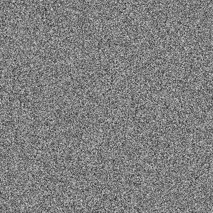

# Bruit blanc

<table>
<tr style="border: 0;">
<td style="border: 0;" valign="top">

<table>
<tr style="border: 0;">
<td width="33.33%" style="border: 0;" valign="top">

{width="200px"}

<b>Entrée :</b> Générateurs de textures > Bruits

</td>
<td width="100.00%" style="border: 0;" valign="top">

## Description

Génère un bruit blanc à l’aide de l’une des trois méthodes ciblant différentes formes d’histogramme : uniforme, gaussien et triangulaire.

</td>
</tr>
</table>

<table>
<tr style="border: 0;">
<td style="border: 0;" valign="top">

### Sorties

</td>
<td style="border: 0;" valign="top">

### Paramètres

</td>
<td style="border: 0;" valign="top">

### Exemples

</td>
</tr>
</table>

## Sorties

|  |  |
| --- | --- |
| <b>Sortie</b> *Niveaux de gris* | Le bruit généré est une image bitmap en niveaux de gris. |

## Paramètres

|  |  |
| --- | --- |
| <b>Répartition du bruit</b> Entier | La méthode de répartition des ingrédients pour cibler une forme d’histogramme :<ul data-preserve-html="true"> <li data-preserve-html="true"><i>Uniforme :</i> histogramme plat.</li> <li data-preserve-html="true"><i>Gaussien :</i> histogramme représentant une distribution normale, semblable à une courbe en cloche.</li> <li data-preserve-html="true"><i>Triangle :</i> un histogramme triangulaire.</li> </ul> |
| <b>Désordre</b> Flottant | Déplace les ingrédients du bruit.    Cela peut être utilisé pour animer le bruit. |
| <b>Désorganiser la vitesse</b> Flotter | Ajuste la distance de displacement appliquée par le paramètre <b>Désordre</b>.    Cela permet de contrôler la vitesse du displacement lors de l’animation du bruit. |

## Exemples

<table>
<tr style="border: 0;">
<td style="border: 0;" valign="top">

{zoomable="yes"}

</td>
<td style="border: 0;" valign="top">

{zoomable="yes"}

</td>
</tr>
</table>

</td>
<td style="border: 0;" valign="top">

</td>
<td style="border: 0;" valign="top">

</td>
</tr>
</table>
