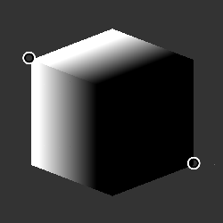

# 3D linear gradient

<table>
<tr style="border: 0;">
<td style="border: 0;" valign="top">

{width="128px"}

## 3D linear gradient

**Entrée :** *Générateurs de textures**/Motifs*

**Intermédiaire**

</td>
<td style="border: 0;" valign="top">

## Description

Crée un dégradé volumique basé sur le mappage de position d’entrée. Génère efficacement une transition du noir au blanc entre 2 points dans l’espace 3D. Destiné à être utilisé uniquement avec le moteur GPU.

Voir également [Masque de volume 3D](../../../../../../compositing-graphs/nodes-reference-for-com/node-library/texture-generators/patterns/3d-volume-mask/3d-volume-mask.md) pour obtenir un effet similaire.

## Paramètres

* **Mode de position des points** : *Positions UV, positions dans l&#39;espace universel* Choisissez si les points de dégradé fonctionnent dans l&#39;espace UV (cela fonctionne mieux lorsque vous les définissez en vue 2D) ou dans les coordonnées 3D, si vous souhaitez saisir manuellement une position exacte.
* **Point 1** :\
  Point de départ du dégradé. Il peut s’agir de coordonnées 2D ou 3D basées sur le mode Position.
* **Point 2** :\
  Point de fin du dégradé. Il peut s’agir de coordonnées 2D ou 3D basées sur le mode Position.
* **Contraste** : *0,0 - 1,0*\
  Règle le contraste du résultat.

## Exemples d’images

</td>
</tr>
</table>
