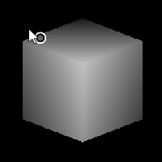

# Cube 3D

<table>
<tr style="border: 0;">
<td width="33.33%" style="border: 0;" valign="top">

<b>Entrée :</b> Générateurs De Textures > Motifs

</td>
<td width="100.00%" style="border: 0;" valign="top">

## Description

Effectue le rendu d’un cube 3D en niveaux de gris dont l’ombrage sert également de profondeur d’écran. Le cube résultant a des bords ultra-nets et nets lorsqu’il est utilisé avec des profondeurs binaires de haute précision. Très intéressant et utile !

</td>
</tr>
</table>

## Paramètres

|  |  |
|:---|:---|
| <b>Décalage d&#39;orientation</b> | Permet une rotation X et Y du cube de type 3D. Peut également être effectué en manipulant le petit point dans l’aperçu 2D (comme indiqué dans l’exemple ci-dessous) |
| <b>Taille</b> <i>0.0 - 1.0</i> | Permet un redimensionnement non uniforme du cube. |
| <b>Échelle</b> <i>0.0 - 1.0</i> | Redimensionne uniformément le cube entier. |
| <b>Extension non carrée</b> <i>Faux/Vrai</i> | Permet la compensation de la courbure et de l’étirement avec des proportions non carrées. |

## Exemples

<table style="margin-top: 32px; margin-bottom: 32px">
    <tr style="border: 0">
        <td style="border: 0; background: transparent">
            
        </td>
    </tr>
</table>
