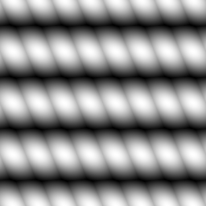

# Fibres 2

<table>
<tr style="border: 0;">
<td width="33.33%" style="border: 0;" valign="top">

{width="128px"}

<b>Entrée :</b> Générateurs de textures > Motifs

</td>
<td width="100.00%" style="border: 0;" valign="top">

## Description

Motif simple ressemblant à un tissu. Peut être utilisé pour le maillage, le tissu ou d&#39;autres cartes organiques d&#39;Heights et de détails. Voir également [Fibres 1](../../../../../../compositing-graphs/nodes-reference-for-com/node-library/texture-generators/patterns/fibers-1/fibers-1.md) pour une version plus petite.

</td>
</tr>
</table>

## Paramètres

|  |  |
|:---|:---|
| <b>Mosaïque</b> <i>1 - 16</i> | Définit le nombre de fois où le résultat doit se produire. |
| <b>Extension non carrée</b> <i>Faux/Vrai</i> | Permet la compensation de la courbure et de l’étirement avec des proportions non carrées. |

## Exemples

<table style="margin-top: 32px; margin-bottom: 32px">
    <tr style="border: 0">
        <td style="border: 0; background: transparent">
            
        </td>
    </tr>
</table>
