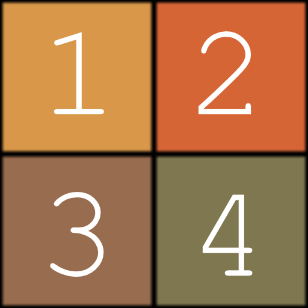

# couleur Atlas en grille

<table>
<tr style="border: 0;">
<td width="33.33%" style="border: 0;" valign="top">

Icône 

<b>Entrée :</b> Générateur > Motif

</td>
<td width="100.00%" style="border: 0;" valign="top">

## Description

Emportez jusqu’à 16 images couleur sur une grille de taille XY réglable. L&#39;image de l&#39;atlas de sortie peut être échantillonnée par un nœud [Shape splatter v2](../shape-splatter-v2/shape-splatter-v2.md) ou [Shape splatter mapper color](../shape-splatter-v2-mapper-color/shape-splatter-v2-mapper-color.md).

Voir aussi [Niveaux de gris Atlas en grille](../grid-atlas-grayscale/grid-atlas-grayscale.md).

</td>
</tr>
</table>

## Entrées

|                         |                            |
|:------------------------|:---------------------------|
| <b>Entrée 1</b> *Couleur* | #1 d’entrée de l’image couleur. |
| <b>Entrée 2</b> *Couleur* | #2 d’entrée de l’image couleur. |
| <b>Entrée 3</b> *Couleur* | #3 d’entrée de l’image couleur. |
| <b>Entrée 4</b> *Couleur* | #4 d’entrée de l’image couleur. |
| <b>Entrée 5</b> *Couleur* | #5 d’entrée de l’image couleur. |
| <b>Entrée 6</b> *Couleur* | #6 d’entrée de l’image couleur. |
| <b>Entrée 7</b> *Couleur* | #7 d’entrée de l’image couleur. |
| <b>Entrée 8</b> *Couleur* | #8 d’entrée de l’image couleur. |
| <b>Entrée 9</b> *Couleur* | #9 d’entrée de l’image couleur. |
| <b>Entrée 10</b> *Couleur* | #10 d’entrée de l’image couleur. |
| <b>Entrée 11</b> *Couleur* | #11 d’entrée de l’image couleur. |
| <b>Entrée 12</b> *Couleur* | #12 d’entrée de l’image couleur. |
| <b>Entrée 13</b> *Couleur* | #13 d’entrée de l’image couleur. |
| <b>Entrée 14</b> *Couleur* | #14 d’entrée de l’image couleur. |
| <b>Entrée 2</b> *Couleur* | #15 d’entrée de l’image couleur. |
| <b>Entrée 2</b> *Couleur* | #16 d’entrée de l’image couleur. |

## Sorties

|               |                              |
|:--------------|:-----------------------------|
| <b>Sortie</b> | Atlas en grille colorimétrique de sortie. |

## Paramètres

|                                   |                                                                                                                                                                                                                                                                                                                                                                    |
|:----------------------------------|:-------------------------------------------------------------------------------------------------------------------------------------------------------------------------------------------------------------------------------------------------------------------------------------------------------------------------------------------------------------------|
| <b>Taille de Grille X</b> *Entier* | Taille de la grille sur l&#39;axe X. C&#39;est-à-dire le nombre d&#39;images compressées sur l&#39;axe X. |
| <b>Taille de Grille Y</b> *Entier* | Taille de la grille sur l&#39;axe Y. C&#39;est-à-dire le nombre d&#39;images compressées sur l&#39;axe Y. |
| <b>Mode Taille de sortie</b> *Entier* | Méthode de définition de la taille de l&#39;image de sortie en fonction du paramètre de base « Taille de sortie » du nœud :  - <b>Manuel :</b> Utilisez la taille telle quelle. - <b>Rapport automatique :</b> Ajustez le rapport d&#39;image en fonction de la taille de la grille afin de réduire la taille de l&#39;image. La déformation se produira pour les grilles non carrées utilisant 3 lignes ou colonnes, par exemple (3, 2), (4, 3) |

## Exemples

 
<i>Nœud de couleur Atlas en grille dans le contexte d&#39;un graphe</i>