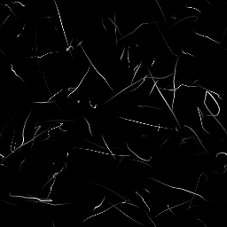

# Générateur Scratches

<table>
<tr style="border: 0;">
<td width="33.33%" style="border: 0;" valign="top">

<b>Entrée :</b> Générateurs De Textures > Motifs

</td>
<td width="100.00%" style="border: 0;" valign="top">

## Description

Cela place des rayures aléatoires avec beaucoup d’options de personnalisation, vous permettant par exemple de définir la direction, l’étendue et la distorsion.

Il existe une version spéciale de Scratches Generator, Scratches Generator Normal, qui génère des cartes de normales en fonction de la profondeur de ces rayures. La plupart des options sont identiques, mais quelques paramètres supplémentaires sont clairement indiqués pour les paramètres Normal (voir ci-dessous).

</td>
</tr>
</table>

## Paramètres

|  |  |
|:---|:---|
| <b>Numéro de spline</b> <i>1 - 512</i> | Quantité de rayures (splines) à placer. |
| <b>Segments Max. Par Spline</b> <i>2 - 256</i> | Nombre de segments/subdivisions sur la longueur d’une rayure. Permet d’obtenir des courbes et des distorsions plus lisses. L’effet est plus perceptible avec des valeurs de Distorsion plus élevées. |
| <b>Rotation de la spline</b> <i>0.0 - 1.0</i> | Rotation uniforme de toutes les splines, pour les orienter dans une direction. |
| <b>Rotation Spline Aléatoire</b> <i>0.0 - 1.0</i> | Variation de l&#39;angle : fait pivoter chaque spline de manière aléatoire. |
| <b>Échelle Spline</b> <i>0.0 - 1.0</i> | Redimensionne uniformément toutes les splines. |
| <b>Échelle Spline Aléatoire</b> <i>0.0 - 1.0</i> | Redimensionne chaque spline de manière aléatoire et individuelle. |
| <b>Distorsion spline</b> <i>0.0 - 1.0</i> | Niveau de distorsion uniforme sur toutes les splines. |
| <b>Distorsion Spline Aléatoire</b> <i>0.0 - 1.0</i> | Rend aléatoire le niveau de distorsion de chaque spline individuellement. |
| <b>Fréquence de Distorsion de la spline</b> <i>0.0 - 1.0</i> | Définit la fréquence de distorsion et l’échelle des détails de la distorsion. |
| <b>Largeur de la spline</b> <i>0.0 - 2.0</i> | Définit la largeur de toutes les splines de manière uniforme. |
| <b>Spline Width Random</b> <i>0.0 - 1.0</i> | Rend aléatoire la largeur de spline de chaque spline individuellement. |
| <b>Position De La Spline Aléatoire</b> <i>0.0 - 1.0</i> | Rend aléatoire la position de chaque spline individuellement. Plus cette valeur est faible, plus le cluster des splines sera important vers le centre de la zone de travail. Peut être utilisé pour créer des taches de rayures. |
| <b>Définir la largeur de la spline en px</b> <i>Faux/Vrai</i> | Détermine les unités utilisées pour les paramètres de largeur de spline. |
| <b>Luminance aléatoire (version en niveaux de gris uniquement)</b> <i>0.0 - 1.0</i> | Rend aléatoire la Luminance de chaque spline individuellement. |
| <b>Intensité normale (version normale uniquement)</b> <i>0.0 - 1.0</i> | Définit globalement la force de l&#39;effet Normal pour chaque spline. |
| <b>Intensité normale aléatoire (version normale uniquement)</b> <i>0.0 - 1.0</i> | Rend aléatoire la force normale de chaque spline individuellement. |
| <b>Format normal (version normale uniquement)</b> <i>DirectX, OpenGL</i> | Bascule entre différents formats de mappage normal (inverse la couche verte). |
| <b>Mode Atténuation</b> <i>Aucun, Début, Fin, Début + Fin</i> | Définit si les splines sont atténuations et dans quel sens. |
| <b>Longueur Atténuation</b> <i>0.0 - 1.0</i> | Définit la longueur de l’effet d’atténuation, si cette option est activée ci-dessus. |
| <b>Extension non carrée</b> <i>Faux/Vrai</i> | Active la compensation de la courbure et de la étire avec des proportions non carrées. |

## Exemples

<table style="margin-top: 32px; margin-bottom: 32px">
    <tr style="border: 0">
        <td style="border: 0; background: transparent">
            
        </td>
        <td style="border: 0; background: transparent">
            
        </td>
    </tr>
</table>
