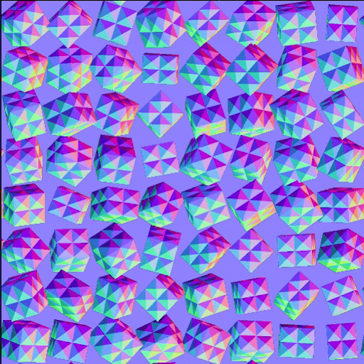

# Couleur du mappeur d’éclaboussures de forme v2

<table>
<tr style="border: 0;">
<td width="33.33%" style="border: 0;" valign="top">

<b>Entrée :</b> Générateur > Motif

</td>
<td width="100.00%" style="border: 0;" valign="top">

## Description

Mappe les images couleur sur les formes générées et dispersées à l&#39;aide du nœud [Shape splatter v2](../shape-splatter-v2/shape-splatter-v2.md) , à l&#39;aide des données supplémentaires fournies par le nœud.  Les images sont fournies en tant qu&#39;entrées de motif distinctes ou compressées dans un atlas en grille. Elles peuvent être appliquées aux formes à l&#39;aide de la cartographie UV, de la projection triplanaire ou de la cartographie personnalisée.  Les formes peuvent être teintées et leurs couleurs ajustées de manière uniforme ou aléatoire par forme.

Voir aussi [Éclaboussure de forme v2 mapper niveaux de gris](../shape-splatter-v2-mapper-grayscale/shape-splatter-v2-mapper-grayscale.md).

</td>
</tr>
</table>

>[!INFO]
>
> Ce nœud nécessite des données d&#39;entrée générées par le nœud [Shape splatter v2](../shape-splatter-v2/shape-splatter-v2.md).
> 
> Autres nœuds de la famille Shape splatter v2 :
> * [Éclaboussure de forme v2 au masque](../shape-splatter-v2-to-mask/shape-splatter-v2-to-mask.md)
>
> Les nœuds de [couleur Atlas en grille](../grid-atlas-color/grid-atlas-color.md) vous permettent de regrouper des images dans un atlas de taille personnalisée, jusqu&#39;à 16 motifs dans 4*4 cellules.

>[!TIP]
> 
> L&#39;échantillon de matière [&#128279;](../../../../../../function-graphs/nodes-reference-for-fun/function-node-library/function-nodes-sdf-functions/working-with-sdf-functions.md#material-sample) des **« boulons rouillés »** est disponible pour commencer avec les nœuds Shape Splatter v2.
> 
> Pour en savoir plus sur les concepts et les workflows impliquant des Fonctions SDF, consultez la page dédiée : [Utilisation des Fonctions SDF](../../../../../../function-graphs/nodes-reference-for-fun/function-node-library/function-nodes-sdf-functions/working-with-sdf-functions.md)

## Entrées

|                                 |                                                                                                                                                                                                                                                                                                                                                                                                                                                                                                                                                                                                                                                                                                                                                                                                                                                                                        |
|:--------------------------------|:---------------------------------------------------------------------------------------------------------------------------------------------------------------------------------------------------------------------------------------------------------------------------------------------------------------------------------------------------------------------------------------------------------------------------------------------------------------------------------------------------------------------------------------------------------------------------------------------------------------------------------------------------------------------------------------------------------------------------------------------------------------------------------------------------------------------------------------------------------------------------------------|
| <b>Entrée Atlas en grille</b> *Couleur* | Image couleur de motifs entassés dans une mise en page en grille.  La taille de la grille doit correspondre à celle utilisée par le nœud [Shape splatter v2](../shape-splatter-v2/shape-splatter-v2.md).  Utilisez le nœud [Couleur d&#39;Atlas en grille](../grid-atlas-color/grid-atlas-color.md) pour compresser des motifs distincts dans un atlas en grille. |
| <b>Entrée de motif 1</b> *Couleur* | Image couleur du motif de #1 mappé aux formes.  <i>Conseil :</i> utilisez une résolution proche de la taille maximale que peut avoir le motif lorsqu&#39;il est diffusé. |
| <b>Entrée de motif 2</b> *Couleur* | Image couleur du motif de #2 mappé aux formes.  <i>Conseil :</i> utilisez une résolution proche de la taille maximale que peut avoir le motif lorsqu&#39;il est diffusé. |
| <b>Entrée de motif 3</b> *Couleur* | Image couleur du motif de #3 mappé aux formes.  <i>Conseil :</i> utilisez une résolution proche de la taille maximale que peut avoir le motif lorsqu&#39;il est diffusé. |
| <b>Entrée de motif 4</b> *Couleur* | Image couleur du motif de #4 mappé aux formes.  <i>Conseil :</i> utilisez une résolution proche de la taille maximale que peut avoir le motif lorsqu&#39;il est diffusé. |
| <b>Entrée de motif 5</b> *Couleur* | Image couleur du motif de #5 mappé aux formes.  <i>Conseil :</i> utilisez une résolution proche de la taille maximale que peut avoir le motif lorsqu&#39;il est diffusé. |
| <b>Entrée de motif 6</b> *Couleur* | Image couleur du motif de #6 mappé aux formes.  <i>Conseil :</i> utilisez une résolution proche de la taille maximale que peut avoir le motif lorsqu&#39;il est diffusé. |
| <b>Entrée de motif 7</b> *Couleur* | Image couleur du motif de #7 mappé aux formes.  <i>Conseil :</i> utilisez une résolution proche de la taille maximale que peut avoir le motif lorsqu&#39;il est diffusé. |
| <b>Entrée de motif 8</b> *Couleur* | Image couleur du motif de #8 mappé aux formes.  <i>Conseil :</i> utilisez une résolution proche de la taille maximale que peut avoir le motif lorsqu&#39;il est diffusé. |
| <b>Entrée en arrière-plan</b> *Couleur* | Image couleur utilisée comme arrière-plan pour les formes mappées. |
| <b>Entrée de couleur</b> *Couleur* | Image couleur utilisée pour teinter les formes mappées en fonction de leur position de pivot.  Utilisez le paramètre d&#39;<b>opacité d&#39;entrée de couleur</b> pour régler l&#39;intensité de la contribution de ces couleurs à la couleur des formes. |
| <b>Normal</b> *Couleur* | Normales calculées pour les formes dispersées, masquées en fonction de la fusion avec l&#39;height d&#39;arrière-plan.   Si le <b>type de forme</b> est &#39;Atlas en grille&#39;, les normales fournies à l&#39;entrée <b>Atlas en grille normal</b> sont utilisées directement. |
| <b>Splatter UVW</b> *Couleur* | <b>R</b> - Composante U des UV des formes. <b>G</b> - Composante V des UV des formes. <b>B</b> - height des formes. (W) <b>A</b> - Données compressées :  - <i>Partie d&#39;entier :</i> Identificateur unique des formes. (ID)  - <i>Partie fractionnaire :</i> dépend du <b>type de forme</b> : ID de matériau si SDF/primitif, ID de motif* si entrée de motif/atlas en grille.  <b>* :</b> L’ID de motif est l’index de la forme dans la liste/l’atlas. |
| <b>Données d’éclaboussures 1</b> *Couleur* | <b>R</b> - Composante X de la position sur la surface de la forme, dans l&#39;espace objet. <b>G</b> - Composante Y de la position sur la surface de la forme, dans l&#39;espace objet. <b>B</b> - Composante Z de la position sur la surface de la forme, dans l&#39;espace objet. <b>A</b> - Données compressées :  - <i>Partie entière :</i> U de la composante UV des coordonnées des données des formes dans les sorties Données 2/3.  - <i>Partie fractionnaire :</i> composante V des coordonnées UV pour les données des formes dans les sorties Données 2/3.  - Masque binaire <i>Sign:</i> pour la fusion des formes avec l&#39;height d&#39;arrière-plan. |
| <b>Données d’éclaboussures 2</b> *Couleur* | <b>R</b> - Composant X de la rotation 3D des formes. <b>G</b> - Composant Y de la rotation 3D des formes. <b>B</b> - Composant Z de la rotation 3D des formes. <b>A</b> - La rotation des formes autour de leur normale.  Toutes les rotations sont définies en nombre de tours. |
| <b>Éclaboussures de données 3</b> *Couleur* | <b>R</b> - Composante X de la position des formes. <b>G</b> - Composante Y de la position des formes. <b>B</b> - Les formes sont décalées le long de leur normale. <b>A</b> - Données compressées :  - <i>Partie entière :</i> ID de la forme.  - <i>Partie fractionnaire :</i>l’index du motif des formes dans son atlas source. (si vous utilisez un type de motif atlas en grille) |
| <b>Données d’éclaboussures 4</b> *Couleur* | <i>Pixel 1</i> <b>R</b> - Taille X des images de sortie Data 2/3. <b>G</b> - Taille Y des images de sortie Data 2/3. <b>B</b> - Taille X de l’image de sortie Data 4. <b>A</b> - Taille Y de l’image de sortie Data 4.  <i>Pixel 2</i> <b>R</b> : type de forme. (E.g. Cube, cylindre, ...) <b>G</b> - Données compressées :  - <i>Valeur absolue :</i> Numéro d&#39;entrée du motif.  - <i>Format Sign:</i> normal du mappage normal de sortie. (Positif : DirectX / Négatif : OpenGL) <b>B</b> - Taille X de l&#39;atlas en grille. (C’est-à-dire le nombre de colonnes) <b>A</b> - Taille Y de l’atlas en grille. (c’est-à-dire le nombre de lignes) |

## Sorties

|               |                     |
|:--------------|:--------------------|
| <b>Sortie</b> | Les formes colorées. |

## Paramètres

|                                            |                                                                                                                                                                                                                                                                                                                                                                                                                                                                                                                                                                                                                                                                                                                                                                                                                                                                                                                                                                                                                                                                |
|:-------------------------------------------|:---------------------------------------------------------------------------------------------------------------------------------------------------------------------------------------------------------------------------------------------------------------------------------------------------------------------------------------------------------------------------------------------------------------------------------------------------------------------------------------------------------------------------------------------------------------------------------------------------------------------------------------------------------------------------------------------------------------------------------------------------------------------------------------------------------------------------------------------------------------------------------------------------------------------------------------------------------------------------------------------------------------------------------------------------------------|
| <b>Mode de projection</b> *Nombre entier* | Méthode de projection des images d&#39;entrée sur les formes :  - <b>À partir d&#39;UV à éclaboussures :</b> Utilisez les UV fournis par le nœud &#39;Shape splatter v2&#39;. - <b>Triplanar :</b> Utilisez la projection triplanaire pour mapper les images sur les axes XYZ locaux des formes. - <b>Fonction personnalisée :</b> Créez un graphique de fonction pour définir le mappage des images sur les formes. |
| <b>Fonction personnalisée</b> *Float4* | Spécifie la couleur RVBA par pixel des formes sous la forme d&#39;un objet Float4.  Les variables suivantes sont disponibles : - <code>shape.position.os</code> (Float3) Position de la surface de la forme dans l&#39;espace objet. - <code>shape.position.ws</code> (Float3) Position de la surface de la forme dans l’espace univers*. - <code>shape.normal.os</code> (Float3) Normales de la surface de la forme dans l&#39;espace objet.  - <code>shape.normal.ws</code> (Float3) Les normales de la surface de la forme dans l’espace univers*. - <code>shape.id</code> (Flottant) Identificateur unique de la forme. - <code>matériau.id</code> (Flottant) ID de matériau de la surface de la forme, défini par le nœud « Shape splatter v2 ».  * : l&#39;espace univers de la forme est centré sur son pivot et ne tient pas compte de l&#39;height de la forme. Cela signifie que la seule différence avec l’espace objet est l’orientation.  Si l&#39;échantillonnage des entrées du nœud de mappeur « Shape splatter v2 » est nécessaire, ces emplacements d&#39;entrée de nœud <b>Échantillon de couleur</b> peuvent être utilisés : - 0 : Atlas en grille - 1-8 : Entrée de motif 1-8 |
| <b>Mappage normal</b> *Booléen* | Spécifie si les images fournies à l&#39;<b>entrée Atlas en grille</b> ou à l&#39;<b>entrée Motif #</b> sont des maps normal.  Cette opération est nécessaire pour activer le traitement requis pour gérer correctement les vecteurs normaux et les appliquer aux formes. |
| <b>Format normal d&#39;entrée</b> *Nombre entier* | Le format des maps normal fournies pour l&#39;<b>entrée d&#39;Atlas en grille</b> ou l&#39;<b>entrée de motif #</b>.  inverse efficacement le canal vert.  -<b>DirectX:</b> L&#39;axe Y pointe vers le haut. -<b>OpenGL:</b> L&#39;axe Y pointe vers le bas. |
| <b>Mélange de contraste</b> *Flotter* | Netteté des transitions entre les projections planaires, où 1 signifie aucun dégradé d’atténuation. |
| <b>projection d&#39;image</b> *Nombre entier* | Quantité d&#39;images <b>d&#39;entrée de motif #</b> distribuées sur les projections planaires contribuant au mappage triplanaire.  Afin de couvrir tous les côtés d’une forme, une projection planaire avant (+) et arrière (-) est effectuée sur chaque axe, pour un total de 6 projections.  - <b>1 image :</b> L’entrée Motif 1 est utilisée pour toutes les projections planaires. - <b>3 images :</b> Une entrée Motif distincte est utilisée pour la +/- projection de chaque axe. - <b>6 images :</b> Chaque projection utilise une entrée Motif distincte. - <b>1 image par ID de matériau :</b> Utilisez une entrée Motif distincte saisie par ID de matériau, où chaque image est utilisée pour toutes les planaires projections. |
| <b>Centre de Projection</b> *Float3* | Décale la projection triplanaire par axe, dans l’espace objet.  Le décalage est appliqué à l&#39;<i>espace de projection entier</i>. Par conséquent, un décalage sur un axe affectera le positionnement des textures projetées sur les <i>deux autres</i> axes. |
| <b>Échelle de Projection</b> *Flotter* | Ajuste l&#39;échelle des textures projetées sur <i>tous les axes</i>, selon le facteur spécifié. |
| <b>Mode de sélection d&#39;entrée</b> *Nombre entier* | Méthode de sélection des images d&#39;entrée à mapper aux formes.  Le <b>type de forme</b> sélectionné dans le nœud source &#39;Shape splatter v2&#39; modifie la façon d&#39;affecter des images aux formes :  -<b>Atlas en grille</b> signifie que les images sont récupérées dans &#39;Entrée d&#39;Atlas en grille&#39; par des index de grille correspondants (les deux atlas doivent utiliser la même taille de grille) -<b>Entrée de motif</b> signifie que les images sont récupérées dans les entrées &#39;Entrée de motif #&#39; en faisant correspondre les index. -<b>Autres types de formes :</b> les images sont affectées en faisant correspondre les index aux matériaux de la forme ID de .  Les méthodes disponibles pour sélectionner les index sont les suivantes : - <b>À partir des données de projection :</b> Faites correspondre les index des images &#39;Pattern input #&#39; ou &#39;Atlas en grille input&#39; aux index des formes attribuées par le nœud &#39;Shape splatter v2&#39;. - <b>Manuel :</b> Utilisez l&#39;index spécifié par le paramètre &#39;Image index&#39;. - <b>Aléatoire :</b> Utilisez un index aléatoire dans la plage spécifiée par le paramètre &#39;Random range&#39;. |
| <b>Numéro d&#39;entrée du motif</b> *Nombre entier* | Quantité d&#39;<b>images d&#39;entrée de motif #</b> à mapper sur les formes. |
| <b>Index d&#39;image</b> *Nombre entier* | Index du motif d&#39;entrée de l&#39;<b>entrée de motif #</b> ou de l&#39;<b>entrée d&#39;Atlas en grille</b> qui doit être mappé sur les formes. |
| <b>Plage aléatoire</b> *Entier2* | La plage d&#39;index de l&#39;<b>entrée de motif #</b> ou de l&#39;<b>entrée d&#39;Atlas en grille</b> dans laquelle ce motif doit être sélectionné aléatoirement pour être mappé sur les formes. |
| <b>Réglage TSL</b> *Float3* | Décalage uniformément appliqué à la teinte, la saturation et la luminance (TSL) de toutes les formes. |
| <b>TSL aléatoire</b> *Float3* | Décalage aléatoire, positif ou négatif, de la teinte, de la saturation et de la luminance (TSL) des formes, jusqu’aux valeurs spécifiées. |
| <b>Opacité d&#39;entrée de couleur</b> *Flotter* | Intensité de la contribution de l&#39;<b>entrée de couleur</b> aux couleurs des formes, selon le <b>mode de fusion d&#39;entrée de couleur</b> sélectionné. |
| <b>Mode de fusion d&#39;entrée de couleur</b> *Nombre entier* | Opération de mélange des couleurs utilisée pour combiner les images de premier plan et d’arrière-plan.  Ces opérations sont identiques à leurs homologues dans le nœud <b>Blend</b>.  Modes disponibles : - <b>Copier</b> - <b>Ajouter (densité linéaire)</b> - <b>Soustraire</b> - <b>Multiplier</b> - <b>Superposer</b> |
| <b>Angle normal aléatoire</b> *Flotter* | Un vecteur de direction est généré à partir de l&#39;origine du vecteur normal vers un point aléatoire sur la base d&#39;un cône autour du vecteur normal, puis le vecteur normal est mélangé avec ce vecteur de direction aléatoire.  Ce paramètre ajuste l&#39;<i>angle du cône</i>, où 1 est un hémisphère et 0 signifie que le vecteur de direction est égal au vecteur normal. |
| <b>Mode mosaïque</b> *Nombre entier* | Axes selon lesquels la texture doit être répétée :  - <b>Aucun carrelage</b>  - <b>Carrelage horizontal</b>  - <b>Carrelage vertical</b>  - <b>Carrelage H et V</b> : carrelage horizontal et vertical combiné. |
| <b>Carrelage UV</b> *Flotter* | Ajuste la mosaïque globale des images mappées sur les formes  Les valeurs élevées entraînent davantage de répétitions. |
| <b>Échelle UV</b> *Float2* | Ajuste la juxtaposition des images mappées sur les formes selon le facteur spécifié, avec des commandes de mise à l’échelle U et V distinctes. Plus la valeur est élevée, plus le nombre de répétitions est élevé. |
| <b>Décalage des UV</b> *Float2* | Applique un décalage au mappage des images sur les formes, ce qui permet un réglage fin du positionnement des images sur les formes.  Ce décalage est ajouté au <b>décalage aléatoire</b>, le cas échéant. |
| <b>Décalage aléatoire</b> *Flotter* | Applique une quantité aléatoire de décalage positif ou négatif <i>par forme</i> au mappage des images sur les formes, jusqu&#39;à la valeur spécifiée.  Ce décalage est ajouté au <b>Décalage des UV</b>, le cas échéant. |

## Exemples

<table style="margin-top: 32px; margin-bottom: 32px; border: none">
    <tr style="border: 0; background: transparent">
        <td style="width: 33%; border: 0; background: transparent">
             <i>Mappage triplanaire</i>
        </td>
        <td style="width: 33%; border: 0; background: transparent">
             <i>Mappage normal</i>
        </td>
        <td style="width: 33%; border: 0; background: transparent">
             <i>Mappage par ID de matériau à partir de formes SDF</i>
        </td>
    </tr>
    <tr style="border: 0; background: transparent">
        <td style="width: 33%; border: 0; background: transparent">
             <i>Réglage de la Répétition avec mappage triplanaire</i>
        </td>
        <td style="width: 33%; border: 0; background: transparent">
             <i>Mappage par ID de matériau à partir de la forme de cylindre</i>
        </td>
        <td style="width: 33%; border: 0; background: transparent">
             <i>Nœud dans le contexte d'un graphe</i> » /&gt;
        </td>
    </tr>
</table>

