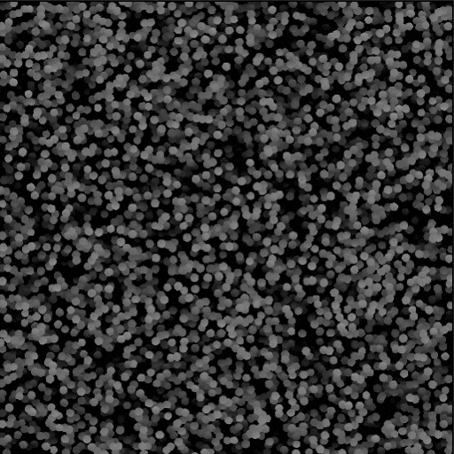

# Éclaboussure de forme v2

<table>
<tr style="border: 0;">
<td width="33.33%" style="border: 0;" valign="top">

Icône 

<b>Entrée :</b> Générateur > Motif

</td>
<td width="100.00%" style="border: 0;" valign="top">

## Description

Dispersion des formes sur une surface d&#39;height d&#39;arrière-plan avec des capacités avancées de diffusion dans un <b>espace 3D virtuel</b>, avec des commandes de position, de rotation, de mise à l&#39;échelle et de caractère aléatoire.  Le nœud offre des formes 3D primitives de base et prend en charge les formes personnalisées fournies sous la forme d&#39;<b>image de motif</b>, d&#39;<b>atlas</b> ou d&#39;une fonction <b>champ de distance signé (SDF)</b> pour les formes 3D personnalisées complexes.  Plusieurs <b>méthodes de distribution des formes</b> sont disponibles, y compris la création d&#39;une fonction personnalisée pour un contrôle complet.Les formes   peuvent être étirées vers des zones spécifiques à l&#39;aide d&#39;une <b>map density</b> personnalisée.  <i>Remarque :</i> ce nœud n&#39;est pas destiné à être utilisé avec les versions CPU du moteur de Substance, c&#39;est-à-dire SSE2 (Windows, Linux) et NEON (macOS).

</td>
</tr>
</table>

>[!INFO]
>
> Les données générées par ce nœud peuvent être utilisées avec les autres nœuds de la famille Shape splatter v2:
> * [Couleur du mappeur d&#39;éclaboussures de forme v2](../shape-splatter-v2-mapper-color/shape-splatter-v2-mapper-color.md)
> * [Éclaboussure de forme v2 mapper niveaux de gris](../shape-splatter-v2-mapper-grayscale/shape-splatter-v2-mapper-grayscale.md)
> * [Éclaboussure de forme v2 au masque](../shape-splatter-v2-to-mask/shape-splatter-v2-to-mask.md)
> 
> Les nœuds de [couleur Atlas en grille](../grid-atlas-color/grid-atlas-color.md) vous permettent de regrouper des images dans un atlas de taille personnalisée, jusqu&#39;à 16 motifs dans 4*4 cellules.

>[!TIP]
>
> L&#39;exemple de matériau ](../../../../../../function-graphs/nodes-reference-for-fun/function-node-library/function-nodes-sdf-functions/working-with-sdf-functions.md#material-sample) [**&#39;Rusty bolts&#39;** est disponible pour commencer avec les nœuds Shape Splatter v2.
> 
> Pour en savoir plus sur les concepts et les workflows impliquant des Fonctions SDF, consultez la page dédiée : [Utilisation des Fonctions SDF](../../../../../../function-graphs/nodes-reference-for-fun/function-node-library/function-nodes-sdf-functions/working-with-sdf-functions.md)

## Entrées

|                                      |                                                                                                                                                                                                                                                                                                                                                                  |
|:-------------------------------------|:-----------------------------------------------------------------------------------------------------------------------------------------------------------------------------------------------------------------------------------------------------------------------------------------------------------------------------------------------------------------|
| <b>height en arrière-plan</b> *Niveaux de gris* | Map height de base dans laquelle les formes sont dispersées. Les heights de chacun sont associés à l&#39;aide d&#39;un mélange Max, où le plus élevé des deux est utilisé.  La contribution de l&#39;height d&#39;arrière-plan à l&#39;height de sortie est contrôlée par le paramètre <b>Opacité d&#39;entrée de l&#39;arrière-plan</b>. |
| <b>Map density</b> *Niveaux de gris* | Une texture en niveaux de gris définissant le displacement des formes en fonction de leur luminance, dans la mesure où les formes se rassemblent dans ses zones les plus lumineuses.  L&#39;intensité du displacement de formes est contrôlée par le paramètre <b>Multiplicateur de Map density</b>. |
| <b>Mappage de décalage d&#39;Height</b> *Niveaux de gris* | Une carte en niveaux de gris dont les valeurs sont ajoutées aux formes de manière uniforme en fonction de leur emplacement de pivot.  La contribution de la carte est contrôlée par le paramètre <b>Multiplicateur de carte de décalage d&#39;Height</b>. |
| <b>Mappage à l&#39;échelle de l&#39;Height</b> *Niveaux de gris* | Carte en niveaux de gris dont les valeurs sont utilisées comme facteur d’height des formes.  La contribution de la carte est contrôlée par le paramètre <b>Multiplicateur de carte à l&#39;échelle de l&#39;Height</b>. |
| <b>Mappage d&#39;échelle de forme</b> *Niveaux de gris* | Carte en niveaux de gris dont les valeurs sont utilisées comme facteur d’échelle des formes.  La contribution de la carte est contrôlée par le paramètre <b>Multiplicateur de carte d&#39;échelle</b>. |
| <b>Rotation de forme</b> *Niveaux de gris* | Carte en niveaux de gris dont les valeurs sont ajoutées à la rotation 3D des formes, ajustée par les facteurs par axe fournis par le paramètre <b>Multiplicateur de map rotation 3D</b>. |
| <b>Carte vectorielle</b> *Couleur* | Une carte décrivant des vecteurs de direction qui peuvent être utilisés pour piloter la rotation et/ou la position des formes, à l&#39;aide des paramètres suivants :  - <b>Le displacement de carte vectorielle</b> ajuste l&#39;effet de la carte pour déplacer les formes. - <b>L&#39;entrée de rotation de Pente</b> peut être définie sur &#39;Carte vectorielle&#39; pour utiliser cette carte pour faire pivoter les formes à l&#39;aide des paramètres associés. |
| <b>Mappage de masque</b> *Niveaux de gris* | Image utilisée pour masquer les formes selon le <b>seuil de la carte de masque</b>.  Les formes situées dans les zones de la carte où la luminance est inférieure à ce seuil seront masquées. |
| <b>Entrée de motif 1</b> *Niveaux de gris* | Map height du motif de #1 qui est diffusé lorsque <b>type de motif</b> est défini sur &#39;Entrée de motif&#39;.  <i>Conseil :</i> utilisez une résolution proche de la taille maximale que peut avoir le motif lorsqu&#39;il est diffusé. |
| <b>Entrée de motif 2</b> *Niveaux de gris* | Map height du motif de #2 qui est diffusé lorsque <b>type de motif</b> est défini sur &#39;Entrée de motif&#39;.  <i>Conseil :</i> utilisez une résolution proche de la taille maximale que peut avoir le motif lorsqu&#39;il est diffusé. |
| <b>Entrée de motif 3</b> *Niveaux de gris* | Map height du motif de #3 qui est diffusé lorsque <b>type de motif</b> est défini sur &#39;Entrée de motif&#39;.  <i>Conseil :</i> utilisez une résolution proche de la taille maximale que peut avoir le motif lorsqu&#39;il est diffusé. |
| <b>Entrée de motif 4</b> *Niveaux de gris* | Map height du motif de #4 qui est diffusé lorsque <b>type de motif</b> est défini sur &#39;Entrée de motif&#39;.  <i>Conseil :</i> utilisez une résolution proche de la taille maximale que peut avoir le motif lorsqu&#39;il est diffusé. |
| <b>Entrée de motif 5</b> *Niveaux de gris* | Map height du motif de #5 qui est diffusé lorsque <b>type de motif</b> est défini sur &#39;Entrée de motif&#39;.  <i>Conseil :</i> utilisez une résolution proche de la taille maximale que peut avoir le motif lorsqu&#39;il est diffusé. |
| <b>Entrée de motif 6</b> *Niveaux de gris* | Map height du motif de #6 qui est diffusé lorsque <b>type de motif</b> est défini sur &#39;Entrée de motif&#39;.  <i>Conseil :</i> utilisez une résolution proche de la taille maximale que peut avoir le motif lorsqu&#39;il est diffusé. |
| <b>Entrée de motif 7</b> *Niveaux de gris* | Map height du motif de #7 qui est diffusé lorsque <b>type de motif</b> est défini sur &#39;Entrée de motif&#39;.  <i>Conseil :</i> utilisez une résolution proche de la taille maximale que peut avoir le motif lorsqu&#39;il est diffusé. |
| <b>Entrée de motif 8</b> *Niveaux de gris* | Map height du motif de #8 qui est diffusé lorsque <b>type de motif</b> est défini sur &#39;Entrée de motif&#39;.  <i>Conseil :</i> utilisez une résolution proche de la taille maximale que peut avoir le motif lorsqu&#39;il est diffusé. |
| <b>height Atlas en grille</b> *Niveaux de gris* | Image décrivant l’height des motifs entassés dans un atlas.  Utilisez le paramètre <b>Taille de l&#39;Atlas en grille</b> pour spécifier la taille de grille de l&#39;atlas. |
| <b>Atlas en grille normal</b> *Couleur* | Image décrivant les normales des motifs entassés dans un atlas.  Utilisez le paramètre <b>Taille de l&#39;Atlas en grille</b> pour spécifier la taille de grille de l&#39;atlas. |

## Sorties

|                        |                                                                                                                                                                                                                                                                                                                                                                                                                                                                                                                                                                                                                                                                                                                                                                                                                                                                                        |
|:-----------------------|:---------------------------------------------------------------------------------------------------------------------------------------------------------------------------------------------------------------------------------------------------------------------------------------------------------------------------------------------------------------------------------------------------------------------------------------------------------------------------------------------------------------------------------------------------------------------------------------------------------------------------------------------------------------------------------------------------------------------------------------------------------------------------------------------------------------------------------------------------------------------------------------|
| <b>Height</b> | Map height calculée pour les formes dispersées, y compris l’height d’arrière-plan s’il est utilisé et visible. |
| <b>Couleur SDF</b> | Couleurs de la forme produites par la <b>Fonction SDF</b>.  Utilisez le nœud <a href="../../../../../../function-graphs/nodes-reference-for-fun/function-node-library/function-nodes-sdf-functions/sdf-functions-material/set-color/set-color.md">Définir la couleur</a> dans le graphe Fonction SDF pour définir une couleur par composant de la forme. |
| <b>Métallique SDF</b> | Couleurs de la forme produites par la <b>Fonction SDF</b>.  Utilisez le nœud <a href="../../../../../../function-graphs/nodes-reference-for-fun/function-node-library/function-nodes-sdf-functions/sdf-functions-material/set-metalness/set-metalness.md">Définir le caractère métallique</a> dans le graphe Fonction SDF pour définir une valeur de caractère métallique par composant de la forme. |
| <b>rugosité SDF</b> | Couleurs de la forme produites par la <b>Fonction SDF</b>.  Utilisez le nœud <a href="../../../../../../function-graphs/nodes-reference-for-fun/function-node-library/function-nodes-sdf-functions/sdf-functions-material/set-roughness/set-roughness.md">Définir la rugosité</a> dans le graphe Fonction SDF pour définir une valeur de rugosité par composant de la forme. |
| <b>Normal</b> | Normales calculées pour les formes dispersées, masquées en fonction de la fusion avec l&#39;height d&#39;arrière-plan.   Si le <b>type de forme</b> est &#39;Atlas en grille&#39;, les normales fournies à l&#39;entrée <b>Atlas en grille normal</b> sont utilisées directement. |
| <b>Splatter UVW</b> | <b>R</b> - Composante U des UV des formes. <b>G</b> - Composante V des UV des formes. <b>B</b> - height des formes. (W) <b>A</b> - Données compressées :  - <i>Partie Entier :</i> identifiant unique des formes. (ID)  - <i>Partie fractionnaire :</i> dépend du <b>type de forme</b> : ID de Matériau si SDF/primitif, ID de modèle* si entrée/atlas en grille de modèle.  <b>* :</b> L’ID de modèle est l’index de la forme dans la liste/l’atlas. |
| <b>Données d’éclaboussures 1</b> | <b>R</b> - Composante X de la position sur la surface de la forme, dans l&#39;espace objet. <b>G</b> - Composante Y de la position sur la surface de la forme, dans l&#39;espace objet. <b>B</b> - Composante Z de la position sur la surface de la forme, dans l&#39;espace objet. <b>A</b> - Données compressées :  - <i>Partie Entier :</i> U de la composante des coordonnées UV pour les données des formes dans les sorties Données 2/3.  - <i>Partie fractionnaire :</i> composante V des coordonnées UV pour les données des formes dans les sorties Données 2/3.  - Masque binaire <i>Sign:</i> pour la fusion des formes avec l&#39;height d&#39;arrière-plan. |
| <b>Données d’éclaboussures 2</b> | <b>R</b> - Composant X de la rotation 3D des formes. <b>G</b> - Composant Y de la rotation 3D des formes. <b>B</b> - Composant Z de la rotation 3D des formes. <b>A</b> - La rotation des formes autour de leur normale.  Toutes les rotations sont définies en nombre de tours. |
| <b>Éclaboussures de données 3</b> | <b>R</b> - Composante X de la position des formes. <b>G</b> - Composante Y de la position des formes. <b>B</b> - Les formes se décalent normalement. <b>A</b> - Données compressées :  - <i>Partie Entier :</i> L&#39;identifiant unique de la forme.  - <i>Partie fractionnaire :</i>l’index du motif des formes dans son atlas source. (si vous utilisez un type de motif atlas en grille) |
| <b>Données d’éclaboussures 4</b> | <i>Pixel 1</i> <b>R</b> - Taille X des images de sortie Data 2/3. <b>G</b> - Taille Y des images de sortie Data 2/3. <b>B</b> - Taille X de l’image de sortie Data 4. <b>A</b> - Taille Y de l’image de sortie Data 4.  <i>Pixel 2</i> <b>R</b> : type de forme. (E.g. Cube, cylindre, ...) <b>G</b> - Données compressées :  - <i>Valeur absolue :</i> Numéro d&#39;entrée du motif.  - <i>Signature :</i> format normal de la map normal de sortie. (Positif : DirectX / Négatif : OpenGL) <b>B</b> - Taille X de l&#39;atlas en grille. (C’est-à-dire le nombre de colonnes) <b>A</b> - Taille Y de l’atlas en grille. (c’est-à-dire le nombre de lignes) |

## Paramètres

|                                                   |                                                                                                                                                                                                                                                                                                                                                                                                                                                                                                                                                                                                                                                                                                                                                                                                                                                                                                                                                               |
|:--------------------------------------------------|:--------------------------------------------------------------------------------------------------------------------------------------------------------------------------------------------------------------------------------------------------------------------------------------------------------------------------------------------------------------------------------------------------------------------------------------------------------------------------------------------------------------------------------------------------------------------------------------------------------------------------------------------------------------------------------------------------------------------------------------------------------------------------------------------------------------------------------------------------------------------------------------------------------------------------------------------------------------|
| <b>Mode de distribution de position</b> *Entier* | Méthode de répartition des formes dans l&#39;espace :  - <b>grille 2D :</b> grille uniforme simple. - <b>Disque de Poisson :</b> simulation visant à décaler aléatoirement les cellules d&#39;une grille pour éviter les chevauchements tout en utilisant l&#39;espace disponible. - <b>Uniforme :</b> répartition régulière d&#39;un nombre spécifié de formes. Nécessite des calculs plus intensifs. - <b>Fonction personnalisée :</b> Créez un graphe de fonction pour définir la répartition des formes. Les variables disponibles sont répertoriées dans la description du nœud. |
| <b>Fonction de position</b> *Flottant 2* | Graphe de fonction utilisé pour définir la répartition des formes.  Le sortie du graphe une valeur Flottant 2 pour la position normalisée XY des formes dans l&#39;image.  Variables disponibles :  - <code>shape.id</code> (Flottant) identifiant unique de la forme.  - <code>shape.amount</code> (Flottant) Quantité de formes spécifiée par le paramètre <b>Quantité</b>. |
| <b>X</b> *Entier* | Quantité de colonnes dans la grille de distribution.  C&#39;est-à-dire la quantité de formes générées sur l&#39;axe X. |
| <b>Quantité Y</b> *Entier* | Nombre de lignes dans la grille de distribution.  C&#39;est-à-dire le nombre de formes générées sur l&#39;axe Y. |
| <b>Quantité</b> *Entier* | Nombre de formes générées. |
| <b>Format normal de sortie</b> *Entier* | Format de la map normal de sortie.  Inverse efficacement la couche verte.  - <b>DirectX:</b> L&#39;axe Y pointe vers le haut. - <b>OpenGL:</b> L&#39;axe Y pointe vers le bas. |
| <b>Expansion non carrée</b> *Booléen* | Dans les images non carrées, préserve le rapport des formes et étend leur génération aux limites de l’image. |
| <b>Type de forme</b> *Entier* | Il existe plusieurs types de forme(s) à disperser, chacun offrant des caractéristiques spécifiques.  La <b>Fonction SDF</b> est un graphe de fonction qui génère un champ de distance signé (SDF) décrivant la surface d&#39;une forme 3D. Cela permet la diffusion 3D de formes procédurales complexes qui peuvent varier de manière dynamique.Les   <b>formes primitives</b>, calculées à l&#39;aide de fonctions simples d&#39;intersection rayon/surface, sont prêtes à être utilisées : cube, sphère, cylindre, plan, disque  <b>les motifs d&#39;entrée</b> sont des images fournies par le graphe. Ils sont mappés à des plans et peuvent être <i>extrudés</i> en formes 3D :  - Entrée d’image : le ou les motifs connectés aux épingles d’entrée <b>Entrée de motif #</b>.  - Atlas en grille : les motifs compressés dans une image d&#39;atlas étaient connectés aux entrées de <b>Atlas en grille</b>. |
| <b>Taille de l&#39;Atlas en grille</b> *Entier 2* | Quantité de lignes et de colonnes de l&#39;atlas fournie aux entrées d&#39;image <b>Atlas en grille</b>.  <i>Remarque :</i> les cellules vides dans l&#39;atlas entraîneront des espaces dans la répartition des formes. |
| <b>Recalculer l&#39;atlas en grille normal</b> *Booléen* | Lorsque <i>True</i>, la map normal fournie à l&#39;entrée d&#39;image <b>Atlas en grille normal</b> est ignorée et les normales des motifs fournis à l&#39;height <b>Atlas en grille</b> sont calculées à partir de zéro.  Lorsque <i>Faux</i>, la map normal fournie à la <b>normale d&#39;Atlas en grille</b> est utilisée telle quelle.  <i>Remarque :</i> l&#39;intensité des normales est ajustée en fonction de l&#39;<b>height d&#39;extrusion de forme</b>. |
| <b>Format normal Atlas en grille</b> *Entier* | Format de la map normal fournie pour l&#39;entrée d&#39;image <b>Atlas en grille normal</b>.  Inverse efficacement la couche verte.  - <b>DirectX:</b> L&#39;axe Y pointe vers le haut. - <b>OpenGL:</b> L&#39;axe Y pointe vers le bas. |
| <b>Numéro d&#39;entrée du motif</b> *Entier* | La quantité de motifs fournis en tant qu’images d&#39;entrée.  Ajoute autant d&#39;épingles d&#39;entrée de motif <b>n°</b> au nœud. |
| <b>Activer l&#39;extrusion de forme</b> *Booléen* | Active/désactive l’extrusion des motifs d’entrée en les interprétant comme des maps height, ce qui crée des formes 3D procédurales complexes. |
| <b>symétrie d&#39;extrusion de forme</b> *Booléen* | Active l&#39;extrusion symétrique avant/arrière des motifs d&#39;entrée.  L&#39;axe de symétrie est le <i>point médian</i> de l&#39;extrusion, ce qui signifie que son emplacement peut changer en fonction de la position de pivot des formes. |
| <b>height d&#39;extrusion de forme</b> *Flottant* | Distance maximale d’extrusion dans l’espace de l’image, où 1 correspond au côté le plus long de l’image.  Cette distance est mise à l&#39;échelle par rapport à la valeur <b>Échelle de forme</b>. |
| <b>Échantillons d’extrusion de forme</b> *Entier* | Quantité d&#39;échantillons effectuée pour dessiner l&#39;extrusion des motifs d&#39;entrée.  Une quantité plus importante produit des extrusions plus lisses et mieux définies, au détriment de certaines performances. |
| <b>Fonction de motif</b> *Flottant* | Graphe de fonction Substance créé utilisé pour calculer le motif mappé à un plan 3D SDF.  Ces motifs peuvent également être extrudés à l&#39;aide de <b>Activer l&#39;extrusion de forme</b>. |
| <b>Fonction SDF de motif</b> *Flottant* | Le graphe de la fonction Substance crée le champ de distance signé (SDF) qui décrit la surface d’un objet 3D dans l’espace.  Parcourez la collection intégrée de [Fonctions SDF](../../../../../../function-graphs/nodes-reference-for-fun/function-node-library/function-node-library.md#sdf-functions) dans la bibliothèque pour créer un objet complexe en associant plusieurs <i>primitives</i> SDF à l&#39;aide des <i>opérateurs</i> et <i>transformations</i> disponibles.  Une forme SDF est entièrement procédurale et peut être ajustée dynamiquement, ce qui peut permettre à chaque forme dispersée d&#39;être <i>unique</i>.  Utilisez le nœud [Visualiseur 3D](../../../filters/effects/3d-viewer/3d-viewer.md) pour visualiser le résultat d&#39;une Fonction SDF.  <i>Remarque :</i> pour appliquer un caractère aléatoire aux Fonctions SDF, utilisez les nœuds [Hachage](../../../../../../function-graphs/nodes-reference-for-fun/function-node-library/function-node-library.md#random) plutôt que « Aléatoire ». |
| <b>Taille du cadre de délimitation SDF</b> *Flottant3* | Définit la taille maximale du cadre de sélection (Bbox) de la forme SDF, qui est à son tour utilisée pour calculer son cadre de sélection 2D.  Les formes sont uniquement dessinées dans les limites de leur cadre de sélection 2D et le reste est rogné. |
| <b>Activer le découpage</b> *Booléen* | Active/désactive le raccord des motifs, ce qui ignore toutes les valeurs inférieures au <b>seuil de découpage</b>. Cela garantit que seule la silhouette souhaitée des motifs est utilisée. |
| <b>Seuil de découpage</b> *Flottant* | Valeur de niveaux de gris en dessous de laquelle les valeurs des motifs sont coupées. C’est-à-dire la valeur utilisée comme bordure de la silhouette pour les motifs. |
| <b>Workflow normalisé</b> *Booléen* | Lorsque cette option est activée, elle active le réglage automatique de l&#39;height des formes afin qu&#39;elles <i>conservent leurs proportions d&#39;origine</i> lors de leur mise à l&#39;échelle.  Lorsque cette option est désactivée, l&#39;height des formes est exprimé dans la plage d&#39;heights complète de l&#39;image, quelles que soient leurs proportions d&#39;origine.  L&#39;height des formes peut toujours être ajusté manuellement à l&#39;aide des paramètres d&#39;<b>échelle d&#39;Height</b>. |
| <b>L&#39;échelle de forme affecte l&#39;échelle d&#39;height</b> *Booléen* | Lorsque <i>Vrai</i>, l&#39;échelle d&#39;height d&#39;une forme est ajustée à mesure que son échelle change pour conserver ses proportions.  Lorsque <i>la valeur est False</i>, l&#39;échelle de l&#39;height est indépendante de l&#39;échelle de la forme, ce qui entraîne une déformation. |
| <b>Échelle d&#39;Height</b> *Flottant* | Multiplicateur de l’height de la forme, où 1 correspond à l’height complet de la forme exprimé dans la plage d’heights complète de l’image de la plage d’heights normalisée de la forme. (Voir <b>Workflow normalisé</b>) |
| <b>Échelle d&#39;Height aléatoire</b> *Flottant* | Réduit de manière aléatoire l’height de chaque forme jusqu’au rapport spécifié, où 1 signifie que l’height d’une forme peut être entièrement réduit à 0. |
| <b>multiplicateur de mappage à l&#39;échelle de l&#39;Height</b> *Flottant* | Intensité de la carte d&#39;échelle d&#39;Height <b>fournie</b>, où 1 signifie que la valeur de carte complète est multipliée par rapport à l&#39;height de la forme. |
| <b>Opacité de l&#39;entrée d&#39;arrière-plan</b> *Flottant* | Intensité de l&#39;entrée d&#39;<b>height d&#39;arrière-plan</b> fournie dans la map height finale.  Les heights des formes et de l’arrière-plan sont associés à l’aide d’une fusion maximale, où la plus élevée des deux est utilisée. |
| <b>Décalage de l&#39;Height par rapport à l&#39;arrière-plan</b> *Flottant* | Rapport entre l’height d’arrière-plan à ajouter et l’height des formes, où 1 signifie que l’height d’arrière-plan complet est ajouté.  Cela peut être utilisé pour que les formes « reposent » sur l&#39;height d&#39;arrière-plan. |
| <b>Se conformer à l&#39;arrière-plan</b> *Flottant* | Intensité de la déformation appliquée à l&#39;height des formes pour correspondre à l&#39;height d&#39;arrière-plan par pixel, où 1 signifie une correspondance exacte.  <i>Remarque :</i> ce paramètre n&#39;a aucun effet lorsque <b>Décalage de l&#39;Height par rapport à l&#39;arrière-plan</b> = 0. |
| <b>Arrière-plan lisse</b> *Flottant* | Intensité du lissage appliqué à l&#39;height d&#39;arrière-plan utilisé pour les réglages <b>Décalage de l&#39;Height par rapport à l&#39;arrière-plan</b> et <b>Conformer à l&#39;arrière-plan</b>.  Cela adoucit les fréquences de déformation et de décalage d&#39;height, qui peuvent être plus dures que souhaité. |
| <b>Décalage de l&#39;Height</b> *Flottant* | Valeur ajoutée à l’height des formes, résultant en un décalage droit.  La valeur est exprimée dans la plage d&#39;heights complète de l&#39;image. |
| <b>Décalage aléatoire de l&#39;Height</b> *Flottant* | Applique un décalage aléatoire à l’height des formes, jusqu’à la valeur spécifiée.  La valeur est exprimée dans la plage d&#39;heights complète de l&#39;image. |
| <b>Décalage d&#39;Height par rapport à l&#39;ID</b> *Flottant* | Décalage appliqué à l’height des formes en fonction de leur index dans la distribution, où le décalage augmente linéairement d’une forme à la suivante jusqu’à la valeur spécifiée.  La valeur peut être définie manuellement au-delà de <code>[0, 1]</code> plage. |
| <b>multiplicateur de mappage de décalage d&#39;Height</b> *Flottant* | Ajuste l&#39;intensité du décalage appliqué par la carte de décalage d&#39;Height <b></b> à l&#39;aide du facteur spécifié, où 1 signifie que les valeurs d&#39;intensité de la carte sont appliquées telles quelles.  L&#39;height complet de la forme est décalé en ajoutant la valeur dans la carte de décalage à son emplacement de pivot XY.  La valeur du multiplicateur peut être définie manuellement au-delà de <code>[0, 1]</code> plage. |
| <b>Mode Taille</b> *Entier* | La méthode de définition de la taille des formes dispersées :  - <b>Auto :</b> Taille est exprimée comme un facteur de la taille de cellule de la forme. - <b>Absolue (espace de texture) :</b> Taille est exprimée comme un facteur de la face la plus longue de l&#39;image. |
| <b>Conserver le rapport de taille</b> *Booléen* | Ajuste la taille des formes pour conserver leurs proportions d’origine dans les grilles non carrées et les tailles d’image. |
| <b>Échelle de forme</b> *Flottant* | Taille de la forme en tant que facteur défini par le <b>mode Taille</b>.  <i>Remarque :</i> lorsque vous utilisez la distribution <b>Disque de Poisson</b>, l&#39;ajustement de la taille des formes entraîne leur déplacement pour exploiter l&#39;espace disponible. Utilisez le paramètre <b>Mise à l&#39;échelle de la forme après Poisson</b> pour mettre à l&#39;échelle les formes en place. |
| <b>Échelle de forme aléatoire</b> *Flottant* | Réduit la taille des formes d’un facteur aléatoire jusqu’à la valeur spécifiée, où 1 peut entraîner la réduction de la taille de certaines formes jusqu’à zéro. |
| <b>Multiplicateur de mappage d&#39;échelle</b> *Flottant* | Intensité de la multiplication des valeurs dans la <b>carte d&#39;échelle de forme</b> par rapport à la taille des formes. |
| <b>Échelle de forme post-Poisson</b> *Flottant* | Facteur d&#39;échelle appliqué après la simulation de disque de Poisson. |
| <b>Taille de la forme</b> *Flottant3* | Facteurs d’échelle distincts par axe pour le réglage de la taille des formes. |
| <b>Taille de forme aléatoire</b> *Flottant3* | Réduit les formes d&#39;un facteur aléatoire <i>par axe</i> jusqu&#39;à la valeur spécifiée, où 1 peut entraîner la mise à l&#39;échelle de certaines formes jusqu&#39;à la taille zéro. |
| <b>Rayon du cylindre</b> *Flottant* | Le rayon des cylindres diffusés SDF. Le rayon est exprimé comme un facteur défini par le <b>mode Taille</b>. |
| <b>Taille de la forme</b> *Flottant 2* | Facteurs d’échelle distincts par axe pour le réglage de la taille des formes. |
| <b>Taille de forme aléatoire</b> *Flottant 2* | Réduit les formes d&#39;un facteur aléatoire <i>par axe</i> jusqu&#39;à la valeur spécifiée, où 1 peut entraîner la mise à l&#39;échelle de certaines formes jusqu&#39;à la taille zéro. |
| <b>Position aléatoire</b> *Flottant* | Applique un décalage aléatoire sur les axes XY jusqu’à la valeur spécifiée, où 1 correspond à la longueur du côté le plus long de l’image. |
| <b>Multiplicateur aléatoire de position</b> *Flottant 2* | Facteurs distincts par axe pour le décalage aléatoire appliqué aux formes sur les axes XY. |
| <b>Séquence de distribution de position</b> *Entier* | Algorithme utilisé pour répartir les formes uniformément dans l’espace.    - <b>R2</b> : basé sur le nombre d&#39;or. Elle est rapide et offre des distributions plus régulières et apparemment aléatoires, quelle que soit la quantité de formes. - <b>Halton</b> : en fonction des nombres premiers. Les distributions clairsemées donnent d’excellents résultats, mais elles sont ralenties et peuvent produire des lignes visibles à mesure que la quantité de formes augmente.  Ces algorithmes sont connus sous le nom de <i>quasirandom</i> et <i>low-décalpancy</i>, en ce sens qu&#39;ils suivent une séquence déterministe (quasirandom) visant à couvrir uniformément un espace (faible écart). |
| <b>Multiplicateur de Map density</b> *Flottant* | Un facteur pour le décalage appliqué aux formes afin qu&#39;elles se rassemblent dans les zones les plus lumineuses de la <b>Map density</b>. |
| <b>Décalage par rapport à la normale</b> *Flottant* | Déplace les formes selon leur axe normal, c’est-à-dire leur axe Z local. |
| <b>Décalage au hasard normal</b> *Flottant* | Ajoute une quantité aléatoire de displacement aux formes le long de leur normale.  La quantité aléatoire peut être positive ou négative jusqu&#39;à la valeur spécifiée, ou jusqu&#39;à sa valeur négative. |
| <b>displacement de mappage vectoriel</b> *Flottant* | Un facteur pour le displacement appliqué aux formes en ajoutant les valeurs de RGB dans la <b>carte vectorielle</b> aux coordonnées XYZ de la forme, respectivement.  Le displacement est exprimé comme un facteur du côté le plus long de l&#39;image. Par ex. une valeur RGB de (0,5, 0,5, 0) déplace les formes de la moitié de leur taille le long des axes X et Y.  Une valeur de paramètre de 1,0 signifie que la valeur complète est ajoutée. |
| <b>Multiplicateur de displacement vectoriel</b> *Flottant3* | Ajuste le <b>displacement de mappage vectoriel</b> selon un facteur distinct par axe, où 0,0 signifie qu&#39;aucun displacement n&#39;est appliqué sur cet axe. |
| <b>Décalage global</b> *Flottant 2* | Un décalage est appliqué à la position de chaque forme <i>après</i> tout décalage d&#39;height, décalages aléatoires et autres displacements.  Cela signifie que le déplacement des formes à l&#39;aide de ce paramètre ne modifiera pas leur position, leur orientation ni leur échelle. |
| <b>Décalage de position de ligne</b> *Flottant* | Décalage appliqué aux lignes de formes sur la grille en fonction du <b>mode de décalage de position des lignes</b>. |
| <b>Mode de décalage de position de ligne</b> *Entier* | Méthode d&#39;application du <b>décalage de position de ligne</b> aux formes.  Les méthodes <b>All</b> appliquent le décalage comme facteur de la longueur de l&#39;image (c&#39;est-à-dire dans l&#39;espace de la texture). -<b>All - Horizontal:</b> ajoute progressivement la valeur de décalage horizontalement ligne par ligne, d&#39;un facteur de l&#39;index de ligne. -<b>All - Vertical:</b> ajoute graduellement la valeur de décalage verticalement colonne par colonne, d&#39;un facteur de l&#39;index de colonne.  Les méthodes <b>Quincunx</b> appliquent le décalage comme facteur de la taille des cellules des formes. -<b>Quincunx - Horizontal :</b> Ajoute la valeur de décalage uniformément sur deux lignes. -<b>Quincunx - Vertical :</b> Ajoute la valeur de décalage uniformément sur deux colonnes. |
| <b>Position de pivot (locale)</b> *Flottant3* | Ajuste la position du pivot dans l’espace local de la forme, ce qui a un impact sur l’origine des transformations. (Par exemple, décalage de position, rotation et mise à l&#39;échelle)  Par exemple, ajustez la position de pivot Z pour que les formes pivotent autour de leur base. |
| <b>Rotation 3D</b> *Flottant3* | Applique uniformément une rotation par axe à toutes les formes, en nombre de tours. |
| <b>Rotation 3D aléatoire</b> *Flottant* | Facteur correspondant au degré aléatoire de rotation appliqué aux formes jusqu&#39;à la valeur spécifiée, dans le sens horaire ou antihoraire, en nombre de tours. |
| <b>Multiplicateur aléatoire de rotation 3D</b> *Flottant3* | Ajuste la quantité de rotation aléatoire appliquée par <b>rotation 3D aléatoire</b> d&#39;un facteur distinct par axe. |
| <b>Multiplicateur de map rotation 3D</b> *Flottant3* | Intensité selon laquelle les valeurs de la carte <b>Rotation de forme</b> sont ajoutées à la rotation par axe de chaque forme, où 1 signifie que la quantité totale de rotation est ajoutée. |
| <b>Rotation autour de la normale</b> *Flottant* | La quantité de rotation appliquée uniformément à toutes les formes autour de leur axe Z, c&#39;est-à-dire leur angle Z local, en nombre de tours. |
| <b>Rotation autour d&#39;un aléa normal</b> *Flottant* | Applique une rotation aléatoire à chaque forme autour de sa valeur normale, c’est-à-dire de son axe Z local, dans le sens horaire ou antihoraire, jusqu’à un tour complet. |
| <b>Rotation de la Pente</b> *Flottant* | Fait pivoter les formes pour qu&#39;elles correspondent à la pente de l&#39;arrière-plan à leur emplacement. Par exemple, applique à l&#39;height d&#39;arrière-plan une rotation égale à celle du vecteur Z-up global.  Ce paramètre est un facteur pour cette rotation, où 1 signifie que la rotation complète est appliquée.  Cette rotation est ajoutée à d&#39;autres rotations qui peuvent être appliquées aux formes. |
| <b>Entrée de rotation de Pente</b> *Entier* | Source de la pente utilisée pour piloter la <b>rotation de la Pente</b>.  - <b>Arrière-plan :</b> La texture d&#39;height d&#39;arrière-plan est utilisée, la normale calculée à partir de cette map height est la direction cible de la rotation. - <b>Mappage vectoriel :</b> Les vecteurs spécifiés par la texture de mappage vectoriel sont utilisés tels quels pour la direction cible de la rotation.</b> |
| <b>Multiplicateur de mappage vectoriel</b> *Flottant* | Fait pivoter les formes autour de l&#39;axe spécifié par l&#39;<b>axe de rotation de la carte vectorielle</b> pour correspondre à la direction des vecteurs décrits par la texture de <b>carte vectorielle</b>. Par exemple, applique une rotation égale à celle du vecteur X droit global aux vecteurs de la texture.  Ce paramètre est un facteur pour cette rotation, où 1 signifie que la rotation complète est appliquée.  Cette rotation est ajoutée à d&#39;autres rotations qui peuvent être appliquées aux formes. |
| <b>axe de rotation de la carte vectorielle</b> *Entier* | Axe autour duquel la rotation spécifiée par la <b>carte vectorielle</b> doit être effectuée.  - <b>Normal :</b> Fait pivoter les formes autour de leur valeur normale, de la même manière qu&#39;avec le paramètre « Rotation autour de la valeur normale ». - <b>axe Z :</b> Fait pivoter les formes autour de l&#39;axe Z global, de la même manière qu&#39;avec le composant Z du paramètre « Rotation 3D ». |
| <b>Masquage aléatoire</b> *Flottant* | Masque le rapport spécifié de la quantité totale de formes dans une séquence aléatoire, où 1 signifie que toutes les formes sont masquées.  Ce paramètre est combiné au mappage de masque. (Le cas échéant) |
| <b>Seuil de mappage de masque</b> *Flottant* | Valeur de niveaux de gris dans la <b>carte de masque</b> sous laquelle les formes sont masquées.  Le mappage est combiné avec le paramètre <b>Mask random</b>. |
| <b>Échelle UV</b> *Flottant 2* | Multiplicateur par axe pour les UV des formes, où la répétition augmente avec les valeurs. |
| <b>Échelle UV de l&#39;extrémité</b> *Flottant 2* | Multiplicateur par axe pour les UV des calottes du cylindre, la répétition augmentant avec les valeurs. |
| <b>Cap UV mode</b> *Entier* | Méthode de calcul des UV pour les majuscules du cylindre.  - <b>Polaire :</b> Utilisez les coordonnées polaires où U augmente autour de l&#39;axe Z du cylindre et V augmente lorsque celui-ci s&#39;éloigne. - <b>Planaire :</b> Utilisez une projection planaire où les UV sont mappés à l&#39;aide du cadre de sélection des majuscules (c&#39;est-à-dire un rectangle ajusté à la taille des majuscules) |
| <b>Afficher la boîte 2D de forme</b> *Booléen* | Superpose une visualisation du rectangle de délimitation de la forme dans l’image. Il s’agit de la zone dans laquelle les formes sont dessinées. |
| <b>Afficher la boîte 3D de forme</b> *Booléen* | Superpose une visualisation du volume limite de la forme dans l’espace 3D. Il s’agit de la zone dans laquelle les formes SDF et les plans extrudés sont dessinés.  Pour les formes SDF, cette zone correspond à la <b>taille du cadre de délimitation SDF</b>.  Cette visualisation permet d&#39;évaluer l&#39;étendue et l&#39;orientation de la forme. |
| <b>Afficher le pivot de forme</b> *Booléen* | Superpose une visualisation du pivot des formes, sous la forme d&#39;une combinaison de ses vecteurs d&#39;axe XYZ locaux.  Cette visualisation permet d&#39;évaluer l&#39;orientation de la forme ainsi que l&#39;origine de ses transformations. (Décalage, rotation, mise à l’échelle) |

## Exemples

<table style="margin-top: 32px; margin-bottom: 32px">
    <tr style="border: 0">
        <td style="border: 0; background: transparent">
             <i>Distribution de Poisson</i>
        </td>
        <td style="border: 0; background: transparent">
             <i>Distribution uniforme</i>
        </td>
        <td style="border: 0; background: transparent">
             <i>Map density</i>
        </td>
    </tr>
    <tr style="border: 0; background: transparent">
        <td style="border: 0; background: transparent">
             <i>Rotation 3D aléatoire</i>
        </td>
        <td style="border: 0; background: transparent">
             <i>Rotation de la Pente</i>
        </td>
        <td style="border: 0; background: transparent">
             <i>Extrusion de forme</i>
        </td>
    </tr>
    <tr style="border: 0; background: transparent">
        <td style="border: 0; background: transparent">
             <i>Formes 3D SDF</i>
        </td>
        <td style="border: 0; background: transparent">
        </td>
        <td style="border: 0; background: transparent">
        </td>
    </tr>
</table>

