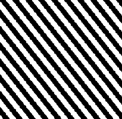

# Rayures

<table>
<tr style="border: 0;">
<td style="border: 0;" valign="top">

{width="128px"}

## Rayures

**Entrée :** *Générateurs de textures**/Motifs*

**Intermédiaire**

</td>
<td style="border: 0;" valign="top">

## Description

Génère un motif de mosaïque, d’angle et de bande. Le modèle s&#39;ajuste pour toujours assurer la continuité.

## Paramètres

* **Stripe** : *1 - 100* définit la quantité de bandes. Décale automatiquement le résultat pour assurer une mosaïque.
* **Largeur** : *0.0 - 1.0* Définit la largeur du Stripe.
* **Lissage** : *0.0 - 1.0* Définit la transition des bords de bande.
* **Maj** :*0 - 20* incline les bandes. Ajoute automatiquement d’autres bandes pour garantir la juxtaposition.
* **Aligner** :*Contours, centre* définit le pivot pour le déplacement.
* **Filtrage** :*Faux/Vrai* Active le filtrage.
* **Extension non carrée** : *Faux/Vrai*\
  Permet la compensation de la courbure et de l’étirement avec des proportions non carrées.

## Exemples d’images

</td>
</tr>
</table>
