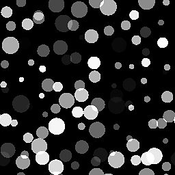

# Générateur de tuiles

<table>
<tr style="border: 0;">
<td style="border: 0;" valign="top">

{width="128px"}

## Tile Generator (Couleur)

**Entrée :** *Générateurs de textures**/Motifs*

**Complexe**

</td>
<td style="border: 0;" valign="top">

## Description

Tile Generator est l’un des nœuds les plus avancés de la bibliothèque. Si vous apprenez à le maîtriser, vous pouvez créer n’importe quel type de motif (dans certaines limites). À partir de la version 2017 2.1, d&#39;importantes mises à jour ont été effectuées, ce qui rend ce nœud plus conforme à ce que [Tile Sampler](../../../../../../compositing-graphs/nodes-reference-for-com/node-library/texture-generators/patterns/tile-sampler/tile-sampler.md) peut faire.

Ce nœud est très utile pour une variété de scénarios, mais gardez à l&#39;esprit que la simple lecture des paramètres ne vous apprendra pas complètement à les utiliser. Nous vous suggérons d&#39;expérimenter aussi !

Dans 99 % des cas, la version couleur n’est PAS nécessaire !

Quelques conseils d’utilisation généraux :

* Vous pouvez commencer par une forme de base, mais si vous avez une entrée personnalisée (Définissez **Type de motif** sur *Entrée d&#39;image*), créez-la d&#39;abord ! Il détermine une grande partie de l’aspect.
* Commencez par définir correctement les valeurs X et Y.
* Trouvez le bon mode **Taille** : les modes relatifs tels que **Interstice** se comportent très différemment des modes **Absolus**.
* Ajustez ensuite l&#39;**échelle** globale et la **taille** non uniforme.
* Enfin, ajustez n&#39;importe quel paramètre de **« Variation »** jusqu&#39;à ce qu&#39;il réponde à vos besoins. La subtilité est la clé de la variation !

## Paramètres

### Entrées

* **Entrée de motif 1-6** : *Entrée en niveaux de gris*\
  Image de motif personnalisée, utilisée lorsque le paramètre « Motif » est défini sur « Entrée image ».
* **Arrière-plan** :*Entrée en niveaux de gris* Arrière-plan à utiliser à la place de la couleur unie.

### Paramètres

* **X Quantité** : *1 - 64*\
  Quantité de répétitions X du motif.
* **Quantité Y** : *1 - 64*\
  Quantité de répétitions Y du motif.
* **Extension non carrée** : *Faux/Vrai*\
  Permet la compensation de la courbure et de l’étirement avec des proportions non carrées.
* **Motif**
  * **Motif** :*Entrée d&#39;image, Carré, Disque, Paraboloïde, Cloche, Gaussien, Épine, Pyramide, Brique, Gradation, Ondes, Demi-Cloche, Cloche striée, Croissant, Capsule, Cône*\
    Sélectionne la forme de motif à utiliser.
  * **Nombre d’entrées de motif** : *1 - 6* Nombre d’entrées d’image différentes à utiliser. Disponible uniquement lorsque l&#39;option *Entrée d&#39;image* est sélectionnée ci-dessus.
  * **Distribution d&#39;entrée de motif** : *aléatoire, par numéro de motif* Comment choisir entre les différentes entrées d&#39;image, si plus de 1 est sélectionné.
  * **Spécifique Au Motif** : *0.0 - 1.0*\
    Permet de modifier la forme du motif sélectionné. L’effet dépend du motif sélectionné.
  * **Filtrage d&#39;entrée d&#39;image (moteur >v4 uniquement)** : *Bilinéaire + Mipmaps, Bilinéaire, Au plus proche*
  * **Rotation** :*0, 90, 180, 270* Fait pivoter toutes les mosaïques globalement selon un angle défini en étapes de 90 degrés.
  * **Rotation aléatoire** :*0.0 - 1.0* La rotation aléatoire fait pivoter un carreau d’une des quatre étapes de 90 degrés.
  * **Symétrie Quincunx** :*Faux/Vrai* Fait pivoter une mosaïque sur deux de 90 degrés.
  * **Aléatoire de symétrie** : *0.0 - 1.0* Le mode aléatoire de symétrie sélectionné reflète aléatoirement certains motifs. Plus cette valeur est élevée, plus les motifs seront mis en miroir.
  * **Mode aléatoire de symétrie** : *Horizontal + Vertical, Horizontal, Vertical* Détermine le comportement de mise en miroir lorsque le mode aléatoire de symétrie est supérieur à 0.
* **Taille**
  * **** Mode Taille **:***Normal - Interstice, Normal - Taille, Conserver le rapport, Absolu, Pixel*Définit le comportement général de la taille du motif.\
    Normal - L’interstice vous permet de définir l’espace entre les éléments de motif. Elle est affectée par les valeurs X et Y.\
    Normal - Taille vous permet de définir la taille des éléments de motif, quel que soit l’espace. Elle est affectée par les valeurs X et Y.\
    L’option Conserver le rapport vous permet de définir une taille affectée par les valeurs X et Y, mais le rapport X et Y entre les deux reste intact.\
    Absolue vous permet de définir une taille absolue qui n&#39;est pas affectée par les valeurs X et Y.\
    Pixel vous permet de définir une taille absolue en pixels, qui n’est pas affectée par les valeurs X et Y. La modification de la résolution affecte la taille des éléments.
  * **Taille moyenne** :*0,0 - 1,0* modifie la taille en alternant les colonnes et les lignes.
  * **Interstice X/Y** : *0.0 - 1.0* Disponible uniquement en mode Normal - Taille de l’interstice. Change l&#39;espace interstitiel. Affecte la couture entre les formes, permet un contrôle non uniforme contrairement à **Échelle**.
  * **Taille (Absolue/Pixel)** : *0,0 - 1,0*\
    Uniquement disponible en dehors du mode Normal - Taille d’interstice. Définit une taille non uniforme, contrairement à l&#39;**échelle**.
  * **Échelle** : *0.0 - 2.0* Définit l&#39;échelle globale.
  * **Échelle aléatoire** : *0.0 - 1.0* définit la variation d&#39;échelle globale par carreau.
  * **Graine aléatoire de mise à l&#39;échelle** : *0 - 1 000* décale la graine de variation de mise à l&#39;échelle.
* **Position**
  * **Décalage** :*0.0 - 1.0* décale l’ensemble du motif de manière incrémentielle sur chaque ligne ou colonne consécutive (le comportement dépend du paramètre Décalage vertical).
  * **Décalage aléatoire** :*0.0 - 1.0* aléatoire le décalage de ligne.
  * **Décalage aléatoire de la valeur initiale** : *0 - 1 000* modifie la valeur initiale relative de l’effet de décalage aléatoire.
  * **Décalage vertical** : *Faux/Vrai* Définit si l&#39;effet de décalage se produit sur les lignes ou les lignes ; horizontal ou vertical.
  * **Position aléatoire** :*0,0 - 1,0* aléatoire la position de manière non uniforme, avec un contrôle séparé pour X et Y.
  * **Décalage global** : *0,0 - 1,0* Décale l’ensemble du résultat sur les axes X et Y.
* **Rotation**
  * **Rotation** : *0.0 - 1.0* Effectue une rotation libre uniforme de toutes les mosaïques de motif.
  * **Rotation aléatoire** :*0.0 - 1.0* aléatoire la rotation libre de toutes les mosaïques. Plus cette valeur est élevée, plus les carreaux peuvent pivoter.
* **Couleur**
  * **Couleur** : *(Valeur Niveaux de gris)*Définit la couleur unie de la mosaïque.
  * **Luminance/Color Random** : *0.0 - 1.0* Introduit la variation de couleur ou de luminance par carreau.
  * **Luminance par numéro** :*Faux/Vrai* Atténue la luminance sur l’ensemble du motif.
  * **Luminance par échelle** :*Faux/Vrai* rend la variation de luminance dépendante de l’échelle des carreaux.
  * **Masque de vérification** : *Faux/Vrai* masque une vignette sur deux.
  * **Masque horizontal** : *Faux/Vrai* masque toutes les deux colonnes.
  * **Masque vertical** : *Faux/Vrai* masque une ligne sur deux.
  * **Masque aléatoire** :*0.0 - 1.0* Masque aléatoirement les vignettes. Plus cette valeur est élevée, plus le nombre de carreaux disparaîtra.
  * **Inverser le masque** :*Faux/Vrai* Inverse le résultat de tous les effets de masquage de cette section.
  * **Mode de fusion** : *Ajouter, Max, Ajouter sub* Définit le mode de fusion à utiliser.
  * **Couleur d&#39;arrière-plan** : *(valeur Niveaux de gris)*Définit une couleur d&#39;arrière-plan unie.
  * **Opacité globale** : *0.0 - 1.0* définit l’opacité globale des vignettes.
  * **Ordre de rendu inversé** : *Faux/Vrai* Rend les vignettes de face ou vice-versa.

## Exemples d’images

</td>
</tr>
</table>
