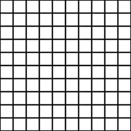

# Générateur de tuiles

<table>
<tr style="border: 0;">
<td width="33.33%" style="border: 0;" valign="top">

{width="128px"}

<b>Entrée :</b> Générateurs de textures > Motifs

</td>
<td width="100.00%" style="border: 0;" valign="top">

## Description

Tile Generator est l’un des nœuds les plus avancés de la bibliothèque. Si vous apprenez à le maîtriser, vous pouvez créer n’importe quel type de motif (dans certaines limites). À partir de la version 2017 2.1, d&#39;importantes mises à jour ont été effectuées, ce qui rend ce nœud plus conforme à ce que [Tile Sampler](../../../../../../compositing-graphs/nodes-reference-for-com/node-library/texture-generators/patterns/tile-sampler/tile-sampler.md) peut faire.

Ce nœud est très utile pour une variété de scénarios, mais gardez à l&#39;esprit que la simple lecture des paramètres ne vous apprendra pas complètement à les utiliser. Nous vous suggérons d&#39;expérimenter aussi !

Dans 99 % des cas, la version couleur n’est PAS nécessaire !

Quelques conseils d’utilisation généraux :

* Vous pouvez commencer par une forme de base, mais si vous avez une entrée personnalisée (Définissez **Type de motif** sur *Entrée d&#39;image*), créez-la d&#39;abord ! Il détermine une grande partie de l’aspect.
* Commencez par définir correctement les valeurs X et Y.
* Trouvez le bon mode **Taille** : les modes relatifs tels que **Interstice** se comportent très différemment des modes **Absolus**.
* Ajustez ensuite l&#39;**échelle** globale et la **taille** non uniforme.
* Enfin, ajustez n&#39;importe quel paramètre de **« Variation »** jusqu&#39;à ce qu&#39;il réponde à vos besoins. La subtilité est la clé de la variation !

</td>
</tr>
</table>

## Entrées

|  |  |
|:---|:---|
| <b>Entrée de motif 1-6</b> <i>Entrée en niveaux de gris</i> | Image de motif personnalisée, utilisée lorsque le paramètre « Motif » est défini sur « Entrée image ». |
| <b>Arrière-plan</b> <i>Entrée en niveaux de gris</i> | Arrière-plan à utiliser à la place de la couleur unie. |

## Paramètres

|  |  |
|:---|:---|
| <b>X Quantité</b> <i>1 - 64</i> | Quantité de répétitions X du motif. |
| <b>Quantité Y</b> <i>1 - 64</i> | Quantité de répétitions Y du motif. |
| <b>Extension non carrée</b> <i>Faux/Vrai</i> | Permet la compensation de la courbure et de l’étirement avec des proportions non carrées. |
| <b>Motif</b> |  |
| <b>Motif</b> <i>Entrée d&#39;image, Carré, Disque, Paraboloïde, Cloche, Gaussien, Épine, Pyramide, Brique, Graduation, Ondes, Demi-cloche, Cloche striée, Croissant, Capsule, Cône</i> | Sélectionne la forme de motif à utiliser. |
| <b>Numéro d&#39;entrée de motif</b> <i>1 - 6</i> | Nombre d’entrées Image différentes à utiliser. Disponible uniquement lorsque l&#39;option <i>Entrée d&#39;image</i> est sélectionnée ci-dessus. |
| <b>Distribution d&#39;entrée de motif</b> <i>Aléatoire, Par Numéro De Motif</i> | Comment choisir entre les différentes entrées d’image, si plus de 1 est sélectionné. |
| <b>Spécifique Au Motif</b> <i>0.0 - 1.0</i> | Permet de modifier la forme du motif sélectionné. L’effet dépend du motif sélectionné. |
| <b>Filtrage d’entrée d’image (Moteur >v4 uniquement)</b> <i>Bilinéaire + Mipmaps, Bilinéaire, Nearest</i> |  |
| <b>Rotation</b> <i>0, 90, 180, 270</i> | Fait pivoter toutes les mosaïques globalement selon un angle défini en plusieurs étapes de 90 degrés. |
| <b>Rotation aléatoire</b> <i>0.0 - 1.0</i> | L’option Aléatoire fait pivoter un carreau d’une des quatre étapes de 90 degrés. |
| <b>Symétrie Quincunx</b> <i>Faux/Vrai</i> | Fait pivoter toutes les autres mosaïques de 90 degrés. |
| <b>Symétrie aléatoire</b> <i>0.0 - 1.0</i> | Applique une symétrie aléatoire à certains motifs selon le mode aléatoire de la Symétrie sélectionnée. Plus cette valeur est élevée, plus les motifs seront mis en miroir. |
| <b>Mode aléatoire de Symétrie</b> <i>Horizontal + Vertical, Horizontal, Vertical</i> | Détermine le comportement de mise en miroir lorsque le nombre aléatoire de Symétries est supérieur à 0. |
| <b>Taille</b> |  |
| <b>Mode Taille</b> <i>Normal - Interstice, Normal - Taille, Conserver le rapport, Absolu, Pixel</i> | Définit le comportement général de la taille du motif.  Normal : l’interstice vous permet de définir l’espace entre les éléments du motif. Elle est affectée par les valeurs X et Y.  Normal - Taille vous permet de définir la taille des éléments de motif, quel que soit l’espace. Elle est affectée par les valeurs X et Y.  Conserver le rapport vous permet de définir une taille affectée par les valeurs X et Y, mais le rapport X et Y entre les deux reste intact.  Absolue vous permet de définir une taille absolue qui n&#39;est pas affectée par les valeurs X et Y.  Pixel vous permet de définir une taille absolue en pixels, qui n’est pas affectée par les valeurs X et Y. La modification de la résolution affecte la taille des éléments. |
| <b>Taille moyenne</b> <i>0.0 - 1.0</i> | Modifie la taille en alternant les colonnes et les lignes. |
| <b>Interstice X/Y</b> <i>0.0 - 1.0</i> | Disponible uniquement en mode Normal - Taille d’interstice. Change l&#39;espace interstitiel. Affecte le seam entre les formes, permet un contrôle non uniforme contrairement à <b>Échelle</b>. |
| <b>Taille (Absolue/Pixel)</b> <i>0.0 - 1.0</i> | Uniquement disponible en dehors du mode Normal - Taille d’interstice. Définit une taille non uniforme, contrairement à l&#39;<b>échelle</b>. |
| <b>Échelle</b> <i>0.0 - 2.0</i> | Définit l’échelle globale. |
| <b>Échelle aléatoire</b> <i>0.0 - 1.0</i> | Définit la variation d’échelle globale par carreau. |
| <b>Générateur aléatoire de mise à l&#39;échelle</b> <i>0 - 1000</i> | Décale la vitesse de variation de l’échelle. |
| <b>Position</b> |  |
| <b>Décalage</b> <i>0.0 - 1.0</i> | Décale le motif entier de manière incrémentielle sur chaque ligne ou colonne consécutive (le comportement dépend du paramètre Décalage vertical ). |
| <b>Décalage aléatoire</b> <i>0.0 - 1.0</i> | Aléatoire du décalage de ligne. |
| <b>Décaler la valeur de départ aléatoire</b> <i>0 - 1000</i> | Modifie la vitesse relative de l’effet de décalage aléatoire. |
| <b>Décalage vertical</b> <i>Faux/Vrai</i> | Définit si l’effet de décalage se produit sur des lignes ou des lignes, horizontales ou verticales. |
| <b>Position aléatoire</b> <i>0.0 - 1.0</i> | Aléatoire la position de manière non uniforme, avec un contrôle séparé pour X et Y. |
| <b>Décalage global</b> <i>0.0 - 1.0</i> | Déplace le résultat entier sur les axes X et Y. |
| <b>Rotation</b> |  |
| <b>Rotation</b> <i>0.0 - 1.0</i> | Applique une rotation libre uniforme à toutes les mosaïques de motif. |
| <b>Rotation aléatoire</b> <i>0.0 - 1.0</i> | Rend aléatoire la rotation libre de toutes les mosaïques. Plus cette valeur est élevée, plus les carreaux peuvent pivoter. |
| <b>Couleur</b> |  |
| <b>Couleur</b> <i>(valeur Niveaux de gris)</i> | Définit la couleur unie de la mosaïque. |
| <b>Luminance/Couleur aléatoire</b> <i>0.0 - 1.0</i> | Introduit une variation de couleur ou de Luminance par mosaïque. |
| <b>Luminance Par Numéro</b> <i>Faux/Vrai</i> | Atténue la Luminance sur l’ensemble du motif. |
| <b>Luminance Par Échelle</b> <i>Faux/Vrai</i> | Rend la variation de la Luminance dépendante de l’échelle de la mosaïque. |
| <b>Masque de vérification</b> <i>Faux/Vrai</i> | Masque toutes les autres mosaïques. |
| <b>Masque horizontal</b> <i>Faux/Vrai</i> | Masque toutes les deux colonnes. |
| <b>Masque vertical</b> <i>Faux/Vrai</i> | Masque une ligne sur deux. |
| <b>Masque Aléatoire</b> <i>0.0 - 1.0</i> | Masque les vignettes de manière aléatoire. Plus cette valeur est élevée, plus le nombre de carreaux disparaîtra. |
| <b>Inverser le masque</b> <i>Faux/Vrai</i> | Inverse le résultat de tous les effets de masquage de cette section. |
| <b>Mode de fusion</b> <i>Ajouter, Max, Ajouter Sub</i> | Définit le mode de fusion à utiliser. |
| <b>Couleur d&#39;arrière-plan</b> <i>(valeur Niveaux de gris)</i> | Définit la couleur d’arrière-plan unie. |
| <b>Opacité globale</b> <i>0.0 - 1.0</i> | Définit l’opacité globale des vignettes. |
| <b>Inverser l&#39;ordre de rendu</b> <i>Faux/Vrai</i> | Effectue le rendu des vignettes vers l’avant ou vice versa. |

## Exemples

<table style="margin-top: 32px; margin-bottom: 32px">
    <tr style="border: 0">
        <td style="border: 0; background: transparent">
            
        </td>
        <td style="border: 0; background: transparent">
            
        </td>
        <td style="border: 0; background: transparent">
            
        </td>
        <td style="border: 0; background: transparent">
            
        </td>
    </tr>
</table>
