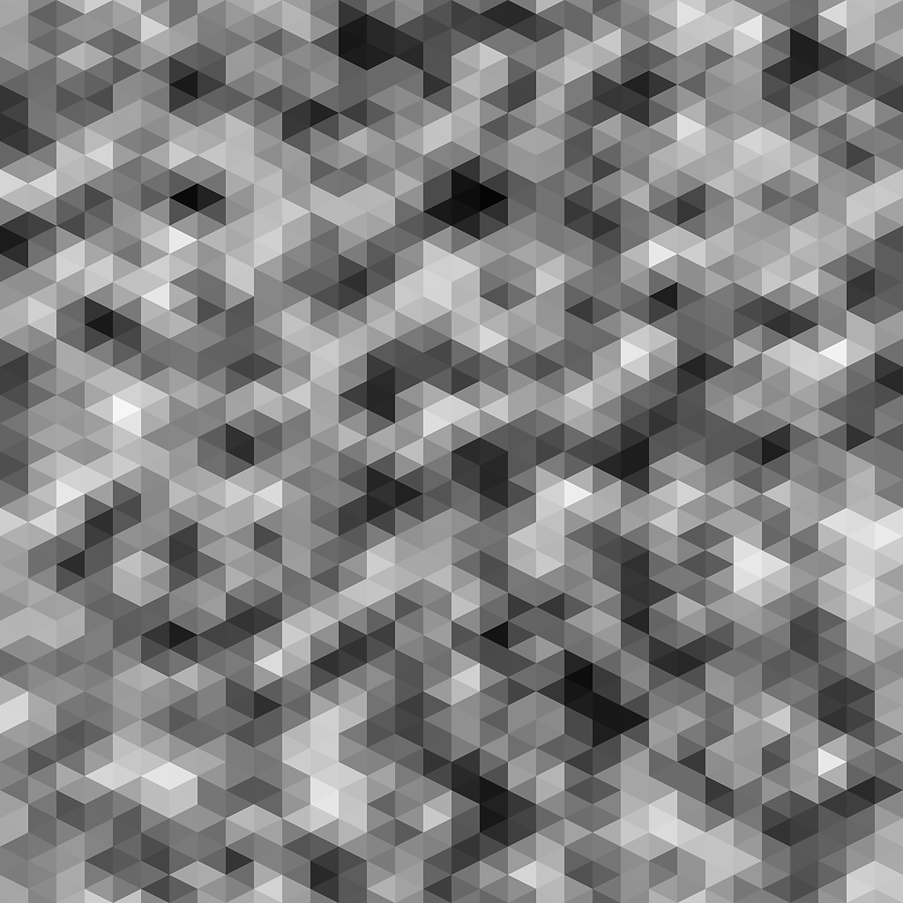

# Triangle Grid

<table>
<tr style="border: 0;">
<td width="41.60%" style="border: 0;" valign="top">

{width="200px"}

{width="200px"}

<b>Entrée :</b> Générateurs de textures > Motifs

</td>
<td width="58.30%" style="border: 0;" valign="top">

## Description

Le nœud **Triangle Grid** génère une représentation en niveaux de gris d&#39;une *surface triangulée* sur *sommets* dans l&#39;espace 3D, à l&#39;aide d&#39;une projection orthographique Z-down.

Le paramètre **Sortie couleur** vous permet de sélectionner les données utilisées pour la représentation, ce qui donne différents styles visuels.\
Les *positions* des sommets peuvent être ajustées, ce qui a un impact sur le maillage généré.

</td>
</tr>
</table>

<table>
<tr style="border: 0;">
<td style="border: 0;" valign="top">

</td>
<td style="border: 0;" valign="top">

### Connecteurs de sortie

</td>
<td style="border: 0;" valign="top">

### Paramètres

</td>
</tr>
</table>

## Connecteurs d’entrée

|  |  |
| --- | --- |
| <b>Height</b> *Niveaux de gris* PRINCIPAUX | Entrée d&#39;image en niveaux de gris utilisée pour mapper l&#39;*height*, c&#39;est-à-dire la position Z, des sommets.    L&#39;influence de cette entrée est contrôlée par le paramètre &#39;Multiplicateur d&#39;entrée d&#39;Height&#39;. |
| <b>Carte vectorielle</b> *Couleur* | Entrée d&#39;image couleur utilisée pour mapper le *displacement* des sommets sur les axes X et Y.    Les décalages X/Y sont respectivement mis en correspondance avec les canaux R/G de l&#39;image.    L&#39;influence de cette entrée est contrôlée par le paramètre &#39;Vector Map Displacement&#39;. |
| <b>Entrée de couleur</b> *Couleur* | Entrée d&#39;image couleur utilisée pour mapper la *couleur* des sommets, segments ou triangles.    Cette entrée est utilisée lorsque le paramètre Source de couleur est défini sur Entrée de couleur. |

## Connecteurs de sortie

|  |  |
| --- | --- |
| <b>Sortie</b> *Couleur* | Image de sortie. |

## Paramètres

|  |  |
| --- | --- |
| <b>Sortie couleur</b> *Nombre entier* | La méthode de représentation de la surface triangulée:<ul data-preserve-html="true"> <li data-preserve-html="true"><b>Par sommet :</b> une couleur est affectée à chaque sommet et interpolée sur la surface du triangle</li> <li data-preserve-html="true"><b>Par triangle :</b> une couleur plate est affectée à chaque triangle</li> <li data-preserve-html="true"><b>Ligne fine</b><b>:</b> applique un contour aux segments entre les sommets</li> <li data-preserve-html="true"><b>Distance jusqu&#39;au contour</b><b>:</b> effectue le rendu de la distance jusqu&#39;au segment le plus proche sur chaque triangle</li> <li data-preserve-html="true"><b>Centre</b><b>:</b> restitue la distance normalisée par rapport au barycentre de chaque triangle</li> </ul> |
| <b>Triangulation</b> *Nombre entier* | Définit la méthode de triangulation de la surface, c&#39;est-à-dire la *paire de sommets opposés* dans un quad qui doit être connectée :<ul data-preserve-html="true"> <li data-preserve-html="true"><b>Auto :</b> sélectionne automatiquement la paire de sommets, ce qui fait que les triangles <i>sont orientés le moins loin</i> de l&#39;appareil photo  <b>45° :</b> connectez des sommets opposés, ce qui donne une ligne <i>tournée de 45 degrés</i> par rapport à l&#39;axe X-droit</li> <li data-preserve-html="true"><b>-45° :</b> connectez des sommets opposés, ce qui entraîne une ligne <i>tournée de -45 degrés</i> par rapport à l&#39;axe X-droit</li> <li data-preserve-html="true"><b>Quincux horizontal :</b> alternent l&#39;orientation de triangulation <i>une ligne sur deux</i> de sommets</li> <li data-preserve-html="true"><b>Vertical quincux :</b> alterne l&#39;orientation de triangulation <i>une colonne sur deux</i> de sommets  </li> </ul> |
| <b>X Quantité</b> *Nombre entier* | Nombre de sommets générés sur l’axe X. |
| <b>Quantité Y</b> *Nombre entier* | Nombre de sommets générés sur l’axe Y. |
| <b>Multiplicateur De Position Aléatoire</b> *Flotter* | Règle l’intensité de l’effet de déformation principal. |
| <b>Position Aléatoire</b> *Float2* | Ajuste l&#39;intensité du décalage aléatoire appliqué aux positions X et Y de chaque sommet, par rapport à la *taille de leur cellule* dans la grille.   Ce décalage *s&#39;empile* avec les paramètres <b>Décalage Quincux</b> et <b>Displacement de mappage vectoriel</b>. |
| <b>Displacement de mappage vectoriel</b> *Flotter* | Ajuste la quantité *globale* de displacement appliquée à chaque sommet à l&#39;aide des valeurs *échantillonnées* de l&#39;entrée <b>Carte vectorielle</b>.    Ce décalage *empile* avec les paramètres <b>Position aléatoire</b> et <b>Décalage Quincux</b>. |
| <b>Décalage Quincux X</b> *Flotter* | Applique le décalage spécifié à *une ligne sur deux* de sommets, par rapport à la *taille de leur cellule* dans la grille.   Ce décalage *empile* avec les paramètres <b>Position aléatoire</b> et <b>Displacement de mappage vectoriel</b>. |
| <b>Décalage Quincux Y</b> *Flotter* | Applique le décalage spécifié à *une colonne sur deux* de sommets, par rapport à la *taille de leur cellule* dans la grille.    Ce décalage *empile* avec les paramètres <b>Position aléatoire</b> et <b>Displacement de mappage vectoriel</b>. |
| <b>Rotation</b> *Flotter* | Applique le degré de rotation *spécifié* à chaque sommet autour de sa *position de base*, c&#39;est-à-dire sa position *avant* le décalage aléatoire et le displacement.    Cette rotation *s&#39;empile* avec le paramètre <b>Trouble de rotation</b>. |
| <b>Trouble De La Rotation</b> *Flotter* | Applique une rotation *aléatoire* à chaque sommet autour de sa *position de base*, c&#39;est-à-dire sa position *avant* l&#39;application du décalage et du displacement aléatoires.    Cette rotation *empile* avec le paramètre <b>Rotation</b>. |
| <b>Multiplicateur d&#39;entrée Height</b> *Flotter* | Ajuste la position Z de chaque sommet à l&#39;aide des valeurs *échantillonnées* à partir de l&#39;entrée <b>Height</b>.    Ce décalage *empile* avec le paramètre <b>Height Random</b>. |
| <b>Height aléatoire</b> *Flotter* | Applique un décalage aléatoire à la position Z de chaque sommet.  Ce décalage *empile* avec le paramètre <b>Multiplicateur d&#39;entrée d&#39;Height</b>. |
| <b>Mode de fusion</b> *Nombre entier* | Définit la méthode de fusion des valeurs des *triangles superposés*. Le mode vous permet de sélectionner *lequel* des triangles doit être visible : <ul data-preserve-html="true"> <li data-preserve-html="true"><b>Min :</b> Texte</li> <li data-preserve-html="true"><b>Max. :</b> Texte</li> <li data-preserve-html="true"><b>Test De Profondeur</b> : Texte</li> <li data-preserve-html="true"><b>Dégradé de formes d&#39;Alpha :</b> Texte</li> </ul>Remarque : les modes de fusion disponibles dépendent de la valeur du paramètre <b>Sortie couleur</b>. |
| <b>Source de couleur</b> *Entier* *Disponible lorsque le paramètre « Sortie couleur » est défini sur « Par sommet », « Par triangle » ou « Ligne fine ».* | Définit la méthode d&#39;*acquisition de la couleur*, c&#39;est-à-dire de la luminance, qui doit être attribuée au sommet, au triangle ou au segment, en fonction du mode <b>Sortie couleur</b> sélectionné :<ul data-preserve-html="true"> <li data-preserve-html="true"><b>Height</b><b>:</b> utilisez l&#39;height du sommet comme luminance</li> <li data-preserve-html="true"><b>Aléatoire</b><b>:</b> utiliser une valeur de luminance aléatoire</li> <li data-preserve-html="true"><b>Entrée couleur</b><b>:</b> utilisez la valeur échantillonnée à partir de l&#39;entrée <b style="">Entrée couleur</b></li> </ul> |
| <b>Opacité de la source de couleur</b> *Flottant* *Disponible lorsque le paramètre « Sortie couleur » est défini sur « Ligne fine ».* | Contrôle le *remplacement* de la valeur <b>Couleur de ligne</b> avec les valeurs résultant de la <b>Source de couleur</b> sélectionnée.   Remarque : lorsque cette valeur est définie sur 1, le paramètre <b>Couleur de ligne</b> n&#39;a aucun impact. |
| <b>Distance jusqu&#39;au Thickness du contour</b> *Flottant* *Disponible lorsque le paramètre « Sortie couleur » est défini sur « Distance jusqu&#39;au contour ».* | Définit le thickness du dégradé de distance. Une valeur inférieure donne un dégradé *plus court*. |
| <b>Couleur de ligne</b> *Float/Float4* *Disponible lorsque le paramètre « Sortie couleur » est défini sur « Trait fin ».* | Valeur de luminance des segments.   Remarque : lorsque la valeur <b>Opacité de la source de couleur</b> est définie sur 1, ce paramètre n&#39;a aucun impact. |
| <b>Couleur d&#39;arrière-plan</b> *Float/Float4* *Disponible lorsque le paramètre « Sortie couleur » est défini sur « Trait fin ».* | Valeur de luminance de l’arrière-plan visible entre les segments.   Remarque : lorsque le <b>mode de fusion</b> est défini sur *Max*, l&#39;arrière-plan remplace les segments où il est *plus lumineux*, comme prévu. |
| <b>Mode générateur de couleurs aléatoire</b> *Entier* *Disponible lorsque le paramètre « Sortie couleur » est défini sur « Par sommet », « Par triangle » ou « Ligne fine » et que le paramètre « Source couleur » est défini sur « Aléatoire ».* | La méthode d&#39;acquisition de la germe utilisée dans la distribution pseudo-aléatoire des couleurs:<ul data-preserve-html="true"> <li data-preserve-html="true"><b>Générateur aléatoire global</b><b>:</b> hérite de la valeur de départ du graphique du nœud</li> <li data-preserve-html="true"><b>Valeur initiale manuelle</b><b> :</b> utilisez une valeur initiale distincte personnalisée</li> </ul> |
| <b>Générateur aléatoire de couleurs</b> *Nombre entier* *Disponible lorsque le paramètre « Mode générateur de couleur aléatoire » est défini sur « Générateur manuel » et que le paramètre « Source de couleur » est défini sur « Aléatoire ».* | Valeur initiale discrète utilisée dans la distribution de couleurs pseudo-aléatoire. |
| <b>Extension non carrée</b> *Booléen* | Permet la compensation de la courbure et de l’étirement avec des proportions non carrées. |

## Exemples d’images

<table>
<tr style="border: 0;">
<td style="border: 0;" valign="top">

{zoomable="yes"}

</td>
<td style="border: 0;" valign="top">

{zoomable="yes"}

</td>
<td style="border: 0;" valign="top">

{zoomable="yes"}

</td>
</tr>
</table>

<table>
<tr style="border: 0;">
<td style="border: 0;" valign="top">

{zoomable="yes"}

</td>
<td style="border: 0;" valign="top">

{zoomable="yes"}

</td>
<td style="border: 0;" valign="top">

{zoomable="yes"}

</td>
</tr>
</table>

<table>
<tr style="border: 0;">
<td style="border: 0;" valign="top">

{zoomable="yes"}

</td>
<td style="border: 0;" valign="top">

{zoomable="yes"}

</td>
</tr>
</table>
