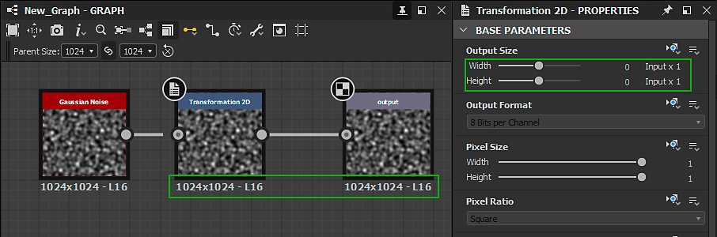

# Taille de sortie

Il s&#39;agit du premier des <b>paramètres de base</b> d&#39;un graphe et, avec le <b>format de sortie</b> (ou profondeur de bit), il est essentiel de bien le comprendre car il a un impact important sur la sortie d&#39;un graphe, à la fois dans Designer et dans d&#39;autres applications en tant que fichier [SBSAR (Substance 3D Asset Asset Asset Asset Frame)](../publishing-asset-files/publishing-substance-3d-asset-files-sbsar.md) publié.

>[!TIP]
>
> Nous vous recommandons vivement d&#39;acquérir une bonne compréhension de l&#39;[héritage dans les graphes de Substance](../../compositing-graphs/inheritance-compositing/inheritance-in-substance-compositing-graphs.md) comme base pour utiliser efficacement la propriété Taille de sortie.

>[!NOTE]
>
> Utilisez le bouton de verrouillage  pour que la valeur Height *corresponde* à la valeur Largeur.

<table>
<tr style="border: 0;">
<td width="100.00%" style="border: 0;" valign="top">

## Puissance de 2 valeurs

Le paramètre Taille de la sortie détermine la résolution de la sortie *texture* par un graphe ou un nœud.

Une texture qui est un objet de l&#39;informatique graphique soumis à certaines restrictions imposées par la façon dont le matériel de traitement graphique exécute ses calculs. L&#39;une de ces restrictions est que la texture doit représenter une image dont le nombre de pixels en X et Y est une *puissance de deux*.

</td>
<td width="33.33%" style="border: 0;" valign="top">

| Puissance de 2 | Pixels |
| --- | --- |
| 7 | 128 |
| 8 | 256 |
| 9 | 512 |
| 10 | 1024 |
| 11 | 2048 |
| 12 | 4096 |
| 13 | 8192 |

</td>
</tr>
</table>

La propriété Taille de la sortie utilise *pas logarithmiques* pour mapper facilement les augmentations de puissance de deux (par exemple, 256, 512, 1024, ...) à une *échelle linéaire* (par exemple, 8, 9, 10, ...). Cela signifie qu’augmenter ou diminuer de 1 la valeur Taille de sortie dans X ou Y revient à multiplier ou à diviser par 2 la résolution actuelle.

Cela s&#39;applique également lorsque la valeur Taille de sortie est contrôlée par une [fonction](../../function-graphs/function-graphs.md), où la fonction doit générer les valeurs logarithmiques cibles (relatives ou absolues) au lieu de la résolution cible.

>[!IMPORTANT]
>
> L&#39;augmentation ou la diminution de la résolution à la fois en X et en Y multiplie ou divise le nombre de pixels par *4*, ce qui a un impact significatif sur les *performances* et l&#39;*empreinte mémoire* d&#39;un graphe.\
> Par conséquent, nous vous recommandons vivement d&#39;utiliser la *plus faible résolution* réellement nécessaire pour obtenir le résultat souhaité. Contrôler les résolutions est l&#39;une de nos [directives d&#39;optimisation des performances](../../best-practices/performance-optimization/performance-optimization-guidelines.md).

>[!NOTE]
>
> Dans les [graphes de fonction](../../function-graphs/function-graphs.md), les `$size` et `$sizelog2` [variables système](../../function-graphs/variables/system-variables/system-variables.md) renvoient une valeur de Flottant 2 correspondant à la résolution actuelle du nœud ou du graphe en tant que nombre de pixels bruts ou puissance de deux, respectivement.\
> Par exemple, pour une image 1024\*512, `$size` renvoie `(1024,512)` tandis que `$sizelog2` renvoie `(10,9)`.

## Taille relative

Lorsque la propriété Taille de sortie utilise une méthode d&#39;héritage *Relative à...* [relative](../../compositing-graphs/inheritance-compositing/inheritance-in-substance-compositing-graphs.md), sa valeur est exprimée sous la forme d&#39;un modificateur *relatif à la valeur logarithmique héritée*.

Les modificateurs relatifs à la résolution héritée vont de -12 à +12 sur une échelle logarithmique, la valeur par défaut étant 0. Cela signifie que chaque étape au-dessus ou au-dessous entraîne un doublement ou une réduction de moitié de la résolution. Le tableau de droite donne un exemple de la façon dont la résolution relative change dans une dimension pour une valeur héritée de 9 (c.-à-d. 512 = 2^9) et 11 (c.-à-d. 2048 = 2^11) :

Notez qu&#39;au-dessus de 8 196, la taille est *plafonnée*. Cette limite est contrôlée par le paramètre <b>Taille limite de cuisson</b> dans la section <b>Général</b> des [Préférences](../../interface/preferences-window/preferences-window.md). Veuillez noter que le fait de travailler avec de très grandes résolutions implique un coût de performance proportionnel et une empreinte mémoire exponentielle. En outre, les limites de traitement graphique imposent une limite stricte à la taille maximale d’une texture.

| -5 | -4 | -3 | -2 | -1 | 0 | +1 | +2 | +3 | +4 | +5 |
| --- | --- | --- | --- | --- | --- | --- | --- | --- | --- | --- |
| 16 | 32 | 64 | 128 | 256 | <b>512</b> | 1024 | 2048 | 4096 | 8196 | 8196 |
| 64 | 128 | 256 | 512 | 1024 | <b>2048</b> | 4096 | 8196 | 8196 | 8196 | 8196 |

>[!NOTE]
>
> En dessous de 16, la résolution n&#39;est *pas* limitée, mais il n&#39;est pas recommandé d&#39;aller plus bas, car il n&#39;y a aucun gain de performances en dessous de ce seuil. Au contraire, les performances *chutent* en raison de l&#39;implémentation spécifique du <b>moteur de Substance</b>. Par conséquent, utilisez une résolution minimale générale de 16 x 16 dans les graphes de Substance.

## Modification de la méthode d’héritage

Dans la plupart des cas, la [méthode d&#39;héritage](../../compositing-graphs/inheritance-compositing/inheritance-in-substance-compositing-graphs.md) par défaut pour la propriété Taille de la sortie est la suivante en fonction de l&#39;élément :

* Graphe : *Relatif au parent*
* Nœud : *Relative à l&#39;entrée* : les valeurs héritées par l&#39;[entrée principale](../../compositing-graphs/inheritance-compositing/inheritance-in-substance-compositing-graphs.md) du nœud sont utilisées dans ce cas
* Nœud [Bitmap](../../compositing-graphs/nodes-reference-for-com/atomic-nodes/bitmap/bitmap.md) :*Absolu* - consultez la page [Ressources bitmap](../../resources/bitmap-resource/bitmap-resource.md) et les [directives d&#39;optimisation des performances](../../best-practices/performance-optimization/performance-optimization-guidelines.md) pour savoir pourquoi

Affichez les propriétés d&#39;un nœud ou d&#39;un graphe en cliquant sur cet élément, puis dans le panneau [Propriétés](../../interface/properties/properties.md) recherchez la propriété <b>Taille de sortie</b> dans la section <b>Paramètres de base</b>. Cliquez sur le menu déroulant Méthode d’héritage et sélectionnez la méthode d’héritage souhaitée.

{width="512px"}

## Exemples de problèmes

Si vous êtes un nouvel utilisateur de [Adobe Substance 3D Designer](https://www.adobe.com/fr/products/substance3d-designer.html), vous risquez de rencontrer des problèmes courants. Nous énumérerons quelques exemples ci-dessous, ainsi que des solutions.

+++Problème 1
** Problème**

Le paramètre **Taille du gabarit** est *grisé* et le graphe l&#39;utilise dans une résolution 256\*256 non souhaitée.

Dans les propriétés du graphe, la méthode d&#39;héritage de la propriété Taille de sortie était définie sur *Absolue*, ce qui arrête l&#39;héritage en faveur d&#39;une valeur arbitraire.

Solution ****

Définissez la méthode d&#39;héritage de la taille de sortie du graphe sur *Relatif au parent*.

+++

+++Problème 2
** Problème**

Ci-dessus, vous voyez un cas où la sortie d&#39;un graphe entraîne une résolution différente (512\*512) de celle définie dans le parent (1024\* 1024), bien que le graphe soit défini sur *Relatif au parent*.

Le problème provient du nœud [Bitmap](../../compositing-graphs/nodes-reference-for-com/atomic-nodes/bitmap/bitmap.md). Il utilise par défaut la méthode d&#39;héritage *Absolue* et a choisi 512\*512 comme résolution en fonction de la [ressource Bitmap](../../resources/bitmap-resource/bitmap-resource.md). Les nœuds qui y sont connectés sont définis sur *Relative à l&#39;entrée*, héritant ainsi de leur taille de sortie du nœud Bitmap.

Solution ****

Définissez la méthode d&#39;héritage de la taille de sortie du nœud Bitmap sur *Relatif au parent*, ce qui résout le problème plus bas dans la chaîne.

+++

+++Problème 3
** Problème**

Au-dessus de vous voyez un problème où la résolution saute beaucoup plus haut à mi-chemin de la chaîne, résultant en une résolution de sortie beaucoup plus élevée que celle définie par le parent.

Le problème est causé par un modificateur relatif de 3 sur le nœud [Transformation 2D](../../compositing-graphs/nodes-reference-for-com/atomic-nodes/transformation-2d/transformation-2d.md), ce qui rend la sortie 8 fois plus grande.

Solution ****

Définissez les modificateurs relatifs pour la largeur et l’Height sur 0, ce qui empêche toute mise à l’échelle supérieure.

+++
